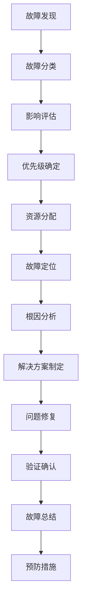

## 日志分析与故障排查：构建高效的运维诊断体系

在复杂的微服务架构中，服务网格作为服务间通信的基础设施层，产生了大量的日志数据。有效地分析这些日志并快速定位问题对于保障系统稳定运行至关重要。本章将深入探讨日志分析与故障排查的方法和技巧，包括日志分析策略、故障排查流程、常见问题诊断、工具使用技巧以及最佳实践。

### 日志分析策略

建立系统化的日志分析策略是高效故障排查的基础。

#### 分层分析方法

采用分层分析方法逐步深入问题根源：

```bash
# 分层分析方法
# 1. 基础设施层分析
#    - 节点资源使用情况
#    - 网络连通性检查
#    - 存储性能分析

# 2. 平台层分析
#    - Kubernetes组件状态
#    - 服务网格组件健康检查
#    - 负载均衡状态分析

# 3. 应用层分析
#    - 业务逻辑执行情况
#    - 数据库访问性能
#    - 外部服务调用状态

# 4. 用户层分析
#    - 用户行为模式
#    - 业务指标异常
#    - 用户体验问题
```

#### 关键指标识别

识别关键的日志指标用于问题诊断：

```json
// 关键日志指标示例
{
  "infrastructure": {
    "cpu_usage": "CPU使用率超过80%",
    "memory_usage": "内存使用率超过85%",
    "disk_io": "磁盘I/O等待时间过长",
    "network_latency": "网络延迟异常"
  },
  "platform": {
    "pod_restart": "Pod频繁重启",
    "service_unavailable": "服务不可用",
    "istio_proxy_error": "Sidecar代理错误",
    "config_sync_fail": "配置同步失败"
  },
  "application": {
    "error_rate": "错误率超过阈值",
    "response_time": "响应时间异常",
    "database_connection": "数据库连接失败",
    "external_api": "外部API调用失败"
  },
  "business": {
    "transaction_fail": "交易失败",
    "payment_error": "支付错误",
    "user_complaint": "用户投诉增加"
  }
}
```

### 故障排查流程

建立标准化的故障排查流程提高诊断效率。

#### 故障响应流程

标准化故障响应流程：



#### 详细排查步骤

详细的故障排查步骤：

```bash
# 故障排查步骤
# 1. 问题确认
#    - 复现问题现象
#    - 收集问题描述
#    - 确定影响范围

# 2. 初步诊断
#    - 检查系统状态
#    - 查看关键指标
#    - 分析最近变更

# 3. 深入分析
#    - 查阅相关日志
#    - 分析调用链路
#    - 检查资源配置

# 4. 根因定位
#    - 验证假设
#    - 排除干扰因素
#    - 确定根本原因

# 5. 解决方案
#    - 制定修复计划
#    - 实施修复措施
#    - 验证修复效果

# 6. 总结改进
#    - 记录故障过程
#    - 分析根本原因
#    - 制定预防措施
```

### 常见问题诊断

分析服务网格环境中常见的问题及其诊断方法。

#### 网络通信问题

网络通信问题的诊断方法：

```bash
# 网络通信问题诊断
# 1. 连接超时问题
#    - 检查服务端点可达性
#    - 分析网络延迟和丢包
#    - 查看连接池状态

# 2. DNS解析问题
#    - 验证DNS配置
#    - 检查DNS解析日志
#    - 测试域名解析

# 3. TLS握手失败
#    - 检查证书有效性
#    - 验证证书配置
#    - 分析TLS日志

# 诊断命令示例
kubectl exec -it <pod-name> -- nslookup <service-name>
kubectl exec -it <pod-name> -- curl -v https://<service-name>
kubectl exec -it <pod-name> -- openssl s_client -connect <service-name>:443
```

#### 性能问题诊断

性能问题的诊断方法：

```bash
# 性能问题诊断
# 1. 高延迟问题
#    - 分析请求处理时间
#    - 检查资源使用情况
#    - 查看数据库查询性能

# 2. 高CPU使用率
#    - 分析CPU热点
#    - 检查线程状态
#    - 查看GC日志

# 3. 内存泄漏
#    - 监控内存使用趋势
#    - 分析堆内存快照
#    - 检查对象创建情况

# 诊断命令示例
kubectl top pod <pod-name>
kubectl exec -it <pod-name> -- top -b -n 1
kubectl exec -it <pod-name> -- jstat -gc <pid>
```

#### 安全问题诊断

安全问题的诊断方法：

```bash
# 安全问题诊断
# 1. 未授权访问
#    - 检查访问控制策略
#    - 分析认证日志
#    - 查看权限配置

# 2. 数据泄露
#    - 检查敏感数据访问
#    - 分析数据传输日志
#    - 验证加密配置

# 3. 拒绝服务攻击
#    - 分析流量模式
#    - 检查限流配置
#    - 查看防护日志

# 诊断命令示例
kubectl get authorizationpolicy -A
kubectl logs <pod-name> | grep "unauthorized"
kubectl exec -it <pod-name> -- iptables -L
```

### 工具使用技巧

掌握日志分析和故障排查工具的使用技巧。

#### Kibana查询技巧

Kibana高级查询技巧：

```kql
# Kibana查询技巧示例
# 1. 基础查询
istio.response_code: 500

# 2. 范围查询
istio.duration: [1000 TO 5000]

# 3. 通配符查询
kubernetes.container_name: *service*

# 4. 正则表达式查询
message: /error|exception/i

# 5. 聚合查询
# 统计各服务的错误率
# Visual Builder中使用：
# Metric: Unique count of @timestamp
# Group by: istio.destination_service
# Filter: istio.response_code: [400 TO 599]

# 6. 时间序列分析
# 查看特定时间段内的日志趋势
# 使用时间过滤器设置时间范围

# 7. 多条件组合
istio.response_code: 500 AND kubernetes.namespace: production AND @timestamp: {now-1h TO now}
```

#### Elasticsearch查询优化

Elasticsearch查询优化技巧：

```json
// Elasticsearch查询优化示例
{
  "query": {
    "bool": {
      "must": [
        {
          "range": {
            "@timestamp": {
              "gte": "now-15m",
              "lte": "now"
            }
          }
        }
      ],
      "filter": [
        {
          "term": {
            "kubernetes.namespace.keyword": "production"
          }
        },
        {
          "terms": {
            "istio.response_code": [500, 502, 503, 504]
          }
        }
      ]
    }
  },
  "aggs": {
    "by_service": {
      "terms": {
        "field": "istio.destination_service.keyword",
        "size": 10
      },
      "aggs": {
        "error_count": {
          "value_count": {
            "field": "@timestamp"
          }
        }
      }
    }
  },
  "size": 0
}
```

#### 命令行工具技巧

命令行工具使用技巧：

```bash
# 命令行工具技巧示例
# 1. kubectl日志查询
kubectl logs -n <namespace> <pod-name> --since=1h
kubectl logs -n <namespace> <pod-name> -c <container-name>
kubectl logs -n <namespace> -l app=<app-name> --tail=100

# 2. 日志实时监控
kubectl logs -n <namespace> <pod-name> -f
kubectl logs -n <namespace> -l app=<app-name> -f --tail=0

# 3. 日志过滤和分析
kubectl logs <pod-name> | grep ERROR | tail -20
kubectl logs <pod-name> | jq '.level=="ERROR"' | wc -l
kubectl logs <pod-name> | awk '/ERROR/ {print $1, $2}' | sort | uniq -c

# 4. 多Pod日志聚合
kubectl get pods -n <namespace> -l app=<app-name> -o name | \
xargs -I {} kubectl logs -n <namespace> {} | \
grep "pattern" | head -50
```

### 自动化诊断

建立自动化诊断机制提高故障响应速度。

#### 健康检查脚本

编写健康检查脚本：

```bash
#!/bin/bash
# 服务网格健康检查脚本

# 检查Istio组件状态
echo "=== 检查Istio组件状态 ==="
kubectl get pods -n istio-system

# 检查服务网格配置
echo "=== 检查服务网格配置 ==="
kubectl get gateways -A
kubectl get virtualservices -A
kubectl get destinationrules -A

# 检查服务状态
echo "=== 检查服务状态 ==="
kubectl get services -n production

# 检查Pod状态
echo "=== 检查Pod状态 ==="
kubectl get pods -n production --field-selector=status.phase!=Running

# 检查资源使用情况
echo "=== 检查资源使用情况 ==="
kubectl top nodes
kubectl top pods -n production

# 输出结果到文件
echo "健康检查完成，结果已保存到 health-check-$(date +%Y%m%d-%H%M%S).log"
```

#### 异常检测规则

配置异常检测规则：

```yaml
# 异常检测规则配置
apiVersion: monitoring.coreos.com/v1
kind: PrometheusRule
metadata:
  name: log-anomaly-detection
  namespace: monitoring
spec:
  groups:
  - name: log-anomaly.rules
    rules:
    - alert: HighErrorRateAnomaly
      expr: |
        rate(istio_requests_total{response_code=~"5.*"}[5m]) > 
        (avg(rate(istio_requests_total{response_code=~"5.*"}[1h]) * 2)
      for: 2m
      labels:
        severity: warning
      annotations:
        summary: "Error rate anomaly detected"
        description: "Error rate has increased significantly compared to historical average"
    - alert: UnusualLatencyPattern
      expr: |
        abs(
          histogram_quantile(0.95, sum(rate(istio_request_duration_milliseconds_bucket[1m])) by (le)) - 
          avg_over_time(histogram_quantile(0.95, sum(rate(istio_request_duration_milliseconds_bucket[1m])) by (le))[1h:5m])
        ) > 2 * stddev_over_time(histogram_quantile(0.95, sum(rate(istio_request_duration_milliseconds_bucket[1m])) by (le))[1h:5m])
      for: 10m
      labels:
        severity: info
      annotations:
        summary: "Unusual latency pattern detected"
        description: "Latency shows unusual pattern compared to historical data"
```

### 故障案例分析

通过实际故障案例学习诊断方法。

#### 案例一：服务响应超时

服务响应超时故障分析：

```bash
# 故障现象
# 用户反馈部分API响应缓慢，有时超时

# 诊断过程
# 1. 查看服务指标
kubectl port-forward -n monitoring svc/prometheus-k8s 9090:9090
# 查询P95延迟指标发现异常

# 2. 分析日志
kubectl logs -n production -l app=user-service --since=1h | \
grep "timeout\|slow" | tail -20

# 3. 检查资源使用
kubectl top pods -n production -l app=user-service

# 4. 分析调用链路
# 在Jaeger中查看慢请求的调用链路
# 发现数据库查询耗时过长

# 5. 优化措施
# - 优化数据库查询SQL
# - 增加数据库索引
# - 调整连接池配置
```

#### 案例二：认证失败问题

认证失败故障分析：

```bash
# 故障现象
# 用户登录失败，返回401错误

# 诊断过程
# 1. 查看认证日志
kubectl logs -n production -l app=auth-service | \
grep "401\|unauthorized" | tail -10

# 2. 检查认证配置
kubectl get requestauthentication -A
kubectl get peerauthentication -A

# 3. 验证JWT令牌
# 检查令牌颁发服务状态
kubectl get pods -n auth-system

# 4. 分析网络策略
kubectl get networkpolicy -n production

# 5. 解决方案
# - 修复JWT验证配置
# - 更新证书
# - 调整认证策略
```

### 最佳实践

在进行日志分析与故障排查时，需要遵循一系列最佳实践。

#### 日志规范

建立日志规范提高分析效率：

```bash
# 日志规范最佳实践
# 1. 统一格式
#    - 使用JSON格式记录日志
#    - 包含必要字段（时间戳、级别、服务名等）
#    - 保持字段命名一致性

# 2. 合理级别
#    - DEBUG: 调试信息，仅开发环境使用
#    - INFO: 一般信息，记录正常流程
#    - WARN: 警告信息，需要注意但可处理的问题
#    - ERROR: 错误信息，影响功能但可恢复
#    - FATAL: 致命错误，系统即将崩溃

# 3. 结构化内容
#    - 避免纯文本日志
#    - 使用键值对记录详细信息
#    - 包含上下文信息（Trace ID、Session ID等）

# 4. 敏感信息保护
#    - 避免记录密码、密钥等敏感信息
#    - 对敏感数据进行脱敏处理
#    - 遵循数据保护法规
```

#### 故障处理规范

建立故障处理规范提高响应效率：

```bash
# 故障处理规范
# 1. 快速响应
#    - 建立7x24小时值班制度
#    - 设置故障响应SLA
#    - 建立应急联系机制

# 2. 分级处理
#    - P1: 严重影响业务，需立即处理
#    - P2: 影响部分业务，需尽快处理
#    - P3: 轻微影响，可计划处理
#    - P4: 一般问题，可后续处理

# 3. 文档记录
#    - 详细记录故障处理过程
#    - 分析根本原因
#    - 制定预防措施
#    - 更新知识库

# 4. 持续改进
#    - 定期回顾故障案例
#    - 优化监控告警
#    - 完善应急预案
#    - 提升团队技能
```

### 总结

日志分析与故障排查是保障服务网格稳定运行的重要环节。通过建立系统化的分析策略、标准化的排查流程、熟练的工具使用技巧、自动化的诊断机制以及规范的最佳实践，我们可以构建高效的运维诊断体系。

通过对常见问题的深入分析和实际案例的学习，我们能够快速定位和解决各类故障，提高系统的可靠性和稳定性。持续优化和完善故障处理流程，建立预防性措施，能够有效减少故障发生频率和影响范围。

随着云原生技术的不断发展，日志分析与故障排查将继续演进，在AI驱动的智能诊断、预测性维护、自动化修复等方面取得新的突破。通过持续学习和实践，我们可以不断提升故障排查能力，为服务网格的稳定运行提供强有力的技术保障。

通过高效的日志分析与故障排查体系，我们能够快速响应和解决系统问题，保障业务连续性，提升用户体验，为企业的数字化转型提供可靠的技术支撑。