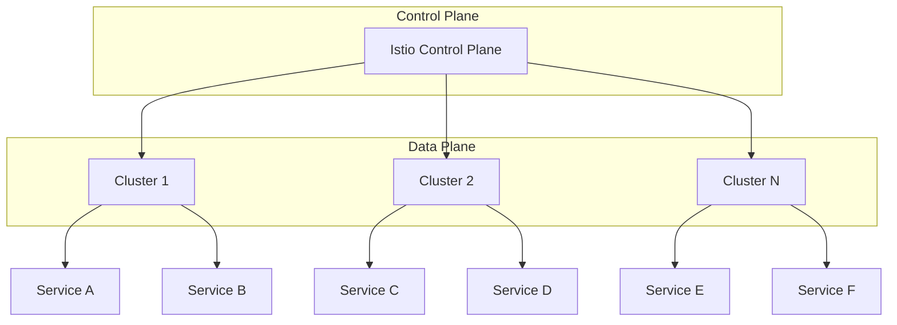
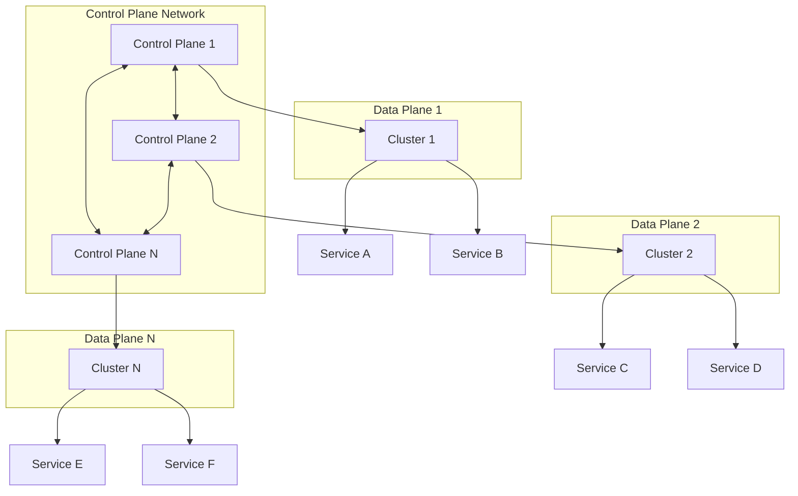
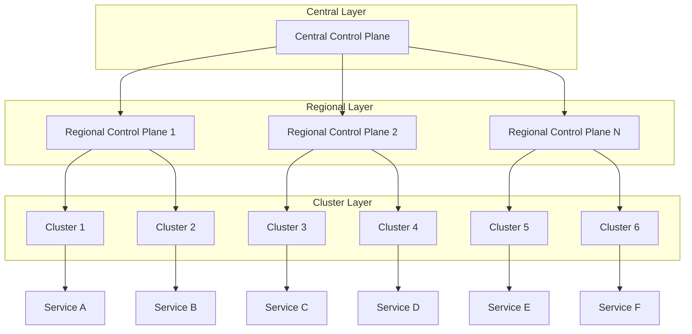

## 多集群部署与服务网格架构设计：构建高可用的跨集群服务治理平台

在现代云原生架构中，多集群部署已成为企业实现高可用性、灾难恢复和地理分布的重要策略。服务网格作为微服务通信的基础设施层，在多集群环境中发挥着关键作用，为跨集群的服务治理提供了统一的解决方案。本章将深入探讨多集群部署与服务网格的架构设计，包括设计原则、架构模式、组件部署以及最佳实践。

### 多集群架构设计原则

设计多集群服务网格架构时，需要遵循一系列核心原则，以确保系统的可靠性、可扩展性和可维护性。

#### 高可用性设计原则

高可用性是多集群架构设计的核心目标：

```yaml
# 高可用性设计原则
# 1. 冗余设计:
#    - 控制平面冗余部署
#    - 数据平面多副本
#    - 跨区域部署策略

# 2. 故障隔离:
#    - 集群间故障隔离
#    - 服务间故障隔离
#    - 网络故障隔离

# 3. 自动恢复:
#    - 自动故障检测
#    - 自动故障转移
#    - 自动服务恢复
```

#### 一致性设计原则

在多集群环境中保持配置和策略的一致性至关重要：

```yaml
# 一致性设计原则
# 1. 配置同步:
#    - 统一配置管理
#    - 配置变更同步
#    - 配置版本控制

# 2. 策略统一:
#    - 安全策略统一
#    - 流量策略统一
#    - 监控策略统一

# 3. 状态同步:
#    - 服务状态同步
#    - 健康状态同步
#    - 指标数据同步
```

#### 可扩展性设计原则

架构应具备良好的可扩展性以适应业务增长：

```yaml
# 可扩展性设计原则
# 1. 水平扩展:
#    - 集群数量扩展
#    - 服务实例扩展
#    - 数据平面扩展

# 2. 弹性伸缩:
#    - 自动扩缩容
#    - 负载自适应
#    - 资源自优化

# 3. 模块化设计:
#    - 组件解耦
#    - 接口标准化
#    - 插件化扩展
```

### 多集群服务网格架构模式

在多集群环境中，有几种常见的服务网格架构模式可供选择。

#### 单控制平面多集群架构

单控制平面架构是最简单的多集群服务网格架构：



该架构的特点和配置示例：

```yaml
# 单控制平面架构配置示例
# 1. 控制平面部署:
apiVersion: install.istio.io/v1alpha1
kind: IstioOperator
metadata:
  name: istio-control-plane
spec:
  profile: minimal
  components:
    pilot:
      enabled: true
    ingressGateways:
    - name: istio-ingressgateway
      enabled: true
  values:
    global:
      multiCluster:
        clusterName: primary
---
# 2. 远程集群配置:
apiVersion: install.istio.io/v1alpha1
kind: IstioOperator
metadata:
  name: istio-remote
spec:
  profile: remote
  values:
    global:
      multiCluster:
        clusterName: cluster-1
      network: network-1
  components:
    ingressGateways:
    - name: istio-ingressgateway
      enabled: true
```

#### 多控制平面架构

多控制平面架构提供更好的高可用性和扩展性：



多控制平面架构的配置示例：

```yaml
# 多控制平面架构配置
# 1. 主控制平面配置:
apiVersion: install.istio.io/v1alpha1
kind: IstioOperator
metadata:
  name: istio-primary
spec:
  profile: demo
  components:
    pilot:
      enabled: true
    ingressGateways:
    - name: istio-ingressgateway
      enabled: true
  values:
    global:
      multiCluster:
        clusterName: primary
      network: network-1
---
# 2. 次控制平面配置:
apiVersion: install.istio.io/v1alpha1
kind: IstioOperator
metadata:
  name: istio-secondary
spec:
  profile: demo
  components:
    pilot:
      enabled: true
    ingressGateways:
    - name: istio-ingressgateway
      enabled: true
  values:
    global:
      multiCluster:
        clusterName: secondary
      network: network-2
```

#### 分层控制平面架构

分层控制平面架构结合了单控制平面和多控制平面的优势：



### 核心组件部署策略

在多集群环境中，服务网格核心组件的部署策略直接影响系统的性能和可靠性。

#### 控制平面部署策略

控制平面是服务网格的大脑，其部署策略需要仔细考虑：

```yaml
# 控制平面部署策略
# 1. 高可用部署:
apiVersion: apps/v1
kind: Deployment
metadata:
  name: istiod
  namespace: istio-system
spec:
  replicas: 3
  selector:
    matchLabels:
      istio: pilot
  template:
    metadata:
      labels:
        istio: pilot
    spec:
      containers:
      - name: discovery
        image: docker.io/istio/pilot:1.18.2
        resources:
          requests:
            cpu: 100m
            memory: 256Mi
          limits:
            cpu: 500m
            memory: 1Gi
---
# 2. 跨集群配置同步:
apiVersion: v1
kind: ConfigMap
metadata:
  name: istio-cluster-config
  namespace: istio-system
data:
  mesh: |-
    defaultConfig:
      discoveryAddress: istiod.istio-system.svc:15012
    enableTracing: true
    accessLogFile: /dev/stdout
```

#### 数据平面部署策略

数据平面负责处理服务间通信，其部署策略需要考虑性能和资源利用：

```yaml
# 数据平面部署策略
# 1. Sidecar注入配置:
apiVersion: admissionregistration.k8s.io/v1
kind: MutatingWebhookConfiguration
metadata:
  name: istio-sidecar-injector
webhooks:
- name: sidecar-injector.istio.io
  clientConfig:
    service:
      name: istiod
      namespace: istio-system
      path: "/inject"
  rules:
  - operations: ["CREATE"]
    apiGroups: [""]
    apiVersions: ["v1"]
    resources: ["pods"]
---
# 2. Sidecar资源配置:
apiVersion: v1
kind: ConfigMap
metadata:
  name: sidecar-injector-config
  namespace: istio-system
data:
  config: |-
    policy: enabled
    alwaysInjectSelector:
      - matchLabels:
          sidecar.istio.io/inject: "true"
    neverInjectSelector:
      - matchLabels:
          sidecar.istio.io/inject: "false"
```

#### 网关部署策略

网关是服务网格与外部世界通信的入口：

```yaml
# 网关部署策略
# 1. 多集群网关配置:
apiVersion: networking.istio.io/v1alpha3
kind: Gateway
metadata:
  name: multi-cluster-gateway
spec:
  selector:
    istio: ingressgateway
  servers:
  - port:
      number: 80
      name: http
      protocol: HTTP
    hosts:
    - "*.example.com"
  - port:
      number: 443
      name: https
      protocol: HTTPS
    tls:
      mode: SIMPLE
      serverCertificate: /etc/istio/ingressgateway-certs/tls.crt
      privateKey: /etc/istio/ingressgateway-certs/tls.key
    hosts:
    - "*.example.com"
---
# 2. 网关高可用配置:
apiVersion: apps/v1
kind: Deployment
metadata:
  name: istio-ingressgateway
  namespace: istio-system
spec:
  replicas: 3
  selector:
    matchLabels:
      app: istio-ingressgateway
      istio: ingressgateway
  template:
    metadata:
      annotations:
        sidecar.istio.io/inject: "false"
      labels:
        app: istio-ingressgateway
        istio: ingressgateway
    spec:
      containers:
      - name: istio-proxy
        image: docker.io/istio/proxyv2:1.18.2
        resources:
          requests:
            cpu: 100m
            memory: 128Mi
          limits:
            cpu: 2000m
            memory: 1024Mi
```

### 网络设计与连通性

多集群环境中的网络设计和连通性是架构设计的关键考虑因素。

#### 网络模型设计

合理的网络模型设计能够确保跨集群通信的高效和安全：

```yaml
# 网络模型设计
# 1. 网络标识配置:
apiVersion: install.istio.io/v1alpha1
kind: IstioOperator
metadata:
  name: network-config
spec:
  values:
    global:
      network: network-1
      meshID: mesh1
      multiCluster:
        clusterName: cluster-1
---
# 2. 网络策略配置:
apiVersion: networking.k8s.io/v1
kind: NetworkPolicy
metadata:
  name: istio-control-plane
  namespace: istio-system
spec:
  podSelector:
    matchLabels:
      istio: pilot
  policyTypes:
  - Ingress
  - Egress
  ingress:
  - from:
    - namespaceSelector:
        matchLabels:
          kubernetes.io/metadata.name: istio-system
  egress:
  - to:
    - namespaceSelector:
        matchLabels:
          kubernetes.io/metadata.name: istio-system
```

#### 跨集群通信机制

跨集群通信需要可靠的机制来确保数据传输的安全和高效：

```yaml
# 跨集群通信机制
# 1. 服务入口配置:
apiVersion: networking.istio.io/v1alpha3
kind: ServiceEntry
metadata:
  name: external-svc
spec:
  hosts:
  - external-service.example.com
  location: MESH_EXTERNAL
  ports:
  - number: 80
    name: http
    protocol: HTTP
  resolution: DNS
---
# 2. 目标规则配置:
apiVersion: networking.istio.io/v1alpha3
kind: DestinationRule
metadata:
  name: external-svc-dr
spec:
  host: external-service.example.com
  trafficPolicy:
    connectionPool:
      tcp:
        maxConnections: 100
      http:
        http1MaxPendingRequests: 1000
        maxRequestsPerConnection: 10
    outlierDetection:
      consecutive5xxErrors: 7
      interval: 30s
      baseEjectionTime: 30s
```

### 安全架构设计

在多集群环境中，安全架构设计需要考虑跨集群的身份认证、授权和加密。

#### 身份认证与授权

跨集群的身份认证和授权机制：

```yaml
# 身份认证与授权设计
# 1. 跨集群认证配置:
apiVersion: security.istio.io/v1beta1
kind: PeerAuthentication
metadata:
  name: default
  namespace: istio-system
spec:
  mtls:
    mode: STRICT
---
# 2. 请求认证配置:
apiVersion: security.istio.io/v1beta1
kind: RequestAuthentication
metadata:
  name: jwt-auth
  namespace: istio-system
spec:
  selector:
    matchLabels:
      app: istio-ingressgateway
  jwtRules:
  - issuer: "https://issuer.example.com"
    jwksUri: "https://issuer.example.com/.well-known/jwks.json"
```

#### 证书管理

跨集群的证书管理策略：

```yaml
# 证书管理策略
# 1. 自定义CA配置:
apiVersion: install.istio.io/v1alpha1
kind: IstioOperator
metadata:
  name: custom-ca-config
spec:
  components:
    pilot:
      enabled: true
  values:
    global:
      certificates:
      - secretName: cacerts
        dnsNames: ["istiod.istio-system.svc", "istiod.istio-system"]
---
# 2. 证书轮换策略:
apiVersion: batch/v1
kind: CronJob
metadata:
  name: cert-rotation
  namespace: istio-system
spec:
  schedule: "0 2 * * *"  # 每天凌晨2点执行
  jobTemplate:
    spec:
      template:
        spec:
          containers:
          - name: cert-rotator
            image: istio/cert-rotator:latest
            command:
            - /bin/cert-rotator
            - --rotate
          restartPolicy: OnFailure
```

### 监控与可观察性

多集群环境中的监控和可观察性设计需要考虑数据收集、聚合和展示。

#### 统一监控架构

构建统一的监控架构：

```yaml
# 统一监控架构
# 1. Prometheus联邦配置:
apiVersion: monitoring.coreos.com/v1
kind: Prometheus
metadata:
  name: federated-prometheus
  namespace: monitoring
spec:
  remoteRead:
  - url: http://prometheus-cluster1:9090/api/v1/read
  - url: http://prometheus-cluster2:9090/api/v1/read
---
# 2. 统一Grafana配置:
apiVersion: v1
kind: ConfigMap
metadata:
  name: grafana-datasources
  namespace: monitoring
data:
  prometheus.yaml: |-
    apiVersion: 1
    datasources:
    - name: Prometheus
      type: prometheus
      url: http://prometheus.monitoring:9090
      access: proxy
      isDefault: true
```

#### 分布式追踪

跨集群的分布式追踪配置：

```yaml
# 分布式追踪配置
# 1. Jaeger跨集群配置:
apiVersion: jaegertracing.io/v1
kind: Jaeger
metadata:
  name: jaeger-multi-cluster
spec:
  strategy: production
  collector:
    maxReplicas: 5
    resources:
      limits:
        cpu: 200m
        memory: 512Mi
  storage:
    type: elasticsearch
    options:
      es:
        server-urls: https://elasticsearch:9200
---
# 2. 追踪采样配置:
apiVersion: v1
kind: ConfigMap
metadata:
  name: tracing-config
  namespace: istio-system
data:
  config.yaml: |-
    tracing:
      sampling: 100
      zipkin:
        address: zipkin.istio-system:9411
```

### 最佳实践与建议

在设计和实施多集群服务网格架构时，需要遵循一系列最佳实践。

#### 部署最佳实践

部署过程中的最佳实践：

```bash
# 部署最佳实践
# 1. 渐进式部署:
#    - 先在测试环境验证
#    - 逐步扩展到生产环境
#    - 监控关键指标

# 2. 版本管理:
#    - 使用版本控制管理配置
#    - 实施蓝绿部署策略
#    - 准备回滚方案

# 3. 自动化部署:
#    - 使用GitOps工具
#    - 实施CI/CD流水线
#    - 自动化测试验证
```

#### 运维最佳实践

运维管理中的最佳实践：

```bash
# 运维最佳实践
# 1. 监控告警:
#    - 设置关键指标告警
#    - 建立告警分级机制
#    - 定期审查告警规则

# 2. 故障处理:
#    - 建立标准故障处理流程
#    - 准备应急响应预案
#    - 定期演练故障场景

# 3. 性能优化:
#    - 定期性能评估
#    - 优化资源配置
#    - 实施容量规划
```

### 总结

多集群部署与服务网格架构设计是构建现代云原生应用的关键环节。通过合理的架构设计、组件部署策略和最佳实践，我们可以构建一个高可用、可扩展、安全可靠的跨集群服务治理平台。

关键要点包括：
1. 遵循高可用性、一致性和可扩展性设计原则
2. 选择合适的架构模式（单控制平面、多控制平面或分层架构）
3. 合理部署控制平面、数据平面和网关组件
4. 设计可靠的网络连通性和安全架构
5. 建立统一的监控和可观察性体系
6. 遵循部署和运维最佳实践

随着云原生技术的不断发展，多集群服务网格架构将继续演进，在自动化管理、智能优化、安全增强等方面取得新的突破。通过持续学习和实践，我们可以不断提升多集群服务网格架构的设计和实施能力，为企业数字化转型提供强有力的技术支撑。

通过系统性的架构设计和实施，我们能够：
1. 构建高可用的跨集群服务治理平台
2. 实现统一的服务发现和流量管理
3. 确保跨集群通信的安全性和可靠性
4. 建立全面的监控和故障排查能力
5. 支持业务的快速扩展和创新发展

这不仅有助于当前系统的高效运行，也为未来的技术演进和业务发展奠定了坚实的基础。