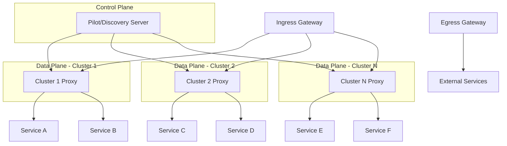

## 多集群流量管理与通信：实现跨集群的智能服务路由

在多集群服务网格环境中，流量管理是确保服务间高效、可靠通信的核心能力。跨集群流量管理不仅需要处理集群内部的服务通信，还需要协调不同集群间的服务调用，实现智能路由、负载均衡、故障转移等功能。本章将深入探讨多集群环境下的流量管理策略、通信机制、配置方法以及最佳实践。

### 多集群流量管理概述

多集群流量管理相较于单集群环境更加复杂，需要考虑跨网络边界的通信、延迟差异、故障处理等因素。

#### 多集群流量管理的挑战

在多集群环境中实施流量管理面临诸多挑战：

```yaml
# 多集群流量管理挑战
# 1. 网络复杂性:
#    - 跨网络通信延迟
#    - 网络分区和故障
#    - 带宽限制和拥塞

# 2. 服务发现:
#    - 跨集群服务发现
#    - 服务实例状态同步
#    - 健康检查机制

# 3. 路由策略:
#    - 地理位置感知路由
#    - 基于延迟的路由决策
#    - 故障转移策略

# 4. 安全性:
#    - 跨集群通信加密
#    - 身份认证和授权
#    - 访问控制策略

# 5. 可观察性:
#    - 统一监控视图
#    - 跨集群追踪
#    - 性能指标收集
```

#### 多集群流量管理的核心组件

多集群流量管理依赖于一系列核心组件的协同工作：



### 跨集群服务发现机制

跨集群服务发现是实现多集群流量管理的基础。

#### 服务注册与同步

跨集群服务注册与同步机制：

```yaml
# 服务注册与同步配置
# 1. 集群本地服务注册:
apiVersion: v1
kind: Service
metadata:
  name: user-service
  namespace: production
  labels:
    app: user-service
    version: v1
spec:
  selector:
    app: user-service
  ports:
  - name: http
    port: 80
    targetPort: 8080
---
# 2. 跨集群服务同步:
apiVersion: networking.istio.io/v1alpha3
kind: ServiceEntry
metadata:
  name: remote-user-service
  namespace: istio-system
spec:
  hosts:
  - user-service.production.global
  location: MESH_INTERNAL
  ports:
  - name: http
    number: 80
    protocol: HTTP
  resolution: DNS
  endpoints:
  - address: user-service.production.svc.cluster.local
    locality: us-central1/us-central1-a
  - address: user-service.production.svc.cluster.remote
    locality: us-west1/us-west1-a
```

#### 健康检查与状态同步

跨集群健康检查和状态同步机制：

```yaml
# 健康检查配置
# 1. 本地健康检查:
apiVersion: v1
kind: Service
metadata:
  name: order-service
  namespace: production
spec:
  selector:
    app: order-service
  ports:
  - name: http
    port: 80
    targetPort: 8080
  type: ClusterIP
---
# 2. 跨集群健康检查:
apiVersion: networking.istio.io/v1alpha3
kind: WorkloadEntry
metadata:
  name: remote-order-service
  namespace: production
spec:
  address: 10.10.10.10
  ports:
    http: 80
  labels:
    app: order-service
    version: v2
  locality: us-west1/us-west1-a
  weight: 1
---
# 3. 健康检查策略:
apiVersion: networking.istio.io/v1alpha3
kind: WorkloadGroup
metadata:
  name: order-service-group
  namespace: production
spec:
  metadata:
    labels:
      app: order-service
  template:
    ports:
      http: 8080
    serviceAccount: order-service-sa
  probe:
    initialDelaySeconds: 5
    timeoutSeconds: 3
    periodSeconds: 30
    successThreshold: 1
    failureThreshold: 3
    httpGet:
      path: /health
      port: 8080
```

### 跨集群路由策略

跨集群路由策略是实现智能流量管理的关键。

#### 基于地理位置的路由

基于地理位置的路由策略能够优化用户体验：

```yaml
# 地理位置路由配置
# 1. 网关配置:
apiVersion: networking.istio.io/v1alpha3
kind: Gateway
metadata:
  name: geo-routing-gateway
spec:
  selector:
    istio: ingressgateway
  servers:
  - port:
      number: 80
      name: http
      protocol: HTTP
    hosts:
    - "*.example.com"
---
# 2. 虚拟服务配置:
apiVersion: networking.istio.io/v1alpha3
kind: VirtualService
metadata:
  name: geo-based-routing
spec:
  hosts:
  - user-service.example.com
  gateways:
  - geo-routing-gateway
  http:
  - match:
    - headers:
        geo-location:
          exact: "us-central"
    route:
    - destination:
        host: user-service.production.svc.cluster.local
        subset: us-central
  - match:
    - headers:
        geo-location:
          exact: "us-west"
    route:
    - destination:
        host: user-service.production.svc.cluster.remote
        subset: us-west
  - route:
    - destination:
        host: user-service.production.svc.cluster.local
        subset: default
---
# 3. 目标规则配置:
apiVersion: networking.istio.io/v1alpha3
kind: DestinationRule
metadata:
  name: user-service-dr
spec:
  host: user-service.production.svc.cluster.local
  subsets:
  - name: us-central
    labels:
      region: us-central1
  - name: us-west
    labels:
      region: us-west1
  - name: default
    labels:
      version: v1
```

#### 基于延迟的路由

基于延迟的路由策略能够优化性能：

```yaml
# 基于延迟的路由配置
# 1. 负载均衡策略:
apiVersion: networking.istio.io/v1alpha3
kind: DestinationRule
metadata:
  name: latency-based-routing
spec:
  host: order-service.production.global
  trafficPolicy:
    loadBalancer:
      localityLbSetting:
        enabled: true
        distribute:
        - from: us-central1/*
          to:
            "us-central1/*": 80
            "us-west1/*": 20
        - from: us-west1/*
          to:
            "us-west1/*": 80
            "us-central1/*": 20
    outlierDetection:
      consecutive5xxErrors: 5
      interval: 10s
      baseEjectionTime: 30s
---
# 2. 智能路由配置:
apiVersion: networking.istio.io/v1alpha3
kind: VirtualService
metadata:
  name: smart-routing
spec:
  hosts:
  - payment-service.production.global
  http:
  - route:
    - destination:
        host: payment-service.production.svc.cluster.local
      weight: 70
    - destination:
        host: payment-service.production.svc.cluster.remote
      weight: 30
    retries:
      attempts: 3
      perTryTimeout: 2s
      retryOn: connect-failure,refused-stream
```

#### 故障转移策略

故障转移策略确保服务的高可用性：

```yaml
# 故障转移配置
# 1. 主备路由配置:
apiVersion: networking.istio.io/v1alpha3
kind: VirtualService
metadata:
  name: failover-routing
spec:
  hosts:
  - inventory-service.production.global
  http:
  - route:
    - destination:
        host: inventory-service.production.svc.cluster.local
      weight: 100
    - destination:
        host: inventory-service.production.svc.cluster.backup
      weight: 0
    timeout: 5s
    retries:
      attempts: 2
      perTryTimeout: 2s
      retryOn: gateway-error,connect-failure
    fault:
      delay:
        percentage:
          value: 0.1
        fixedDelay: 5s
---
# 2. 条件故障转移:
apiVersion: networking.istio.io/v1alpha3
kind: VirtualService
metadata:
  name: conditional-failover
spec:
  hosts:
  - catalog-service.production.global
  http:
  - match:
    - headers:
        user-type:
          exact: "premium"
    route:
    - destination:
        host: catalog-service.production.svc.cluster.premium
  - route:
    - destination:
        host: catalog-service.production.svc.cluster.local
      weight: 90
    - destination:
        host: catalog-service.production.svc.cluster.backup
      weight: 10
    retries:
      attempts: 3
      perTryTimeout: 1s
      retryOn: "5xx"
```

### 跨集群通信安全

跨集群通信安全是保障服务网格安全的重要环节。

#### 通信加密

跨集群通信加密配置：

```yaml
# 通信加密配置
# 1. mTLS配置:
apiVersion: security.istio.io/v1beta1
kind: PeerAuthentication
metadata:
  name: default
  namespace: istio-system
spec:
  mtls:
    mode: STRICT
---
# 2. 跨集群mTLS:
apiVersion: security.istio.io/v1beta1
kind: DestinationRule
metadata:
  name: cross-cluster-mtls
spec:
  host: "*.global"
  trafficPolicy:
    tls:
      mode: ISTIO_MUTUAL
    portLevelSettings:
    - port:
        number: 80
      tls:
        mode: ISTIO_MUTUAL
---
# 3. 证书管理:
apiVersion: cert-manager.io/v1
kind: Certificate
metadata:
  name: cross-cluster-cert
  namespace: istio-system
spec:
  secretName: cross-cluster-tls
  issuerRef:
    name: cluster-issuer
    kind: ClusterIssuer
  commonName: "*.global"
  dnsNames:
  - "*.global"
  - "*.cluster.local"
```

#### 身份认证与授权

跨集群身份认证与授权配置：

```yaml
# 身份认证与授权配置
# 1. 请求认证:
apiVersion: security.istio.io/v1beta1
kind: RequestAuthentication
metadata:
  name: jwt-auth
  namespace: istio-system
spec:
  selector:
    matchLabels:
      app: istio-ingressgateway
  jwtRules:
  - issuer: "https://accounts.google.com"
    jwksUri: "https://www.googleapis.com/oauth2/v3/certs"
---
# 2. 授权策略:
apiVersion: security.istio.io/v1beta1
kind: AuthorizationPolicy
metadata:
  name: cross-cluster-authz
  namespace: production
spec:
  selector:
    matchLabels:
      app: user-service
  rules:
  - from:
    - source:
        principals: ["cluster.local/ns/production/sa/user-service-sa"]
    - source:
        namespaces: ["production"]
    to:
    - operation:
        methods: ["GET", "POST"]
        paths: ["/api/*"]
    when:
    - key: request.auth.claims[groups]
      values: ["users", "admins"]
```

### 流量控制与限流

跨集群流量控制和限流策略保障系统的稳定性。

#### 限流策略

跨集群限流策略配置：

```yaml
# 限流策略配置
# 1. 本地限流:
apiVersion: networking.istio.io/v1alpha3
kind: EnvoyFilter
metadata:
  name: local-rate-limit
  namespace: production
spec:
  workloadSelector:
    labels:
      app: user-service
  configPatches:
  - applyTo: HTTP_FILTER
    match:
      context: SIDECAR_INBOUND
      listener:
        filterChain:
          filter:
            name: "envoy.filters.network.http_connection_manager"
    patch:
      operation: INSERT_BEFORE
      value:
        name: envoy.filters.http.local_ratelimit
        typed_config:
          "@type": type.googleapis.com/envoy.extensions.filters.http.local_ratelimit.v3.LocalRateLimit
          stat_prefix: http_local_rate_limiter
          token_bucket:
            max_tokens: 1000
            tokens_per_fill: 100
            fill_interval: 1s
          filter_enabled:
            runtime_key: local_rate_limit_enabled
            default_value:
              numerator: 100
              denominator: HUNDRED
---
# 2. 全局限流:
apiVersion: networking.istio.io/v1alpha3
kind: EnvoyFilter
metadata:
  name: global-rate-limit
  namespace: istio-system
spec:
  configPatches:
  - applyTo: HTTP_FILTER
    match:
      context: GATEWAY
      listener:
        filterChain:
          filter:
            name: "envoy.filters.network.http_connection_manager"
    patch:
      operation: INSERT_BEFORE
      value:
        name: envoy.filters.http.ratelimit
        typed_config:
          "@type": type.googleapis.com/envoy.extensions.filters.http.ratelimit.v3.RateLimit
          domain: production
          rate_limit_service:
            grpc_service:
              envoy_grpc:
                cluster_name: rate_limit_service
              timeout: 100ms
```

#### 断路器配置

跨集群断路器配置：

```yaml
# 断路器配置
# 1. 基础断路器:
apiVersion: networking.istio.io/v1alpha3
kind: DestinationRule
metadata:
  name: circuit-breaker
spec:
  host: payment-service.production.global
  trafficPolicy:
    connectionPool:
      tcp:
        maxConnections: 100
        connectTimeout: 30ms
      http:
        http1MaxPendingRequests: 1000
        maxRequestsPerConnection: 10
        maxRetries: 3
    outlierDetection:
      consecutive5xxErrors: 7
      interval: 30s
      baseEjectionTime: 30s
      maxEjectionPercent: 10
---
# 2. 高级断路器:
apiVersion: networking.istio.io/v1alpha3
kind: DestinationRule
metadata:
  name: advanced-circuit-breaker
spec:
  host: order-service.production.global
  trafficPolicy:
    connectionPool:
      tcp:
        maxConnections: 200
        connectTimeout: 50ms
        tcpKeepalive:
          time: 7200s
          interval: 75s
      http:
        http1MaxPendingRequests: 2000
        maxRequestsPerConnection: 20
        maxRetries: 5
        idleTimeout: 60s
    outlierDetection:
      consecutive5xxErrors: 5
      consecutiveGatewayErrors: 5
      interval: 60s
      baseEjectionTime: 60s
      maxEjectionPercent: 20
      minHealthPercent: 20
```

### 监控与可观察性

跨集群流量管理的监控和可观察性配置。

#### 统一监控配置

统一监控配置实现跨集群指标收集：

```yaml
# 统一监控配置
# 1. Prometheus配置:
apiVersion: monitoring.coreos.com/v1
kind: Prometheus
metadata:
  name: multi-cluster-prometheus
  namespace: monitoring
spec:
  serviceAccountName: prometheus
  serviceMonitorSelector:
    matchLabels:
      team: frontend
  ruleSelector:
    matchLabels:
      team: frontend
  resources:
    requests:
      memory: 400Mi
  retention: 30d
  storage:
    volumeClaimTemplate:
      spec:
        resources:
          requests:
            storage: 50Gi
---
# 2. 跨集群指标收集:
apiVersion: monitoring.coreos.com/v1
kind: ServiceMonitor
metadata:
  name: istio-mesh-monitor
  namespace: monitoring
  labels:
    team: frontend
spec:
  selector:
    matchLabels:
      istio: mixer
  namespaceSelector:
    matchNames:
    - istio-system
  endpoints:
  - port: http-monitoring
    path: /metrics
    interval: 15s
```

#### 分布式追踪配置

跨集群分布式追踪配置：

```yaml
# 分布式追踪配置
# 1. Jaeger配置:
apiVersion: jaegertracing.io/v1
kind: Jaeger
metadata:
  name: jaeger-multi-cluster
  namespace: istio-system
spec:
  strategy: production
  collector:
    maxReplicas: 5
    resources:
      limits:
        cpu: 200m
        memory: 512Mi
  storage:
    type: elasticsearch
    options:
      es:
        server-urls: https://elasticsearch:9200
---
# 2. 追踪采样配置:
apiVersion: v1
kind: ConfigMap
metadata:
  name: tracing-config
  namespace: istio-system
data:
  config.yaml: |-
    tracing:
      sampling: 100
      zipkin:
        address: zipkin.istio-system:9411
```

### 最佳实践与建议

实施多集群流量管理的最佳实践。

#### 配置管理最佳实践

配置管理的最佳实践：

```bash
# 配置管理最佳实践
# 1. 版本控制:
#    - 使用Git管理配置
#    - 实施分支策略
#    - 自动化部署流程

# 2. 环境隔离:
#    - 不同环境使用不同配置
#    - 命名空间隔离
#    - 标签和注解管理

# 3. 配置验证:
#    - 预部署验证
#    - 金丝雀发布
#    - 回滚机制
```

#### 性能优化建议

性能优化的建议：

```bash
# 性能优化建议
# 1. 资源优化:
#    - 合理设置资源请求和限制
#    - 优化Sidecar资源配置
#    - 实施自动扩缩容

# 2. 网络优化:
#    - 减少跨集群调用
#    - 优化网络路径
#    - 使用缓存减少调用

# 3. 监控优化:
#    - 合理设置采样率
#    - 优化指标收集
#    - 实施告警分级
```

#### 故障处理建议

故障处理的最佳建议：

```bash
# 故障处理建议
# 1. 快速响应:
#    - 建立7x24小时值班制度
#    - 设置故障响应SLA
#    - 建立应急联系机制

# 2. 分级处理:
#    - P1: 严重影响业务，需立即处理
#    - P2: 影响部分业务，需尽快处理
#    - P3: 轻微影响，可计划处理
#    - P4: 一般问题，可后续处理

# 3. 文档记录:
#    - 详细记录故障处理过程
#    - 分析根本原因
#    - 制定预防措施
#    - 更新知识库
```

### 总结

多集群流量管理与通信是构建高可用、高性能服务网格的关键环节。通过合理的服务发现机制、智能路由策略、安全保障措施、流量控制手段以及完善的监控体系，我们可以实现跨集群的高效服务通信。

关键要点包括：
1. 理解多集群流量管理的挑战和核心组件
2. 实施跨集群服务发现和健康检查机制
3. 配置基于地理位置、延迟和故障的路由策略
4. 保障跨集群通信的安全性
5. 实施有效的流量控制和限流策略
6. 建立统一的监控和可观察性体系
7. 遵循配置管理和故障处理最佳实践

随着云原生技术的不断发展，多集群流量管理将继续演进，在AI驱动的智能路由、预测性故障处理、自动化优化等方面取得新的突破。通过持续学习和实践，我们可以不断提升多集群流量管理能力，为业务发展提供强有力的技术支撑。

通过系统性的流量管理和通信优化，我们能够：
1. 实现跨集群的高效服务通信
2. 优化用户体验和系统性能
3. 保障服务的高可用性和可靠性
4. 提升系统的安全性和可维护性
5. 支持业务的快速扩展和创新发展

这不仅有助于当前系统的高效运行，也为未来的技术演进和业务发展奠定了坚实的基础。