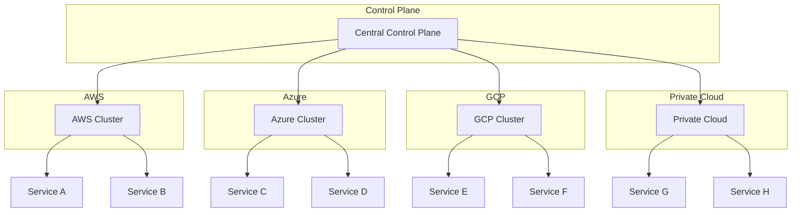
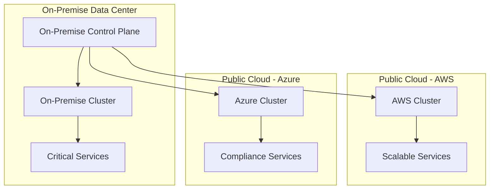

## 多云环境中的服务网格应用：构建跨云平台的统一服务治理平台

随着企业数字化转型的深入，多云战略已成为现代IT架构的重要组成部分。企业通过在多个云平台间分布工作负载，实现高可用性、避免供应商锁定、优化成本并满足合规要求。服务网格作为云原生应用的核心基础设施，在多云环境中发挥着关键作用，为跨云平台的服务治理提供了统一的解决方案。本章将深入探讨多云环境中的服务网格应用，包括架构设计、部署策略、挑战应对以及最佳实践。

### 多云环境概述

多云环境是指企业同时使用多个云服务提供商的服务来满足不同的业务需求。

#### 多云战略的驱动因素

企业采用多云战略主要有以下几个驱动因素：

```yaml
# 多云战略驱动因素
# 1. 避免供应商锁定:
#    - 防止对单一供应商的依赖
#    - 保持谈判优势
#    - 灵活选择最佳服务

# 2. 优化成本:
#    - 利用不同云平台的价格优势
#    - 按需选择服务
#    - 避免单一平台的高昂费用

# 3. 满足合规要求:
#    - 数据主权法规
#    - 行业特定合规标准
#    - 地理位置要求

# 4. 提高可用性和容错性:
#    - 跨云平台冗余
#    - 灾难恢复能力
#    - 业务连续性保障

# 5. 利用最佳技术:
#    - 选择各云平台的优势服务
#    - 获得最新技术能力
#    - 满足特定业务需求
```

#### 多云环境的挑战

在多云环境中部署和管理服务网格面临诸多挑战：

```yaml
# 多云环境挑战
# 1. 网络复杂性:
#    - 跨云网络连通性
#    - 网络延迟和带宽限制
#    - 安全网络边界管理

# 2. 安全性:
#    - 跨云身份认证
#    - 统一安全策略
#    - 数据保护和隐私

# 3. 管理复杂性:
#    - 多平台统一管理
#    - 配置一致性
#    - 监控和故障排查

# 4. 成本控制:
#    - 跨云成本可见性
#    - 资源优化
#    - 预算管理

# 5. 技术兼容性:
#    - 不同云平台的差异
#    - API和工具链兼容性
#    - 标准化挑战
```

### 多云服务网格架构

在多云环境中设计服务网格架构需要考虑跨平台的统一性和各平台的特殊性。

#### 架构设计原则

多云服务网格架构设计应遵循以下原则：

```yaml
# 多云服务网格架构设计原则
# 1. 统一控制平面:
#    - 集中管理策略和配置
#    - 统一身份认证和授权
#    - 跨云服务发现

# 2. 分布式数据平面:
#    - 每个云平台部署数据平面
#    - 本地化流量处理
#    - 最小化跨云通信

# 3. 标准化接口:
#    - 使用标准API和协议
#    - 抽象云平台差异
#    - 保持可移植性

# 4. 安全边界:
#    - 明确安全责任划分
#    - 实施零信任安全模型
#    - 加密跨云通信

# 5. 可观察性:
#    - 统一监控和日志
#    - 跨云追踪能力
#    - 统一告警机制
```

#### 多云架构模式

在多云环境中，有几种常见的服务网格架构模式：



#### 混合云架构

混合云架构结合了公有云和私有云的优势：



### 多云部署策略

在多云环境中部署服务网格需要考虑各云平台的特点和限制。

#### 跨云控制平面部署

跨云控制平面的部署策略：

```yaml
# 跨云控制平面部署
# 1. 集中式部署:
apiVersion: install.istio.io/v1alpha1
kind: IstioOperator
metadata:
  name: central-control-plane
spec:
  profile: minimal
  components:
    pilot:
      enabled: true
      k8s:
        replicaCount: 3
        resources:
          requests:
            cpu: 100m
            memory: 256Mi
          limits:
            cpu: 500m
            memory: 1Gi
  values:
    global:
      multiCluster:
        enabled: true
        clusterName: central
      network: central-network
      meshID: multi-cloud-mesh
---
# 2. 远程集群配置:
apiVersion: install.istio.io/v1alpha1
kind: IstioOperator
metadata:
  name: aws-cluster-config
spec:
  profile: remote
  values:
    global:
      multiCluster:
        enabled: true
        clusterName: aws-cluster
      network: aws-network
      meshID: multi-cloud-mesh
```

#### 数据平面部署

各云平台数据平面的部署策略：

```yaml
# 数据平面部署配置
# 1. AWS集群配置:
apiVersion: install.istio.io/v1alpha1
kind: IstioOperator
metadata:
  name: aws-data-plane
spec:
  profile: minimal
  components:
    ingressGateways:
    - name: istio-ingressgateway
      enabled: true
      k8s:
        service:
          ports:
          - port: 80
            targetPort: 8080
            name: http2
          - port: 443
            targetPort: 8443
            name: https
          - port: 15021
            targetPort: 15021
            name: status-port
          - port: 15443
            targetPort: 15443
            name: tls
---
# 2. Azure集群配置:
apiVersion: install.istio.io/v1alpha1
kind: IstioOperator
metadata:
  name: azure-data-plane
spec:
  profile: minimal
  components:
    ingressGateways:
    - name: istio-ingressgateway
      enabled: true
      k8s:
        service:
          type: LoadBalancer
          annotations:
            service.beta.kubernetes.io/azure-load-balancer-internal: "false"
---
# 3. GCP集群配置:
apiVersion: install.istio.io/v1alpha1
kind: IstioOperator
metadata:
  name: gcp-data-plane
spec:
  profile: minimal
  components:
    ingressGateways:
    - name: istio-ingressgateway
      enabled: true
      k8s:
        service:
          type: LoadBalancer
          annotations:
            cloud.google.com/neg: '{"ingress": true}'
```

### 跨云网络连接

跨云网络连接是多云服务网格的关键基础设施。

#### 网络连接方案

实现跨云网络连接的几种方案：

```yaml
# 网络连接方案
# 1. VPN连接:
apiVersion: networking.istio.io/v1alpha3
kind: ServiceEntry
metadata:
  name: cross-cloud-vpn
spec:
  hosts:
  - "*.internal.example.com"
  location: MESH_INTERNAL
  ports:
  - number: 80
    name: http
    protocol: HTTP
  resolution: DNS
  endpoints:
  - address: 10.0.0.1  # AWS VPN endpoint
    locality: aws/us-east-1
  - address: 10.1.0.1  # Azure VPN endpoint
    locality: azure/eastus
  - address: 10.2.0.1  # GCP VPN endpoint
    locality: gcp/us-central1
---
# 2. 专线连接:
apiVersion: networking.istio.io/v1alpha3
kind: ServiceEntry
metadata:
  name: cross-cloud-direct-connect
spec:
  hosts:
  - "*.enterprise.example.com"
  location: MESH_INTERNAL
  ports:
  - number: 443
    name: https
    protocol: HTTPS
  resolution: STATIC
  endpoints:
  - address: 203.0.113.1  # AWS Direct Connect
    locality: aws/us-west-2
  - address: 198.51.100.1  # Azure ExpressRoute
    locality: azure/westus
  - address: 192.0.2.1  # GCP Interconnect
    locality: gcp/us-west1
```

#### 网络策略管理

跨云网络策略的统一管理：

```yaml
# 网络策略配置
# 1. 统一网络策略:
apiVersion: networking.k8s.io/v1
kind: NetworkPolicy
metadata:
  name: multi-cloud-policy
  namespace: production
spec:
  podSelector:
    matchLabels:
      app: user-service
  policyTypes:
  - Ingress
  - Egress
  ingress:
  - from:
    - namespaceSelector:
        matchLabels:
          kubernetes.io/metadata.name: production
    - ipBlock:
        cidr: 10.0.0.0/8  # AWS CIDR
    - ipBlock:
        cidr: 10.1.0.0/8  # Azure CIDR
    - ipBlock:
        cidr: 10.2.0.0/8  # GCP CIDR
  egress:
  - to:
    - namespaceSelector:
        matchLabels:
          kubernetes.io/metadata.name: production
```

### 跨云安全策略

在多云环境中实施统一的安全策略是保障服务网格安全的关键。

#### 身份认证与授权

跨云身份认证与授权机制：

```yaml
# 跨云身份认证配置
# 1. 统一身份提供商:
apiVersion: security.istio.io/v1beta1
kind: RequestAuthentication
metadata:
  name: multi-cloud-jwt
  namespace: istio-system
spec:
  selector:
    matchLabels:
      app: istio-ingressgateway
  jwtRules:
  - issuer: "https://auth.example.com"
    jwksUri: "https://auth.example.com/.well-known/jwks.json"
    forwardOriginalToken: true
---
# 2. 跨云授权策略:
apiVersion: security.istio.io/v1beta1
kind: AuthorizationPolicy
metadata:
  name: multi-cloud-authz
  namespace: production
spec:
  selector:
    matchLabels:
      app: user-service
  rules:
  - from:
    - source:
        principals: ["*.example.com/*"]
    to:
    - operation:
        methods: ["GET", "POST"]
        paths: ["/api/*"]
    when:
    - key: request.auth.claims[groups]
      values: ["users", "admins"]
```

#### 通信加密

跨云通信加密策略：

```yaml
# 通信加密配置
# 1. 跨云mTLS:
apiVersion: security.istio.io/v1beta1
kind: PeerAuthentication
metadata:
  name: multi-cloud-mtls
  namespace: istio-system
spec:
  mtls:
    mode: STRICT
---
# 2. 目标规则配置:
apiVersion: networking.istio.io/v1alpha3
kind: DestinationRule
metadata:
  name: cross-cloud-encryption
spec:
  host: "*.global"
  trafficPolicy:
    tls:
      mode: ISTIO_MUTUAL
    portLevelSettings:
    - port:
        number: 80
      tls:
        mode: ISTIO_MUTUAL
```

### 监控与可观察性

在多云环境中建立统一的监控和可观察性体系。

#### 统一监控架构

构建跨云平台的统一监控架构：

```yaml
# 统一监控架构配置
# 1. Prometheus联邦:
apiVersion: monitoring.coreos.com/v1
kind: Prometheus
metadata:
  name: federated-prometheus
  namespace: monitoring
spec:
  remoteRead:
  - url: http://prometheus-aws:9090/api/v1/read
    name: aws-prometheus
  - url: http://prometheus-azure:9090/api/v1/read
    name: azure-prometheus
  - url: http://prometheus-gcp:9090/api/v1/read
    name: gcp-prometheus
---
# 2. 统一Grafana配置:
apiVersion: v1
kind: ConfigMap
metadata:
  name: grafana-datasources
  namespace: monitoring
data:
  datasources.yaml: |-
    apiVersion: 1
    datasources:
    - name: AWS Prometheus
      type: prometheus
      url: http://prometheus-aws.monitoring:9090
      access: proxy
      isDefault: false
    - name: Azure Prometheus
      type: prometheus
      url: http://prometheus-azure.monitoring:9090
      access: proxy
      isDefault: false
    - name: GCP Prometheus
      type: prometheus
      url: http://prometheus-gcp.monitoring:9090
      access: proxy
      isDefault: false
    - name: Federated Prometheus
      type: prometheus
      url: http://federated-prometheus.monitoring:9090
      access: proxy
      isDefault: true
```

#### 跨云追踪

实现跨云平台的分布式追踪：

```yaml
# 跨云追踪配置
# 1. 集中化Jaeger:
apiVersion: jaegertracing.io/v1
kind: Jaeger
metadata:
  name: centralized-jaeger
  namespace: istio-system
spec:
  strategy: production
  collector:
    maxReplicas: 5
    resources:
      limits:
        cpu: 200m
        memory: 512Mi
  storage:
    type: elasticsearch
    options:
      es:
        server-urls: https://elasticsearch.multi-cloud:9200
---
# 2. 追踪采样配置:
apiVersion: v1
kind: ConfigMap
metadata:
  name: tracing-config
  namespace: istio-system
data:
  config.yaml: |-
    tracing:
      sampling: 100
      zipkin:
        address: zipkin.istio-system:9411
```

### 成本管理与优化

在多云环境中有效管理服务网格的成本。

#### 成本监控

跨云成本监控和分析：

```yaml
# 成本监控配置
# 1. 成本指标收集:
apiVersion: monitoring.coreos.com/v1
kind: ServiceMonitor
metadata:
  name: cost-metrics
  namespace: monitoring
spec:
  selector:
    matchLabels:
      app: cost-analyzer
  endpoints:
  - port: http
    path: /metrics
    interval: 60s
---
# 2. 成本告警规则:
apiVersion: monitoring.coreos.com/v1
kind: PrometheusRule
metadata:
  name: cost-alerts
  namespace: monitoring
spec:
  groups:
  - name: cost.rules
    rules:
    - alert: HighServiceMeshCost
      expr: |
        sum(rate(istio_proxy_cpu_usage_seconds_total[5m])) * 0.05 > 100
      for: 10m
      labels:
        severity: warning
      annotations:
        summary: "High service mesh cost detected"
        description: "Service mesh cost is above $100 per hour"
```

#### 资源优化

跨云资源优化策略：

```bash
# 资源优化策略
# 1. 自动扩缩容:
kubectl autoscale deployment user-service -n production --cpu-percent=70 --min=3 --max=20

# 2. 资源请求优化:
kubectl patch deployment user-service -n production -p '{"spec":{"template":{"spec":{"containers":[{"name":"user-service","resources":{"requests":{"cpu":"50m","memory":"128Mi"},"limits":{"cpu":"200m","memory":"512Mi"}}}]}}}}'

# 3. Sidecar资源优化:
kubectl patch sidecar default -n production -p '{"spec":{"egress":[{"hosts":["istio-system/*","production/*"]}],"ingress":[{"port":{"number":80,"protocol":"HTTP","name":"http"},"defaultEndpoint":"127.0.0.1:8080"}]}}' --type=merge
```

### 最佳实践与建议

在多云环境中实施服务网格的最佳实践。

#### 部署最佳实践

部署过程中的最佳实践：

```bash
# 部署最佳实践
# 1. 渐进式部署:
#    - 先在单一云平台验证
#    - 逐步扩展到多云环境
#    - 监控关键指标

# 2. 标准化配置:
#    - 使用统一的配置模板
#    - 实施配置版本控制
#    - 自动化配置部署

# 3. 灾难恢复:
#    - 制定跨云灾难恢复计划
#    - 定期演练恢复流程
#    - 保持备份和恢复能力
```

#### 运维最佳实践

运维管理中的最佳实践：

```bash
# 运维最佳实践
# 1. 统一监控:
#    - 建立跨云统一监控视图
#    - 设置关键指标告警
#    - 实施告警分级机制

# 2. 安全管理:
#    - 实施零信任安全模型
#    - 定期安全审计
#    - 及时更新安全补丁

# 3. 性能优化:
#    - 定期性能评估
#    - 优化资源配置
#    - 实施容量规划
```

#### 故障处理最佳实践

故障处理的最佳实践：

```bash
# 故障处理最佳实践
# 1. 快速响应:
#    - 建立7x24小时值班制度
#    - 设置故障响应SLA
#    - 建立应急联系机制

# 2. 分级处理:
#    - P1: 严重影响业务，需立即处理
#    - P2: 影响部分业务，需尽快处理
#    - P3: 轻微影响，可计划处理
#    - P4: 一般问题，可后续处理

# 3. 文档记录:
#    - 详细记录故障处理过程
#    - 分析根本原因
#    - 制定预防措施
#    - 更新知识库
```

### 案例研究

通过实际案例学习多云服务网格的应用。

#### 案例一：金融行业多云部署

金融行业多云服务网格部署案例：

```bash
# 金融行业案例
# 1. 业务需求:
#    - 高可用性和灾难恢复
#    - 满足金融行业合规要求
#    - 优化成本结构

# 2. 架构设计:
#    - AWS用于弹性扩展
#    - Azure用于合规服务
#    - 私有云用于核心业务

# 3. 实施效果:
#    - 系统可用性提升至99.99%
#    - 合规要求完全满足
#    - 成本降低15%
```

#### 案例二：电商行业混合云部署

电商行业混合云服务网格部署案例：

```bash
# 电商行业案例
# 1. 业务需求:
#    - 应对流量高峰
#    - 保障数据安全
#    - 快速业务创新

# 2. 架构设计:
#    - 私有云处理核心业务
#    - AWS处理促销活动
#    - GCP处理数据分析

# 3. 实施效果:
#    - 支持双11等大促活动
#    - 数据安全完全保障
#    - 新业务上线时间缩短50%
```

### 未来发展趋势

多云服务网格的未来发展趋势。

#### 技术发展趋势

多云服务网格的技术发展趋势：

```yaml
# 技术发展趋势
# 1. 标准化:
#    - 服务网格接口标准化
#    - 跨云API统一
#    - 互操作性增强

# 2. 智能化:
#    - AI驱动的流量管理
#    - 自动化故障处理
#    - 预测性性能优化

# 3. 简化化:
#    - 简化部署和管理
#    - 降低运维复杂度
#    - 提升用户体验
```

#### 市场发展趋势

多云服务网格的市场发展趋势：

```yaml
# 市场发展趋势
# 1. 增长态势:
#    - 市场规模持续扩大
#    - 企业采用率快速提升
#    - 投资热度不断增加

# 2. 竞争格局:
#    - 开源方案主导市场
#    - 商业化产品快速发展
#    - 云厂商深度集成

# 3. 应用场景:
#    - 从互联网向传统行业扩展
#    - 从大型企业向中小企业普及
#    - 从试点应用向生产环境迁移
```

### 总结

多云环境中的服务网格应用是构建现代云原生架构的重要组成部分。通过合理的架构设计、部署策略、安全措施、监控体系以及最佳实践，我们可以构建一个跨云平台的统一服务治理平台。

关键要点包括：
1. 理解多云战略的驱动因素和挑战
2. 设计符合多云环境的服务网格架构
3. 实施跨云的控制平面和数据平面部署
4. 建立可靠的跨云网络连接机制
5. 实施统一的安全策略和通信加密
6. 构建跨云的监控和可观察性体系
7. 有效管理多云环境中的成本
8. 遵循部署、运维和故障处理最佳实践

随着云原生技术的不断发展，多云服务网格将继续演进，在标准化、智能化、简化化等方面取得新的突破。通过持续学习和实践，我们可以不断提升多云服务网格的实施能力，为企业数字化转型提供强有力的技术支撑。

通过系统性的多云服务网格应用，我们能够：
1. 构建跨云平台的统一服务治理平台
2. 实现高可用性和灾难恢复能力
3. 满足多样化的合规要求
4. 优化成本结构和资源利用
5. 支持业务的快速创新和发展

这不仅有助于当前系统的高效运行，也为未来的技术演进和业务发展奠定了坚实的基础。