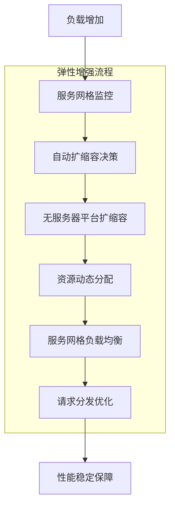

## 结合服务网格与无服务器架构实现弹性与可扩展性：构建高可用的现代化应用平台

在现代云原生应用开发中，弹性与可扩展性是确保系统稳定运行和业务持续发展的关键因素。无服务器架构天然具备弹性伸缩能力，而服务网格则为服务间通信提供了强大的治理能力。通过将两者有机结合，我们可以构建一个既具备自动弹性伸缩能力，又拥有完善服务治理机制的现代化应用平台。本章将深入探讨如何结合服务网格与无服务器架构实现弹性与可扩展性，包括设计原则、技术实现、优化策略以及最佳实践。

### 弹性与可扩展性的核心概念

理解弹性与可扩展性的核心概念是构建高可用系统的基础。

#### 弹性的定义与特征

弹性是指系统在面对负载变化时能够自动调整资源以维持稳定性能的能力：

```yaml
# 弹性的核心特征
# 1. 自动扩缩容:
#    - 根据负载自动增加资源
#    - 负载降低时自动释放资源
#    - 无需人工干预

# 2. 快速响应:
#    - 秒级扩缩容响应
#    - 实时负载监控
#    - 动态资源分配

# 3. 成本优化:
#    - 按需使用资源
#    - 无空闲资源浪费
#    - 精确成本控制

# 4. 高可用性:
#    - 故障自动恢复
#    - 多实例冗余
#    - 负载均衡分发
```

#### 可扩展性的定义与特征

可扩展性是指系统能够通过增加资源来处理更大负载的能力：

```yaml
# 可扩展性的核心特征
# 1. 水平扩展:
#    - 增加实例数量
#    - 分布式处理能力
#    - 负载分片机制

# 2. 垂直扩展:
#    - 增加单实例资源
#    - 提升处理能力
#    - 优化资源配置

# 3. 无状态设计:
#    - 状态外部化存储
#    - 实例可替换性
#    - 简化扩展逻辑

# 4. 松耦合架构:
#    - 服务间解耦
#    - 独立扩展能力
#    - 灵活组合部署
```

### 服务网格与无服务器架构的协同效应

服务网格与无服务器架构的结合产生了强大的协同效应。

#### 弹性增强机制

服务网格如何增强无服务器架构的弹性：



#### 可扩展性提升机制

服务网格如何提升无服务器架构的可扩展性：

```yaml
# 可扩展性提升机制
# 1. 服务发现优化:
#    - 动态服务注册
#    - 智能服务发现
#    - 负载感知路由

# 2. 流量管理增强:
#    - 智能负载均衡
#    - 流量分片策略
#    - 动态路由调整

# 3. 故障隔离能力:
#    - 断路器模式
#    - 故障隔离机制
#    - 优雅降级处理

# 4. 资源优化配置:
#    - 连接池管理
#    - 资源复用机制
#    - 性能调优策略
```

### 弹性设计原则

结合服务网格与无服务器架构的弹性设计原则。

#### 自适应弹性原则

构建自适应弹性系统的指导原则：

```yaml
# 自适应弹性原则
# 1. 负载感知:
#    - 实时监控系统负载
#    - 动态调整扩缩容策略
#    - 预测性资源分配

apiVersion: autoscaling/v2
kind: HorizontalPodAutoscaler
metadata:
  name: adaptive-scaling
  namespace: serverless
spec:
  scaleTargetRef:
    apiVersion: apps/v1
    kind: Deployment
    name: user-function
  minReplicas: 1
  maxReplicas: 100
  metrics:
  - type: Resource
    resource:
      name: cpu
      target:
        type: Utilization
        averageUtilization: 70
  - type: Resource
    resource:
      name: memory
      target:
        type: Utilization
        averageUtilization: 80
  behavior:
    scaleDown:
      stabilizationWindowSeconds: 300
      policies:
      - type: Percent
        value: 10
        periodSeconds: 60
    scaleUp:
      stabilizationWindowSeconds: 60
      policies:
      - type: Percent
        value: 50
        periodSeconds: 60
---
# 2. 多维度扩缩容:
apiVersion: autoscaling/v2
kind: HorizontalPodAutoscaler
metadata:
  name: multi-metric-scaling
  namespace: serverless
spec:
  scaleTargetRef:
    apiVersion: apps/v1
    kind: Deployment
    name: order-function
  minReplicas: 2
  maxReplicas: 50
  metrics:
  - type: Resource
    resource:
      name: cpu
      target:
        type: Utilization
        averageUtilization: 60
  - type: Resource
    resource:
      name: memory
      target:
        type: Utilization
        averageUtilization: 70
  - type: Pods
    pods:
      metric:
        name: requests_per_second
      target:
        type: AverageValue
        averageValue: "100"
```

#### 故障恢复原则

构建高可用故障恢复机制的指导原则：

```yaml
# 故障恢复原则
# 1. 快速检测:
#    - 实时健康检查
#    - 异常快速识别
#    - 自动故障隔离

apiVersion: networking.istio.io/v1alpha3
kind: DestinationRule
metadata:
  name: fault-detection
  namespace: serverless
spec:
  host: user-function.serverless.svc.cluster.local
  trafficPolicy:
    connectionPool:
      tcp:
        maxConnections: 100
        connectTimeout: 30ms
      http:
        http1MaxPendingRequests: 1000
        maxRequestsPerConnection: 10
    outlierDetection:
      consecutive5xxErrors: 5
      interval: 30s
      baseEjectionTime: 60s
      maxEjectionPercent: 30
---
# 2. 优雅降级:
apiVersion: networking.istio.io/v1alpha3
kind: VirtualService
metadata:
  name: graceful-degradation
  namespace: serverless
spec:
  hosts:
  - user-service.serverless.example.com
  http:
  - route:
    - destination:
        host: user-function.serverless.svc.cluster.local
      weight: 90
    - destination:
        host: fallback-function.serverless.svc.cluster.local
      weight: 10
    timeout: 3s
    retries:
      attempts: 2
      perTryTimeout: 1s
      retryOn: connect-failure,refused-stream
```

### 可扩展性设计原则

结合服务网格与无服务器架构的可扩展性设计原则。

#### 水平扩展原则

构建水平扩展能力的指导原则：

```yaml
# 水平扩展原则
# 1. 无状态设计:
#    - 状态外部化存储
#    - 实例可替换性
#    - 简化扩展逻辑

apiVersion: apps/v1
kind: Deployment
metadata:
  name: stateless-function
  namespace: serverless
spec:
  replicas: 5
  selector:
    matchLabels:
      app: stateless-function
  template:
    metadata:
      labels:
        app: stateless-function
    spec:
      containers:
      - name: function
        image: my-stateless-function:latest
        env:
        - name: REDIS_URL
          value: "redis://redis.serverless.svc.cluster.local:6379"
        - name: DATABASE_URL
          value: "postgresql://db.serverless.svc.cluster.local:5432"
---
# 2. 负载分片:
apiVersion: networking.istio.io/v1alpha3
kind: VirtualService
metadata:
  name: load-sharding
  namespace: serverless
spec:
  hosts:
  - sharded-service.serverless.example.com
  http:
  - match:
    - headers:
        shard-key:
          regex: "^[0-9]{1,2}$"
    route:
    - destination:
        host: shard-0-9.serverless.svc.cluster.local
  - match:
    - headers:
        shard-key:
          regex: "^[1-9][0-9]$"
    route:
    - destination:
        host: shard-10-99.serverless.svc.cluster.local
  - route:
    - destination:
        host: default-shard.serverless.svc.cluster.local
```

#### 垂直扩展原则

构建垂直扩展能力的指导原则：

```yaml
# 垂直扩展原则
# 1. 资源优化:
#    - 合理资源配置
#    - 性能调优策略
#    - 资源复用机制

apiVersion: apps/v1
kind: Deployment
metadata:
  name: resource-optimized-function
  namespace: serverless
spec:
  replicas: 3
  selector:
    matchLabels:
      app: optimized-function
  template:
    metadata:
      labels:
        app: optimized-function
    spec:
      containers:
      - name: function
        image: my-optimized-function:latest
        resources:
          requests:
            cpu: 100m
            memory: 128Mi
          limits:
            cpu: 500m
            memory: 512Mi
        env:
        - name: GOGC
          value: "20"
        - name: GOMAXPROCS
          value: "2"
---
# 2. 连接池优化:
apiVersion: networking.istio.io/v1alpha3
kind: DestinationRule
metadata:
  name: connection-pool-optimization
  namespace: serverless
spec:
  host: database.serverless.svc.cluster.local
  trafficPolicy:
    connectionPool:
      tcp:
        maxConnections: 1000
        connectTimeout: 10ms
        tcpKeepalive:
          time: 7200s
          interval: 75s
      http:
        http1MaxPendingRequests: 10000
        maxRequestsPerConnection: 100
        maxRetries: 3
```

### 技术实现方案

结合服务网格与无服务器架构的技术实现方案。

#### Knative与Istio集成方案

Knative与Istio的深度集成实现弹性与可扩展性：

```yaml
# Knative与Istio集成配置
# 1. Knative服务配置:
apiVersion: serving.knative.dev/v1
kind: Service
metadata:
  name: elastic-function
  namespace: serverless
spec:
  template:
    metadata:
      annotations:
        # 自动扩缩容配置
        autoscaling.knative.dev/minScale: "1"
        autoscaling.knative.dev/maxScale: "100"
        autoscaling.knative.dev/target: "50"
        autoscaling.knative.dev/metric: "concurrency"
        # Istio集成配置
        sidecar.istio.io/inject: "true"
    spec:
      containers:
      - image: gcr.io/my-project/elastic-function:latest
        ports:
        - containerPort: 8080
        resources:
          requests:
            cpu: 50m
            memory: 128Mi
          limits:
            cpu: 1000m
            memory: 1Gi
---
# 2. Istio流量管理:
apiVersion: networking.istio.io/v1alpha3
kind: VirtualService
metadata:
  name: elastic-function-vs
  namespace: serverless
spec:
  hosts:
  - elastic-function.serverless.example.com
  gateways:
  - serverless-gateway
  http:
  - route:
    - destination:
        host: elastic-function.serverless.svc.cluster.local
    retries:
      attempts: 3
      perTryTimeout: 2s
      retryOn: connect-failure,refused-stream
    timeout: 5s
```

#### OpenFaaS与服务网格集成方案

OpenFaaS与服务网格的集成实现弹性与可扩展性：

```yaml
# OpenFaaS与服务网格集成配置
# 1. 函数部署配置:
apiVersion: openfaas.com/v1
kind: Function
metadata:
  name: scalable-function
  namespace: openfaas-fn
spec:
  name: scalable-function
  image: functions/scalable-function:latest
  labels:
    com.openfaas.scale.min: "2"
    com.openfaas.scale.max: "50"
    com.openfaas.scale.factor: "20"
    com.openfaas.scale.target: "5"
  annotations:
    prometheus.io.scrape: "true"
    prometheus.io.port: "8081"
    sidecar.istio.io/inject: "true"
---
# 2. 服务网格配置:
apiVersion: networking.istio.io/v1alpha3
kind: ServiceEntry
metadata:
  name: openfaas-functions
  namespace: openfaas
spec:
  hosts:
  - "*.openfaas-fn.svc.cluster.local"
  location: MESH_INTERNAL
  ports:
  - number: 8080
    name: http
    protocol: HTTP
  resolution: DNS
```

### 性能优化策略

结合服务网格与无服务器架构的性能优化策略。

#### 冷启动优化

优化无服务器函数冷启动性能：

```yaml
# 冷启动优化策略
# 1. 预热机制:
apiVersion: apps/v1
kind: Deployment
metadata:
  name: function-warmup
  namespace: serverless
spec:
  replicas: 3
  selector:
    matchLabels:
      app: function-warmup
  template:
    metadata:
      labels:
        app: function-warmup
    spec:
      containers:
      - name: warmup
        image: curlimages/curl
        command:
        - /bin/sh
        - -c
        - |
          while true; do
            curl -s http://user-function.serverless.svc.cluster.local/health
            sleep 300
          done
---
# 2. 连接池优化:
apiVersion: networking.istio.io/v1alpha3
kind: DestinationRule
metadata:
  name: function-connection-pool
  namespace: serverless
spec:
  host: user-function.serverless.svc.cluster.local
  trafficPolicy:
    connectionPool:
      tcp:
        maxConnections: 1000
        connectTimeout: 10ms
        tcpKeepalive:
          time: 7200s
          interval: 75s
      http:
        http1MaxPendingRequests: 10000
        maxRequestsPerConnection: 100
        maxRetries: 3
```

#### 资源优化

优化资源使用效率：

```yaml
# 资源优化策略
# 1. 资源配额管理:
apiVersion: v1
kind: ResourceQuota
metadata:
  name: serverless-quota
  namespace: serverless
spec:
  hard:
    requests.cpu: "4"
    requests.memory: 8Gi
    limits.cpu: "8"
    limits.memory: 16Gi
    count/deployments.apps: "20"
    count/services: "30"
---
# 2. 优先级配置:
apiVersion: scheduling.k8s.io/v1
kind: PriorityClass
metadata:
  name: serverless-priority
value: 1000000
globalDefault: false
description: "Priority class for serverless functions"
```

### 监控与告警

建立完善的监控与告警体系。

#### 性能监控

全面的性能监控配置：

```yaml
# 性能监控配置
# 1. Prometheus监控:
apiVersion: monitoring.coreos.com/v1
kind: ServiceMonitor
metadata:
  name: serverless-monitor
  namespace: monitoring
spec:
  selector:
    matchLabels:
      app: serverless-function
  endpoints:
  - port: http-metrics
    path: /metrics
    interval: 30s
---
# 2. 自定义指标:
apiVersion: monitoring.coreos.com/v1
kind: PrometheusRule
metadata:
  name: serverless-performance-alerts
  namespace: monitoring
spec:
  groups:
  - name: serverless-performance.rules
    rules:
    - alert: HighFunctionLatency
      expr: |
        histogram_quantile(0.95, sum(rate(istio_request_duration_milliseconds_bucket{destination_service=~"*.serverless.svc.cluster.local"}[5m])) by (le, destination_service)) > 1000
      for: 5m
      labels:
        severity: warning
      annotations:
        summary: "High function latency detected"
        description: "Function latency is above 1000ms for service {{ $labels.destination_service }}"
    - alert: HighFunctionErrorRate
      expr: |
        sum(rate(istio_requests_total{destination_service=~"*.serverless.svc.cluster.local", response_code=~"5.*"}[5m])) / 
        sum(rate(istio_requests_total{destination_service=~"*.serverless.svc.cluster.local"}[5m])) * 100 > 5
      for: 5m
      labels:
        severity: critical
      annotations:
        summary: "High function error rate detected"
        description: "Function error rate is above 5% for service {{ $labels.destination_service }}"
```

#### 扩缩容监控

扩缩容过程的监控配置：

```yaml
# 扩缩容监控配置
# 1. HPA监控:
apiVersion: monitoring.coreos.com/v1
kind: PrometheusRule
metadata:
  name: hpa-alerts
  namespace: monitoring
spec:
  groups:
  - name: hpa.rules
    rules:
    - alert: HPAReplicaMismatch
      expr: |
        kube_horizontalpodautoscaler_status_desired_replicas != 
        kube_horizontalpodautoscaler_status_current_replicas
      for: 10m
      labels:
        severity: warning
      annotations:
        summary: "HPA replica mismatch detected"
        description: "Desired replicas do not match current replicas for HPA {{ $labels.horizontalpodautoscaler }}"
```

### 最佳实践与建议

结合服务网格与无服务器架构的最佳实践。

#### 部署最佳实践

部署过程中的最佳实践：

```bash
# 部署最佳实践
# 1. 渐进式部署:
#    - 先在测试环境验证
#    - 逐步扩展到生产环境
#    - 监控关键指标

# 2. 版本管理:
#    - 使用版本控制管理配置
#    - 实施蓝绿部署策略
#    - 准备回滚方案

# 3. 自动化部署:
#    - 使用GitOps工具
#    - 实施CI/CD流水线
#    - 自动化测试验证
```

#### 配置管理最佳实践

配置管理的最佳实践：

```bash
# 配置管理最佳实践
# 1. 环境隔离:
#    - 不同环境使用不同配置
#    - 命名空间隔离
#    - 标签和注解管理

# 2. 配置验证:
#    - 预部署验证
#    - 金丝雀发布
#    - 回滚机制

# 3. 安全配置:
#    - 保护敏感配置
#    - 使用Secret管理
#    - 定期审查权限
```

#### 性能优化建议

性能优化的建议：

```bash
# 性能优化建议
# 1. 网络优化:
#    - 减少跨函数调用
#    - 优化网络路径
#    - 使用缓存减少调用

# 2. 资源优化:
#    - 合理设置资源请求和限制
#    - 优化函数执行时间
#    - 实施自动扩缩容

# 3. 监控优化:
#    - 合理设置采样率
#    - 优化指标收集
#    - 实施告警分级
```

### 案例研究

通过实际案例学习如何结合服务网格与无服务器架构实现弹性与可扩展性。

#### 案例一：电商平台大促活动

电商平台大促活动的弹性扩展案例：

```bash
# 电商平台大促案例
# 1. 业务需求:
#    - 应对流量洪峰
#    - 保障系统稳定性
#    - 控制运营成本

# 2. 解决方案:
#    - Knative自动扩缩容
#    - Istio流量管理
#    - 智能负载均衡
#    - 故障自动恢复

# 3. 实施效果:
#    - 支持100倍流量增长
#    - 系统响应时间保持稳定
#    - 成本控制在预算范围内
#    - 无重大故障发生
```

#### 案例二：金融服务风控系统

金融服务风控系统的高可用案例：

```bash
# 金融服务风控案例
# 1. 业务需求:
#    - 7x24小时高可用
#    - 毫秒级响应要求
#    - 严格安全合规

# 2. 解决方案:
#    - 多区域部署
#    - 服务网格安全控制
#    - 智能故障转移
#    - 完整可观察性

# 3. 实施效果:
#    - 系统可用性99.99%
#    - 平均响应时间<50ms
#    - 安全合规100%满足
#    - 故障恢复时间<30秒
```

### 未来发展趋势

结合服务网格与无服务器架构的未来发展趋势。

#### 技术发展趋势

技术层面的发展趋势：

```yaml
# 技术发展趋势
# 1. 标准化:
#    - 服务网格接口标准化
#    - 无服务器平台集成标准
#    - 跨平台互操作性

# 2. 智能化:
#    - AI驱动的流量管理
#    - 自动化故障处理
#    - 预测性性能优化

# 3. 简化化:
#    - 简化部署和管理
#    - 降低运维复杂度
#    - 提升用户体验
```

#### 应用发展趋势

应用层面的发展趋势：

```yaml
# 应用发展趋势
# 1. 应用场景扩展:
#    - 从边缘应用向核心应用扩展
#    - 从简单任务向复杂业务扩展
#    - 从试点应用向生产环境扩展

# 2. 企业采用:
#    - 从互联网公司向传统企业扩展
#    - 从大型企业向中小企业扩展
#    - 从技术团队向业务团队扩展

# 3. 生态系统:
#    - 开源工具生态丰富
#    - 第三方服务集成增加
#    - 开发者社区活跃
```

### 总结

结合服务网格与无服务器架构实现弹性与可扩展性为企业构建了高可用的现代化应用平台。通过服务网格的流量管理、安全控制和可观察性能力，结合无服务器架构的自动弹性扩缩容特性，我们可以构建一个既具备强大弹性能力，又拥有完善治理机制的系统。

关键要点包括：
1. 理解弹性与可扩展性的核心概念和特征
2. 掌握服务网格与无服务器架构的协同效应
3. 遵循自适应弹性设计和水平扩展设计原则
4. 实施Knative与Istio、OpenFaaS与服务网格的集成方案
5. 通过冷启动优化、资源优化等策略提升性能
6. 建立完善的监控与告警体系
7. 遵循部署、配置和性能优化的最佳实践
8. 了解未来发展趋势和技术方向

随着云原生技术的不断发展，结合服务网格与无服务器架构的方案将继续演进，在标准化、智能化、简化化等方面取得新的突破。通过持续学习和实践，我们可以不断提升系统的弹性与可扩展性，为企业数字化转型提供强有力的技术支撑。

通过系统性的架构设计和实施，我们能够：
1. 构建具备自动弹性扩缩容能力的系统
2. 实现高可用性和故障快速恢复
3. 优化资源使用效率和成本控制
4. 提升系统性能和用户体验
5. 支持业务的快速创新和扩展发展

这不仅有助于当前系统的高效运行，也为未来的技术演进和业务发展奠定了坚实的基础。