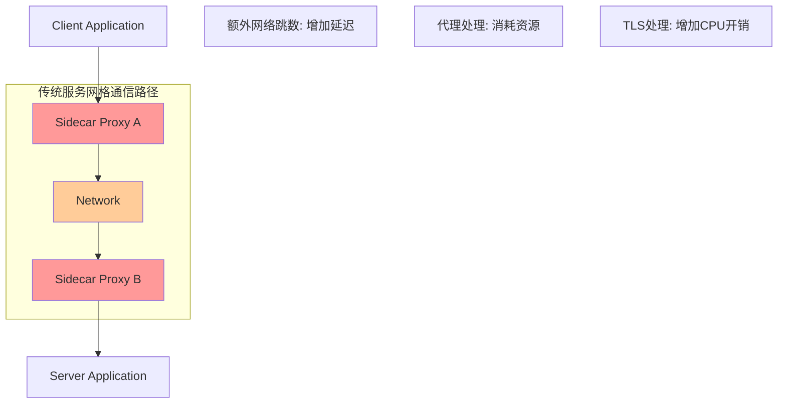
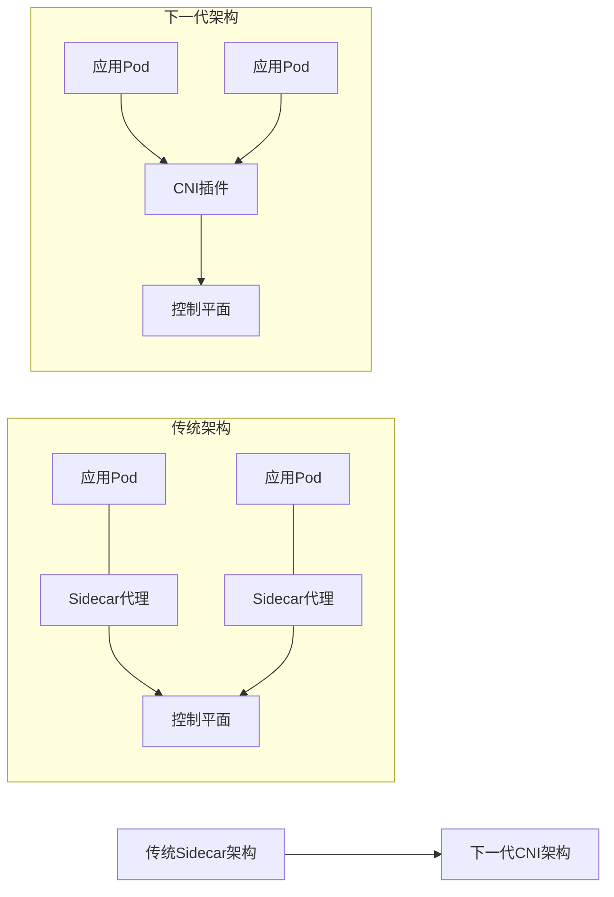

## 从传统服务网格到下一代服务网格：技术演进与发展方向

服务网格作为云原生生态系统的重要组成部分，经历了从简单流量管理工具到全功能服务治理平台的演进过程。随着技术的不断发展和企业需求的日益复杂，传统服务网格正面临着性能、复杂性、可扩展性等方面的挑战。下一代服务网格应运而生，通过技术创新和架构优化，致力于解决传统服务网格的局限性，提供更高效、更智能、更易用的服务治理能力。本章将深入探讨从传统服务网格到下一代服务网格的技术演进路径，分析下一代服务网格的核心特征和发展方向。

### 传统服务网格的局限性

尽管传统服务网格在服务治理方面取得了显著成就，但仍存在一些明显的局限性。

#### 性能开销问题

传统服务网格的性能开销是其主要局限性之一：

```yaml
# 性能开销问题
# 1. 网络延迟:
#    - Sidecar代理引入额外网络跳数
#    - TLS加密解密增加处理时间
#    - 协议转换带来延迟

# 2. 资源消耗:
#    - 每个Pod都需要Sidecar代理
#    - 内存和CPU资源占用较大
#    - 集群资源利用率降低

# 3. 吞吐量限制:
#    - 代理处理能力限制
#    - 连接池管理效率
#    - 并发处理瓶颈
```

性能开销示例分析：



#### 复杂性管理挑战

传统服务网格的复杂性给运维管理带来了挑战：

```yaml
# 复杂性管理挑战
# 1. 配置复杂性:
#    - 大量CRD资源配置
#    - 策略规则复杂
#    - 版本兼容性问题

# 2. 运维复杂性:
#    - 多组件协同管理
#    - 故障排查困难
#    - 升级维护复杂

# 3. 学习曲线陡峭:
#    - 概念众多
#    - 技术门槛高
#    - 最佳实践缺乏
```

复杂性示例：

```yaml
# 传统服务网格复杂配置示例
# 1. 多个CRD资源配置:
apiVersion: networking.istio.io/v1alpha3
kind: VirtualService
metadata:
  name: complex-routing
spec:
  hosts:
  - user-service.example.com
  http:
  - match:
    - headers:
        user-type:
          exact: "premium"
    route:
    - destination:
        host: premium-user-service.svc.cluster.local
  - match:
    - headers:
        version:
          exact: "v2"
    route:
    - destination:
        host: user-service.svc.cluster.local
        subset: v2
  - route:
    - destination:
        host: user-service.svc.cluster.local
        subset: v1
---
apiVersion: networking.istio.io/v1alpha3
kind: DestinationRule
metadata:
  name: complex-dr
spec:
  host: user-service.svc.cluster.local
  subsets:
  - name: v1
    labels:
      version: v1.0.0
  - name: v2
    labels:
      version: v2.0.0
  trafficPolicy:
    loadBalancer:
      simple: LEAST_CONN
    connectionPool:
      tcp:
        maxConnections: 100
      http:
        http1MaxPendingRequests: 1000
    outlierDetection:
      consecutive5xxErrors: 5
      interval: 60s
---
apiVersion: security.istio.io/v1beta1
kind: AuthorizationPolicy
metadata:
  name: complex-authz
spec:
  selector:
    matchLabels:
      app: user-service
  rules:
  - from:
    - source:
        principals: ["cluster.local/ns/production/sa/user-service-sa"]
    to:
    - operation:
        methods: ["GET", "POST"]
        paths: ["/api/*"]
    when:
    - key: request.auth.claims[groups]
      values: ["users", "admins"]
```

#### 可扩展性限制

传统服务网格在可扩展性方面存在限制：

```yaml
# 可扩展性限制
# 1. 规模限制:
#    - 集群规模扩展困难
#    - 服务数量增长瓶颈
#    - 配置管理复杂度增长

# 2. 架构限制:
#    - Sidecar模式固有限制
#    - 控制平面扩展性
#    - 数据平面性能瓶颈

# 3. 功能扩展:
#    - 自定义功能开发困难
#    - 插件机制限制
#    - 第三方集成复杂
```

### 下一代服务网格的特征

下一代服务网格针对传统服务网格的局限性，提出了新的解决方案和特征。

#### 零信任架构集成

下一代服务网格深度集成零信任安全架构：

```yaml
# 零信任架构集成
# 1. 身份验证:
#    - 每个请求都需要验证
#    - 动态身份管理
#    - 多因素认证支持

# 2. 访问控制:
#    - 细粒度权限控制
#    - 动态授权决策
#    - 上下文感知访问

# 3. 数据保护:
#    - 端到端加密
#    - 数据分类保护
#    - 隐私保护机制
```

零信任架构示例：

```yaml
# 零信任架构配置示例
# 1. 动态身份验证:
apiVersion: security.istio.io/v1beta1
kind: RequestAuthentication
metadata:
  name: zero-trust-auth
spec:
  selector:
    matchLabels:
      app: user-service
  jwtRules:
  - issuer: "https://identity-provider.example.com"
    jwksUri: "https://identity-provider.example.com/.well-known/jwks.json"
    forwardOriginalToken: true
    outputPayloadToHeader: "x-jwt-payload"
---
# 2. 上下文感知访问控制:
apiVersion: security.istio.io/v1beta1
kind: AuthorizationPolicy
metadata:
  name: context-aware-authz
spec:
  selector:
    matchLabels:
      app: user-service
  rules:
  - from:
    - source:
        requestPrincipals: ["*"]
    to:
    - operation:
        methods: ["GET"]
        paths: ["/api/public/*"]
  - from:
    - source:
        requestPrincipals: ["*"]
    when:
    - key: request.auth.claims[groups]
      values: ["admin"]
    to:
    - operation:
        methods: ["POST", "PUT", "DELETE"]
        paths: ["/api/admin/*"]
```

#### 智能化治理能力

下一代服务网格具备智能化治理能力：

```yaml
# 智能化治理能力
# 1. 自适应流量管理:
#    - 基于AI的路由决策
#    - 动态负载均衡
#    - 智能故障处理

# 2. 预测性运维:
#    - 异常预测
#    - 性能优化建议
#    - 自动扩缩容

# 3. 自动化策略执行:
#    - 策略自动生成
#    - 动态策略调整
#    - 智能策略优化
```

智能化治理示例：

```yaml
# 智能化治理配置示例
# 1. 自适应负载均衡:
apiVersion: networking.istio.io/v1alpha3
kind: DestinationRule
metadata:
  name: adaptive-lb
spec:
  host: user-service.svc.cluster.local
  trafficPolicy:
    loadBalancer:
      simple: LEAST_REQUEST
    connectionPool:
      tcp:
        maxConnections: 1000
        connectTimeout: 10ms
      http:
        http1MaxPendingRequests: 10000
        maxRequestsPerConnection: 100
    outlierDetection:
      consecutive5xxErrors: 5
      interval: 30s
      baseEjectionTime: 30s
      splitExternalLocalOriginErrors: true
      consecutiveLocalOriginFailures: 5
      localOriginSuccessRateMinimum: 0.95
```

#### 简化架构设计

下一代服务网格采用简化架构设计：

```yaml
# 简化架构设计
# 1. 无Sidecar模式:
#    - CNI插件集成
#    - 内核级流量拦截
#    - 减少资源开销

# 2. 统一控制平面:
#    - 集中式管理
#    - 简化配置
#    - 统一策略执行

# 3. 模块化组件:
#    - 按需启用功能
#    - 插件化架构
#    - 灵活扩展能力
```

简化架构示例：

```yaml
# 简化架构配置示例
# 1. CNI插件配置:
apiVersion: install.istio.io/v1alpha1
kind: IstioOperator
metadata:
  name: simplified-mesh
spec:
  components:
    cni:
      enabled: true
    ingressGateways:
    - name: istio-ingressgateway
      enabled: true
  values:
    cni:
      excludeNamespaces:
      - istio-system
      - kube-system
    sidecarInjectorWebhook:
      enabled: false
---
# 2. 无Sidecar部署:
apiVersion: apps/v1
kind: Deployment
metadata:
  name: user-service
spec:
  template:
    metadata:
      annotations:
        sidecar.istio.io/inject: "false"
    spec:
      containers:
      - name: user-service
        image: user-service:latest
```

### 技术演进路径

下一代服务网格的技术演进路径包括多个方向。

#### 架构演进

服务网格架构的演进方向：

```yaml
# 架构演进方向
# 1. 从Sidecar到CNI:
#    - 减少代理开销
#    - 提升性能
#    - 简化部署

# 2. 从集中到分布:
#    - 分布式控制平面
#    - 本地化决策
#    - 降低延迟

# 3. 从静态到动态:
#    - 动态配置更新
#    - 实时策略调整
#    - 自适应治理
```

架构演进对比图：



#### 功能演进

服务网格功能的演进方向：

```yaml
# 功能演进方向
# 1. 从基础到高级:
#    - 基础流量管理
#    - 高级安全控制
#    - 智能治理能力

# 2. 从单一到多元:
#    - 多协议支持
#    - 多环境适配
#    - 多云统一

# 3. 从被动到主动:
#    - 被动响应故障
#    - 主动预测问题
#    - 自动优化性能
```

功能演进示例：

```yaml
# 功能演进配置示例
# 1. 多协议支持:
apiVersion: networking.istio.io/v1alpha3
kind: Gateway
metadata:
  name: multi-protocol-gateway
spec:
  selector:
    istio: ingressgateway
  servers:
  - port:
      number: 80
      name: http
      protocol: HTTP
    hosts:
    - "http.example.com"
  - port:
      number: 443
      name: https
      protocol: HTTPS
    tls:
      mode: SIMPLE
      serverCertificate: /etc/istio/ingressgateway-certs/tls.crt
      privateKey: /etc/istio/ingressgateway-certs/tls.key
    hosts:
    - "https.example.com"
  - port:
      number: 3306
      name: tcp
      protocol: TCP
    hosts:
    - "mysql.example.com"
---
# 2. 多环境适配:
apiVersion: install.istio.io/v1alpha1
kind: IstioOperator
metadata:
  name: multi-environment-mesh
spec:
  profiles:
  - default
  values:
    global:
      multiCluster:
        enabled: true
      network: ""
    pilot:
      autoscaleEnabled: true
      autoscaleMin: 2
      autoscaleMax: 5
```

#### 性能优化

服务网格性能的优化方向：

```yaml
# 性能优化方向
# 1. 网络优化:
#    - 减少网络跳数
#    - 优化数据路径
#    - 提升传输效率

# 2. 资源优化:
#    - 减少资源占用
#    - 提升资源利用率
#    - 优化内存管理

# 3. 算法优化:
#    - 高效路由算法
#    - 快速加密算法
#    - 智能负载均衡
```

性能优化示例：

```yaml
# 性能优化配置示例
# 1. 连接池优化:
apiVersion: networking.istio.io/v1alpha3
kind: DestinationRule
metadata:
  name: performance-optimized-dr
spec:
  host: user-service.svc.cluster.local
  trafficPolicy:
    connectionPool:
      tcp:
        maxConnections: 10000
        connectTimeout: 1ms
        tcpKeepalive:
          time: 7200s
          interval: 75s
      http:
        http1MaxPendingRequests: 100000
        maxRequestsPerConnection: 1000
        maxRetries: 3
        idleTimeout: 30s
    outlierDetection:
      consecutive5xxErrors: 7
      interval: 10s
      baseEjectionTime: 30s
      maxEjectionPercent: 10
```

### 发展方向展望

下一代服务网格的发展方向包括多个重要领域。

#### 标准化进程

服务网格标准化的发展方向：

```yaml
# 标准化进程方向
# 1. API标准化:
#    - 统一接口规范
#    - 跨平台兼容
#    - 互操作性增强

# 2. 协议标准化:
#    - 服务发现协议
#    - 配置管理协议
#    - 监控指标协议

# 3. 策略标准化:
#    - 安全策略标准
#    - 流量策略标准
#    - 治理策略标准
```

标准化示例：

```yaml
# 标准化配置示例
# 1. 标准化API使用:
apiVersion: gateway.networking.k8s.io/v1beta1
kind: Gateway
metadata:
  name: standardized-gateway
spec:
  gatewayClassName: istio
  listeners:
  - name: http
    protocol: HTTP
    port: 80
    allowedRoutes:
      namespaces:
        from: Same
---
# 2. 标准化策略:
apiVersion: security.istio.io/v1beta1
kind: AuthorizationPolicy
metadata:
  name: standardized-authz
spec:
  action: ALLOW
  rules:
  - from:
    - source:
        principals: ["cluster.local/ns/*/sa/*"]
    to:
    - operation:
        methods: ["GET"]
        paths: ["/api/*"]
```

#### 生态系统发展

服务网格生态系统的发展方向：

```yaml
# 生态系统发展方向
# 1. 工具链完善:
#    - 开发工具增强
#    - 运维工具完善
#    - 监控工具集成

# 2. 第三方集成:
#    - 云厂商集成
#    - 安全厂商集成
#    - 监控厂商集成

# 3. 社区发展:
#    - 开源项目繁荣
#    - 最佳实践分享
#    - 人才培养体系
```

生态系统示例：

```yaml
# 生态系统集成示例
# 1. 监控工具集成:
apiVersion: monitoring.coreos.com/v1
kind: ServiceMonitor
metadata:
  name: mesh-monitor
  labels:
    app: istio
spec:
  selector:
    matchLabels:
      istio: mixer
  endpoints:
  - port: http-monitoring
    path: /metrics
    interval: 15s
---
# 2. 日志工具集成:
apiVersion: fluentd.io/v1alpha1
kind: FluentdConfig
metadata:
  name: mesh-logging
spec:
  fluentdCfg:
  - input:
      type: tail
      path: /var/log/istio/*.log
    filter:
      type: parser
      format: json
    output:
      type: elasticsearch
      host: elasticsearch.logging.svc.cluster.local
      port: 9200
```

#### 应用场景扩展

服务网格应用场景的扩展方向：

```yaml
# 应用场景扩展方向
# 1. 边缘计算:
#    - 边缘节点支持
#    - 低延迟通信
#    - 资源受限环境

# 2. 无服务器架构:
#    - FaaS集成
#    - 函数间通信
#    - 事件驱动治理

# 3. 混合云环境:
#    - 多云统一管理
#    - 跨云服务发现
#    - 统一安全策略
```

应用场景扩展示例：

```yaml
# 应用场景扩展示例
# 1. 边缘计算支持:
apiVersion: apps/v1
kind: DaemonSet
metadata:
  name: edge-proxy
spec:
  selector:
    matchLabels:
      app: edge-proxy
  template:
    metadata:
      labels:
        app: edge-proxy
    spec:
      containers:
      - name: edge-proxy
        image: istio/proxyv2:latest
        resources:
          requests:
            cpu: 50m
            memory: 64Mi
          limits:
            cpu: 100m
            memory: 128Mi
        env:
        - name: NODE_NAME
          valueFrom:
            fieldRef:
              fieldPath: spec.nodeName
---
# 2. 无服务器集成:
apiVersion: serving.knative.dev/v1
kind: Service
metadata:
  name: serverless-service
spec:
  template:
    metadata:
      annotations:
        autoscaling.knative.dev/minScale: "0"
        autoscaling.knative.dev/maxScale: "100"
    spec:
      containers:
      - image: serverless-function:latest
        ports:
        - containerPort: 8080
```

### 技术挑战与解决方案

下一代服务网格面临的技术挑战及解决方案。

#### 技术挑战

下一代服务网格面临的主要技术挑战：

```yaml
# 技术挑战
# 1. 性能挑战:
#    - 延迟敏感应用
#    - 高吞吐量需求
#    - 资源限制环境

# 2. 复杂性挑战:
#    - 多环境适配
#    - 多协议支持
#    - 多云统一

# 3. 安全挑战:
#    - 零信任实施
#    - 数据隐私保护
#    - 合规性要求
```

#### 解决方案

针对技术挑战的解决方案：

```yaml
# 解决方案
# 1. 性能优化方案:
#    - eBPF技术应用
#    - 硬件加速支持
#    - 算法优化改进

# 2. 简化方案:
#    - 声明式API设计
#    - 自动化配置管理
#    - 智能策略生成

# 3. 安全增强方案:
#    - 硬件安全模块
#    - 同态加密技术
#    - 隐私计算支持
```

解决方案示例：

```yaml
# 解决方案示例
# 1. eBPF性能优化:
apiVersion: cilium.io/v2
kind: CiliumNetworkPolicy
metadata:
  name: ebpf-optimized-policy
spec:
  endpointSelector:
    matchLabels:
      app: user-service
  ingress:
  - fromEndpoints:
    - matchLabels:
        app: api-gateway
    toPorts:
    - ports:
      - port: "8080"
        protocol: TCP
      rules:
        http:
        - method: "GET"
          path: "/api/users"
---
# 2. 声明式API:
apiVersion: gateway.networking.k8s.io/v1beta1
kind: HTTPRoute
metadata:
  name: declarative-route
spec:
  parentRefs:
  - name: my-gateway
  rules:
  - matches:
    - path:
        type: PathPrefix
        value: /api
    backendRefs:
    - name: user-service
      port: 80
```

### 总结

从传统服务网格到下一代服务网格的演进是一个持续的过程，涉及架构优化、功能增强、性能提升等多个方面。下一代服务网格通过集成零信任架构、智能化治理能力、简化架构设计等特征，致力于解决传统服务网格的局限性，提供更高效、更智能、更易用的服务治理能力。

关键要点包括：
1. 理解传统服务网格的性能开销、复杂性管理和可扩展性限制
2. 掌握下一代服务网格的零信任架构集成、智能化治理和简化设计特征
3. 了解服务网格从Sidecar到CNI、从集中到分布、从静态到动态的架构演进路径
4. 认识服务网格在API标准化、生态系统发展、应用场景扩展等方面的发展方向
5. 应对性能、复杂性、安全等方面的技术挑战

通过持续的技术创新和架构优化，下一代服务网格将为企业提供更强大的服务治理能力，支持业务的快速发展和数字化转型。随着云原生技术的不断演进，服务网格将继续在标准化、智能化、简化化等方面取得新的突破，成为企业构建现代化应用架构的重要基石。

通过系统性的技术演进和创新，我们能够：
1. 构建高性能、低延迟的服务网格架构
2. 实现智能化、自动化的服务治理能力
3. 建立统一、标准的服务治理体系
4. 支持多样化的应用场景和部署环境
5. 保障服务通信的安全性和可靠性

这不仅有助于当前系统的高效运行，也为未来的技术演进和业务发展奠定了坚实的基础。