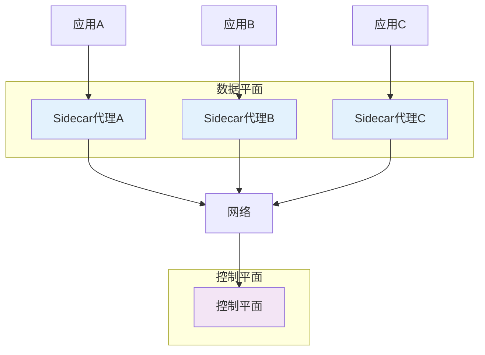
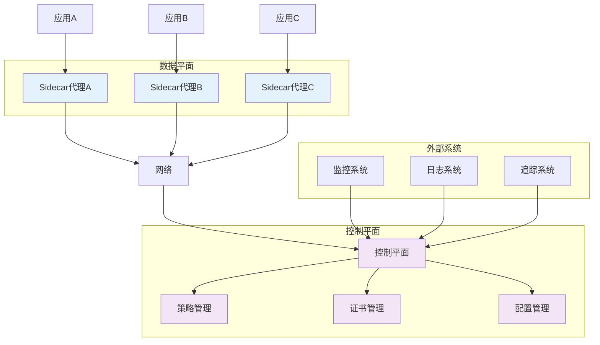
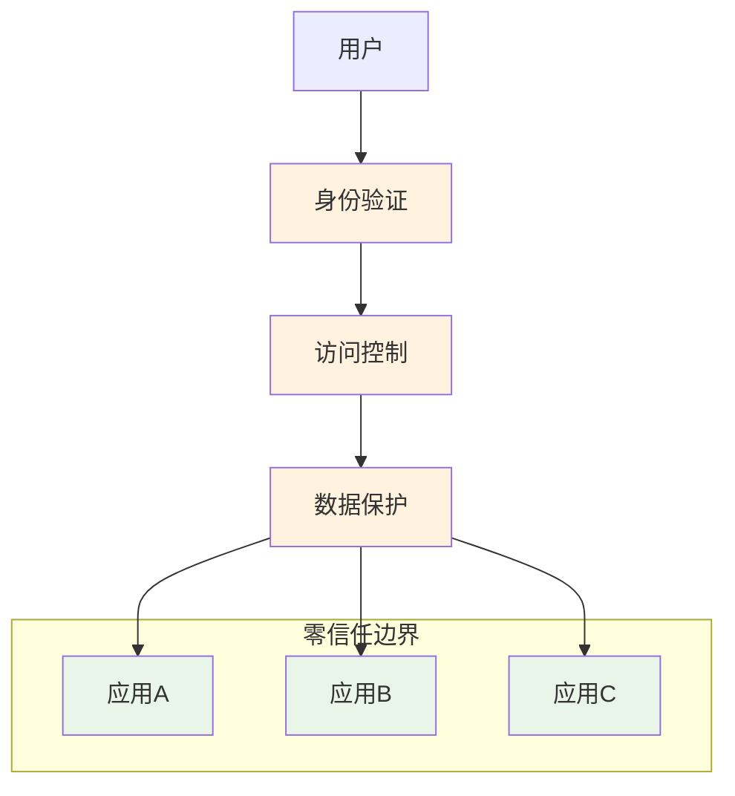
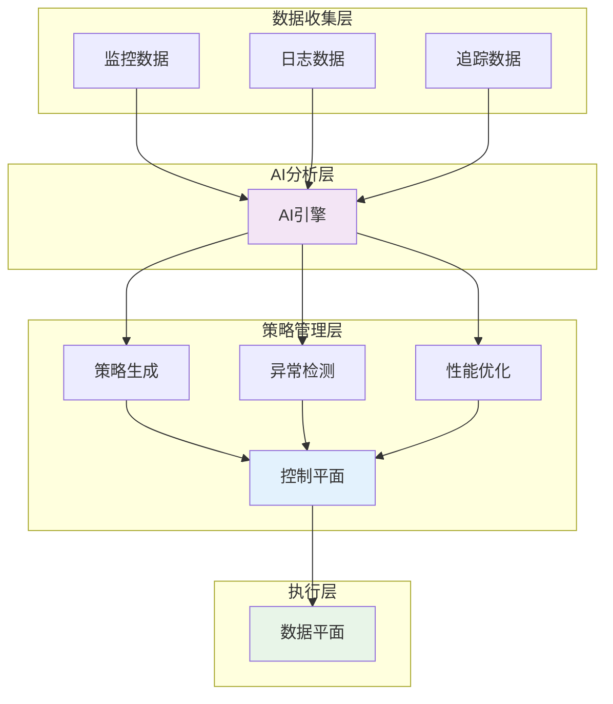
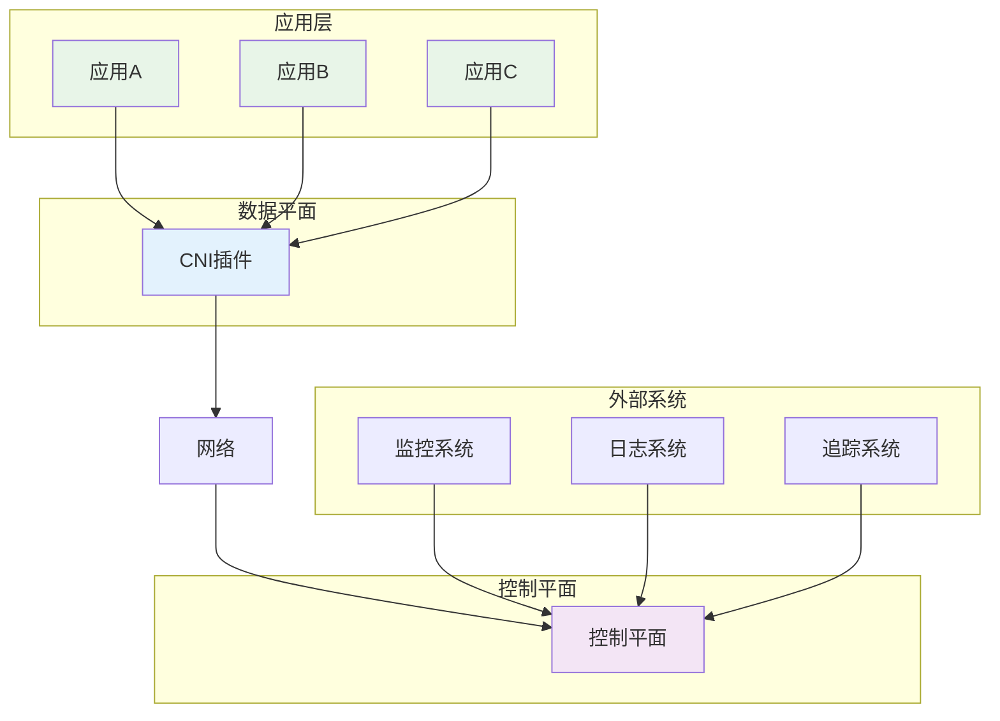
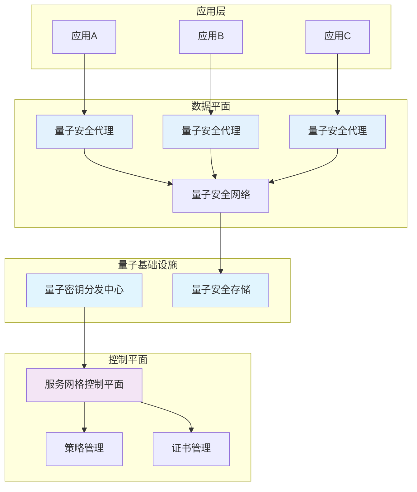
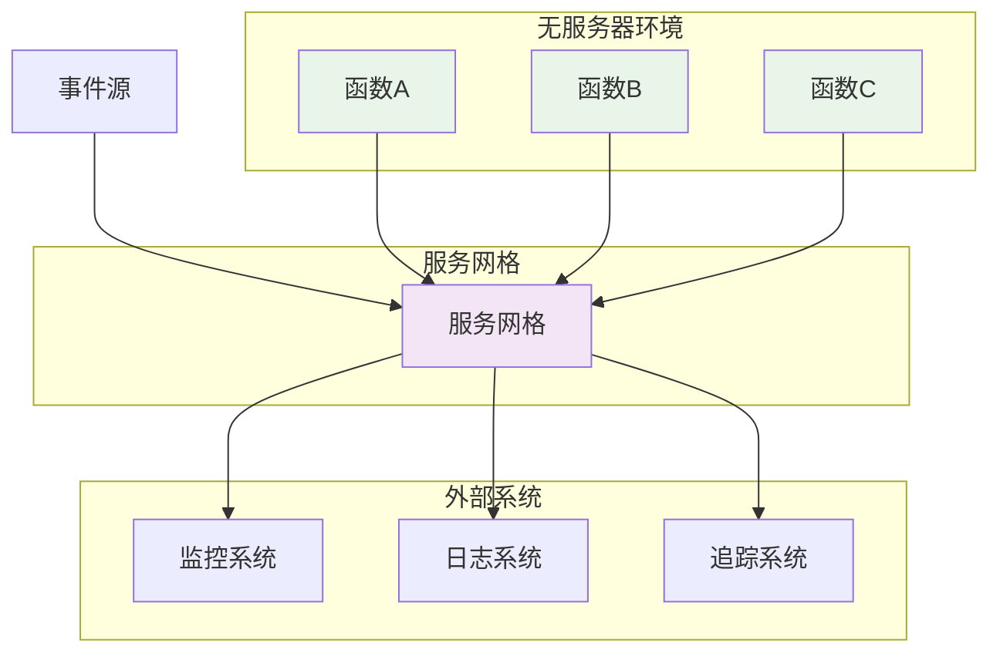

## 未来服务网格的发展方向：探索下一代服务网格技术的演进路径

服务网格技术作为云原生生态系统的核心组件，正在经历快速的演进和发展。从最初的流量管理工具到现在的全功能服务治理平台，服务网格已经走过了多个发展阶段。展望未来，服务网格技术将继续在架构优化、功能增强、智能化治理等方面取得突破性进展。本章将深入探讨服务网格的未来发展方向，分析技术演进路径，预测新兴应用场景，帮助读者把握服务网格技术的发展脉络和未来趋势。

### 服务网格技术演进路径

理解服务网格的未来发展方向需要先回顾其技术演进路径。

#### 第一代服务网格（2016-2018）

第一代服务网格主要解决服务间通信的基础问题：

```yaml
# 第一代服务网格特点
# 1. 核心功能:
#    - 流量管理
#    - 负载均衡
#    - 服务发现
#    - 基础安全

# 2. 技术特点:
#    - 基于Sidecar代理
#    - 控制平面与数据平面分离
#    - 集中式配置管理
#    - 基础监控能力

# 3. 代表产品:
#    - Linkerd 1.x
#    - Istio早期版本
#    - Consul Connect
```

第一代服务网格架构示意图：



#### 第二代服务网格（2018-2021）

第二代服务网格在第一代基础上增加了更多企业级功能：

```yaml
# 第二代服务网格特点
# 1. 增强功能:
#    - 完善的安全机制(mTLS)
#    - 细粒度访问控制
#    - 分布式追踪
#    - 高级流量管理

# 2. 技术特点:
#    - 标准化API接口
#    - 多平台支持
#    - 可扩展架构
#    - 完善的可观测性

# 3. 代表产品:
#    - Istio成熟版本
#    - Linkerd 2.x
#    - AWS App Mesh
#    - Azure Service Mesh
```

第二代服务网格架构示意图：



#### 第三代服务网格（2021-至今）

第三代服务网格开始关注性能优化和简化管理：

```yaml
# 第三代服务网格特点
# 1. 核心优化:
#    - 性能优化
#    - 资源效率提升
#    - 简化架构
#    - 降低复杂性

# 2. 技术特点:
#    - eBPF技术应用
#    - 无Sidecar模式探索
#    - 智能化治理
#    - 云原生深度集成

# 3. 代表产品:
#    - Linkerd 2.10+
#    - Istio Ambient Mesh
#    - Cilium Service Mesh
#    - Kuma 2.x
```

### 下一代服务网格的核心特征

下一代服务网格将具备以下核心特征：

#### 零信任安全架构集成

下一代服务网格将深度集成零信任安全架构：

```yaml
# 零信任安全架构集成
# 1. 身份验证:
#    - 每个请求都需要验证
#    - 动态身份管理
#    - 多因素认证支持

# 2. 访问控制:
#    - 细粒度权限控制
#    - 动态授权决策
#    - 上下文感知访问

# 3. 数据保护:
#    - 端到端加密
#    - 数据分类保护
#    - 隐私保护机制
```

零信任架构示意图：



#### 智能化治理能力

下一代服务网格将具备智能化治理能力：

```yaml
# 智能化治理能力
# 1. 自适应流量管理:
#    - 基于AI的路由决策
#    - 动态负载均衡
#    - 智能故障处理

# 2. 预测性运维:
#    - 异常预测
#    - 性能优化建议
#    - 自动扩缩容

# 3. 自动化策略执行:
#    - 策略自动生成
#    - 动态策略调整
#    - 智能策略优化
```

智能化治理架构：



#### 简化架构设计

下一代服务网格将采用简化架构设计：

```yaml
# 简化架构设计
# 1. 无Sidecar模式:
#    - CNI插件集成
#    - 内核级流量拦截
#    - 减少资源开销

# 2. 统一控制平面:
#    - 集中式管理
#    - 简化配置
#    - 统一策略执行

# 3. 模块化组件:
#    - 按需启用功能
#    - 插件化架构
#    - 灵活扩展能力
```

无Sidecar架构示意图：



### 新兴技术融合方向

下一代服务网格将与多种新兴技术深度融合。

#### 与人工智能和机器学习的结合

AI/ML技术将赋能服务网格实现智能化治理：

```yaml
# AI/ML技术结合
# 1. 智能路由决策:
#    - 基于历史数据的路由优化
#    - 实时性能分析
#    - 动态路径选择

# 2. 异常检测与预测:
#    - 异常行为识别
#    - 故障预测预警
#    - 性能瓶颈分析

# 3. 自动化运维:
#    - 自动配置优化
#    - 智能故障处理
#    - 资源自动调度
```

AI驱动的服务网格架构：

```yaml
# AI驱动配置示例
# 1. 智能负载均衡:
apiVersion: networking.istio.io/v1alpha3
kind: DestinationRule
metadata:
  name: ai-driven-lb
spec:
  host: user-service
  trafficPolicy:
    loadBalancer:
      simple: LEAST_REQUEST
    connectionPool:
      tcp:
        maxConnections: 1000
        connectTimeout: 10ms
      http:
        http1MaxPendingRequests: 10000
        maxRequestsPerConnection: 100
    outlierDetection:
      consecutive5xxErrors: 5
      interval: 30s
      baseEjectionTime: 30s
      splitExternalLocalOriginErrors: true
      consecutiveLocalOriginFailures: 5
      localOriginSuccessRateMinimum: 0.95
---
# 2. 智能重试策略:
apiVersion: networking.istio.io/v1alpha3
kind: VirtualService
metadata:
  name: ai-driven-retry
spec:
  hosts:
  - payment-service
  http:
  - route:
    - destination:
        host: payment-service
    retries:
      attempts: 3
      perTryTimeout: 2s
      retryOn: connect-failure,refused-stream,gateway-error
```

#### 与量子计算的结合

量子计算技术将为服务网格带来新的可能性：

```yaml
# 量子计算结合
# 1. 量子加密:
#    - 量子密钥分发
#    - 抗量子攻击加密
#    - 量子安全通信

# 2. 量子优化:
#    - 复杂路由优化
#    - 资源调度优化
#    - 性能瓶颈优化

# 3. 量子机器学习:
#    - 量子增强AI模型
#    - 超高速数据分析
#    - 智能决策优化
```

量子安全架构示意图：



#### 与边缘计算的结合

边缘计算将扩展服务网格的应用场景：

```yaml
# 边缘计算结合
# 1. 边缘节点支持:
#    - 轻量级代理
#    - 资源受限环境优化
#    - 低延迟通信

# 2. 边缘安全:
#    - 边缘身份管理
#    - 本地安全策略
#    - 离线模式支持

# 3. 边缘治理:
#    - 分布式治理
#    - 本地决策能力
#    - 云端协同管理
```

边缘计算架构示例：

```yaml
# 边缘计算配置示例
# 1. 边缘节点配置:
apiVersion: apps/v1
kind: DaemonSet
metadata:
  name: edge-proxy
spec:
  selector:
    matchLabels:
      app: edge-proxy
  template:
    metadata:
      labels:
        app: edge-proxy
    spec:
      containers:
      - name: edge-proxy
        image: istio/proxyv2:latest
        resources:
          requests:
            cpu: 50m
            memory: 64Mi
          limits:
            cpu: 100m
            memory: 128Mi
        env:
        - name: NODE_NAME
          valueFrom:
            fieldRef:
              fieldPath: spec.nodeName
---
# 2. 边缘路由策略:
apiVersion: networking.istio.io/v1alpha3
kind: VirtualService
metadata:
  name: edge-routing
spec:
  hosts:
  - user-service.edge.global
  http:
  - match:
    - headers:
        geo-location:
          exact: "edge"
    route:
    - destination:
        host: user-service.edge.svc.cluster.local
  - route:
    - destination:
        host: user-service.cloud.svc.cluster.local
```

### 自动化与自愈能力发展

下一代服务网格将具备更强的自动化和自愈能力。

#### 自动化配置管理

自动化配置管理将简化服务网格的运维：

```yaml
# 自动化配置管理
# 1. 配置自动生成:
#    - 基于应用特征的配置
#    - 最佳实践模板
#    - 动态配置更新

# 2. 配置优化:
#    - 性能调优建议
#    - 资源利用率优化
#    - 安全配置强化

# 3. 配置验证:
#    - 预部署验证
#    - 配置一致性检查
#    - 安全合规检查
```

自动化配置示例：

```yaml
# 自动化配置示例
# 1. 智能配置生成:
apiVersion: config.istio.io/v1alpha2
kind: ConfigTemplate
metadata:
  name: smart-config-template
spec:
  selector:
    matchLabels:
      app: user-service
  template:
    trafficPolicy:
      connectionPool:
        tcp:
          maxConnections: ${auto}
        http:
          http1MaxPendingRequests: ${auto}
      outlierDetection:
        consecutive5xxErrors: ${auto}
        interval: ${auto}
---
# 2. 配置验证规则:
apiVersion: validation.istio.io/v1alpha1
kind: ConfigValidation
metadata:
  name: config-validation-rules
spec:
  rules:
  - name: security-check
    condition: mTLS.enabled == true
    action: allow
  - name: performance-check
    condition: connectionPool.tcp.maxConnections > 100
    action: warn
```

#### 自愈能力增强

自愈能力将提升服务网格的可靠性：

```yaml
# 自愈能力增强
# 1. 故障自动检测:
#    - 实时健康检查
#    - 异常行为识别
#    - 故障根因分析

# 2. 故障自动恢复:
#    - 自动重试机制
#    - 流量切换
#    - 服务重启

# 3. 预防性自愈:
#    - 性能预测
#    - 资源预分配
#    - 负载均衡优化
```

自愈能力配置示例：

```yaml
# 自愈能力配置示例
# 1. 智能故障检测:
apiVersion: monitoring.coreos.com/v1
kind: PrometheusRule
metadata:
  name: self-healing-rules
spec:
  groups:
  - name: self-healing.rules
    rules:
    - alert: HighErrorRate
      expr: |
        sum(rate(istio_requests_total{response_code=~"5.*"}[5m])) / 
        sum(rate(istio_requests_total[5m])) * 100 > 5
      for: 2m
      labels:
        severity: critical
      annotations:
        summary: "High error rate detected"
---
# 2. 自动恢复策略:
apiVersion: autoscaling/v2
kind: HorizontalPodAutoscaler
metadata:
  name: user-service-hpa
spec:
  scaleTargetRef:
    apiVersion: apps/v1
    kind: Deployment
    name: user-service
  minReplicas: 3
  maxReplicas: 10
  metrics:
  - type: Resource
    resource:
      name: cpu
      target:
        type: Utilization
        averageUtilization: 70
```

### 标准化与生态发展

标准化和生态发展将推动服务网格技术的普及。

#### 标准化进程

服务网格标准化将促进技术的互操作性和普及：

```yaml
# 标准化进程
# 1. API标准化:
#    - 统一接口规范
#    - 跨平台兼容
#    - 互操作性增强

# 2. 协议标准化:
#    - 服务发现协议
#    - 配置管理协议
#    - 监控指标协议

# 3. 策略标准化:
#    - 安全策略标准
#    - 流量策略标准
#    - 治理策略标准
```

标准化架构示例：

```yaml
# 标准化配置示例
# 1. SMI标准配置:
apiVersion: split.smi-spec.io/v1alpha2
kind: TrafficSplit
metadata:
  name: recommendation-split
spec:
  service: recommendation-service
  backends:
  - service: recommendation-v1
    weight: 90
  - service: recommendation-v2
    weight: 10
---
# 2. Gateway API配置:
apiVersion: gateway.networking.k8s.io/v1beta1
kind: Gateway
metadata:
  name: standardized-gateway
spec:
  gatewayClassName: istio
  listeners:
  - name: http
    protocol: HTTP
    port: 80
    allowedRoutes:
      namespaces:
        from: Same
```

#### 生态系统发展

服务网格生态系统将不断完善：

```yaml
# 生态系统发展
# 1. 工具链完善:
#    - 开发工具增强
#    - 运维工具完善
#    - 监控工具集成

# 2. 第三方集成:
#    - 云厂商集成
#    - 安全厂商集成
#    - 监控厂商集成

# 3. 社区发展:
#    - 开源项目繁荣
#    - 最佳实践分享
#    - 人才培养体系
```

生态系统集成示例：

```yaml
# 生态系统集成示例
# 1. 监控工具集成:
apiVersion: monitoring.coreos.com/v1
kind: ServiceMonitor
metadata:
  name: mesh-monitor
  labels:
    app: istio
spec:
  selector:
    matchLabels:
      istio: mixer
  endpoints:
  - port: http-monitoring
    path: /metrics
    interval: 15s
---
# 2. 日志工具集成:
apiVersion: fluentd.io/v1alpha1
kind: FluentdConfig
metadata:
  name: mesh-logging
spec:
  fluentdCfg:
  - input:
      type: tail
      path: /var/log/istio/*.log
    filter:
      type: parser
      format: json
    output:
      type: elasticsearch
      host: elasticsearch.logging.svc.cluster.local
      port: 9200
```

### 应用场景扩展

下一代服务网格将支持更多应用场景。

#### 无服务器架构集成

服务网格与无服务器架构的深度集成：

```yaml
# 无服务器架构集成
# 1. 函数间通信:
#    - 函数调用管理
#    - 流量控制
#    - 安全通信

# 2. 事件驱动治理:
#    - 事件路由
#    - 事件追踪
#    - 事件监控

# 3. 资源优化:
#    - 冷启动优化
#    - 资源利用率提升
#    - 成本控制
```

无服务器集成架构：



#### 多云环境支持

服务网格在多云环境中的应用：

```yaml
# 多云环境支持
# 1. 统一管理:
#    - 跨云服务发现
#    - 统一策略执行
#    - 集中监控

# 2. 流量管理:
#    - 跨云流量路由
#    - 负载均衡优化
#    - 故障转移

# 3. 安全保障:
#    - 跨云安全通信
#    - 统一身份管理
#    - 合规性保障
```

多云架构示例：

```yaml
# 多云配置示例
# 1. 跨云服务发现:
apiVersion: networking.istio.io/v1alpha3
kind: ServiceEntry
metadata:
  name: multi-cloud-service
spec:
  hosts:
  - user-service.global
  location: MESH_INTERNAL
  ports:
  - number: 80
    name: http
    protocol: HTTP
  resolution: DNS
  endpoints:
  - address: user-service.aws.example.com
    locality: us-east1/us-east1-a
  - address: user-service.azure.example.com
    locality: eu-west1/eu-west1-a
  - address: user-service.gcp.example.com
    locality: apac-south1/apac-south1-a
---
# 2. 跨云路由策略:
apiVersion: networking.istio.io/v1alpha3
kind: VirtualService
metadata:
  name: multi-cloud-routing
spec:
  hosts:
  - user-service.global
  http:
  - route:
    - destination:
        host: user-service.aws.example.com
      weight: 40
    - destination:
        host: user-service.azure.example.com
      weight: 30
    - destination:
        host: user-service.gcp.example.com
      weight: 30
```

### 技术挑战与解决方案

下一代服务网格发展面临的技术挑战及解决方案。

#### 性能优化挑战

性能优化是下一代服务网格面临的主要挑战：

```yaml
# 性能优化挑战
# 1. 延迟优化:
#    - 减少网络跳数
#    - 优化数据路径
#    - 提升传输效率

# 2. 资源效率:
#    - 减少资源占用
#    - 提升资源利用率
#    - 优化内存管理

# 3. 算法优化:
#    - 高效路由算法
#    - 快速加密算法
#    - 智能负载均衡
```

性能优化解决方案：

```yaml
# 性能优化解决方案
# 1. eBPF技术应用:
apiVersion: cilium.io/v2
kind: CiliumNetworkPolicy
metadata:
  name: ebpf-optimized-policy
spec:
  endpointSelector:
    matchLabels:
      app: user-service
  ingress:
  - fromEndpoints:
    - matchLabels:
        app: api-gateway
    toPorts:
    - ports:
      - port: "8080"
        protocol: TCP
      rules:
        http:
        - method: "GET"
          path: "/api/users"
---
# 2. 硬件加速支持:
apiVersion: v1
kind: ConfigMap
metadata:
  name: hardware-acceleration-config
  namespace: istio-system
data:
  config.yaml: |-
    hardwareAcceleration:
      enabled: true
      type: "dpdk"
      cpuAffinity: "0-3"
```

#### 复杂性管理挑战

复杂性管理是服务网格普及的重要障碍：

```yaml
# 复杂性管理挑战
# 1. 配置简化:
#    - 简化CRD配置
#    - 提供默认配置
#    - 智能配置生成

# 2. 运维简化:
#    - 可视化管理界面
#    - 自动化运维工具
#    - 简化故障排查

# 3. 学习曲线:
#    - 简化概念模型
#    - 提供最佳实践
#    - 完善文档体系
```

复杂性管理解决方案：

```bash
# 复杂性管理解决方案
# 1. 声明式API:
apiVersion: gateway.networking.k8s.io/v1beta1
kind: HTTPRoute
metadata:
  name: declarative-route
spec:
  parentRefs:
  - name: my-gateway
  rules:
  - matches:
    - path:
        type: PathPrefix
        value: /api
    backendRefs:
    - name: user-service
      port: 80
---
# 2. 可视化管理:
#    提供Web管理界面
#    图形化配置编辑
#    实时状态监控
#    一键式操作支持
```

### 总结

下一代服务网格技术将在架构优化、功能增强、智能化治理等方面取得重大突破。从技术演进路径来看，服务网格已经从解决基础通信问题的第一代发展到具备完善企业级功能的第二代，目前正在向具备高性能、低复杂性、智能化特征的第三代演进。

下一代服务网格的核心特征包括：
1. 零信任安全架构集成，提供更强大的安全保障
2. 智能化治理能力，实现自适应流量管理和预测性运维
3. 简化架构设计，通过无Sidecar模式等技术降低资源开销

在技术融合方面，服务网格将与人工智能、量子计算、边缘计算等新兴技术深度结合，拓展应用场景和能力边界。同时，自动化和自愈能力的增强将显著提升服务网格的可靠性和运维效率。

标准化进程和生态系统的发展将促进服务网格技术的普及和互操作性，而应用场景的扩展将推动服务网格在无服务器架构、多云环境等新领域的发展。

尽管面临性能优化、复杂性管理等挑战，但通过eBPF技术、硬件加速、声明式API等解决方案，这些挑战正在逐步被克服。

关键要点包括：
1. 理解服务网格从第一代到第三代的技术演进路径
2. 掌握下一代服务网格的零信任安全、智能化治理、简化架构等核心特征
3. 认识服务网格与AI/ML、量子计算、边缘计算等技术的融合趋势
4. 了解服务网格在自动化、自愈能力、标准化、生态系统等方面的发展方向
5. 把握服务网格在无服务器、多云等新场景中的应用扩展
6. 应对性能优化、复杂性管理等技术挑战

通过持续的技术创新和架构优化，下一代服务网格将为企业提供更强大的服务治理能力，支持业务的快速发展和数字化转型。随着云原生技术的不断演进，服务网格将继续在标准化、智能化、简化化等方面取得新的突破，成为企业构建现代化应用架构的重要基石。

通过系统性的技术演进和创新，我们能够：
1. 构建高性能、低延迟的服务网格架构
2. 实现智能化、自动化的服务治理能力
3. 建立统一、标准的服务治理体系
4. 支持多样化的应用场景和部署环境
5. 保障服务通信的安全性和可靠性

这不仅有助于当前系统的高效运行，也为未来的技术演进和业务发展奠定了坚实的基础。