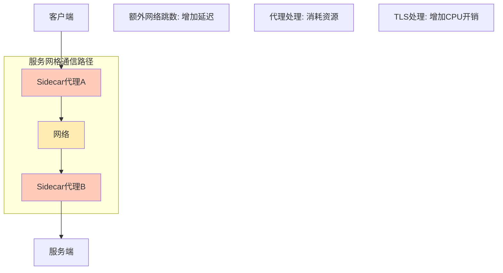
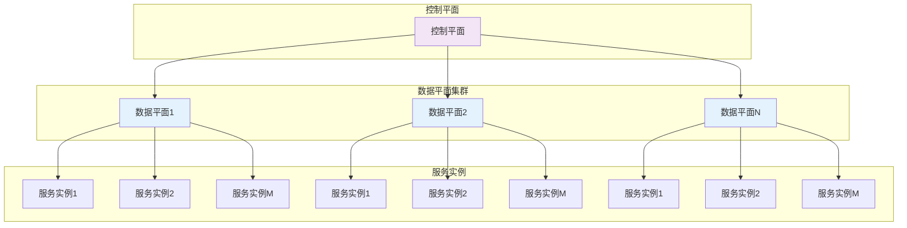

## 服务网格的挑战：性能、扩展性与易用性分析与应对策略

尽管服务网格技术在微服务治理方面展现出巨大潜力，但在实际应用中仍面临诸多挑战。这些挑战主要集中在性能开销、扩展性限制和易用性复杂性三个方面。深入理解和有效应对这些挑战对于成功实施服务网格至关重要。本章将全面分析服务网格在性能、扩展性和易用性方面面临的主要挑战，并提出相应的解决方案和最佳实践，帮助读者在实际项目中更好地应用服务网格技术。

### 服务网格性能挑战

性能是服务网格面临的首要挑战之一，主要体现在延迟增加和资源消耗方面。

#### 延迟开销分析

服务网格引入的延迟开销是影响应用性能的主要因素：

```yaml
# 延迟开销分析
# 1. 网络延迟:
#    - Sidecar代理引入额外网络跳数
#    - TLS加密解密增加处理时间
#    - 协议转换带来延迟

# 2. 处理延迟:
#    - 代理处理请求响应
#    - 策略检查和执行
#    - 日志记录和监控数据收集

# 3. 连接延迟:
#    - 连接建立和维护
#    - 连接池管理
#    - 负载均衡决策
```

延迟开销示意图：



#### 资源消耗分析

服务网格对系统资源的消耗也是一个重要考量：

```yaml
# 资源消耗分析
# 1. 内存消耗:
#    - 每个Pod的Sidecar内存占用
#    - 控制平面内存需求
#    - 缓存和连接状态存储

# 2. CPU消耗:
#    - 代理处理请求
#    - 加密解密运算
#    - 策略执行计算

# 3. 网络带宽:
#    - 控制平面通信
#    - 监控数据传输
#    - 服务发现信息同步
```

资源消耗对比图：

```mermaid
barChart
    title 服务网格资源消耗对比
    xAxis: 组件类型
    yAxis: 资源消耗 (相对值)
    data:
        "Sidecar代理": 40
        "控制平面": 30
        "监控系统": 20
        "其他": 10
```

#### 性能优化策略

针对性能挑战，可以采用以下优化策略：

```yaml
# 性能优化策略
# 1. 架构优化:
#    - 采用CNI插件减少代理
#    - 使用eBPF技术提升性能
#    - 实施无Sidecar模式

# 2. 配置优化:
#    - 调整连接池参数
#    - 优化资源请求和限制
#    - 合理设置超时时间

# 3. 硬件加速:
#    - 使用DPDK提升网络性能
#    - 利用硬件加密模块
#    - 采用专用网络芯片
```

性能优化配置示例：

```yaml
# 性能优化配置示例
# 1. 连接池优化:
apiVersion: networking.istio.io/v1alpha3
kind: DestinationRule
metadata:
  name: performance-optimized-dr
spec:
  host: user-service
  trafficPolicy:
    connectionPool:
      tcp:
        maxConnections: 10000
        connectTimeout: 1ms
        tcpKeepalive:
          time: 7200s
          interval: 75s
      http:
        http1MaxPendingRequests: 100000
        maxRequestsPerConnection: 1000
        maxRetries: 3
        idleTimeout: 30s
    outlierDetection:
      consecutive5xxErrors: 7
      interval: 10s
      baseEjectionTime: 30s
      maxEjectionPercent: 10
---
# 2. 资源限制优化:
apiVersion: v1
kind: LimitRange
metadata:
  name: istio-proxy-limits
spec:
  limits:
  - default:
      cpu: 100m
      memory: 128Mi
    defaultRequest:
      cpu: 50m
      memory: 64Mi
    type: Container
```

### 服务网格扩展性挑战

随着微服务数量和集群规模的增长，服务网格的扩展性成为关键挑战。

#### 大规模部署挑战

在大规模部署场景下，服务网格面临以下挑战：

```yaml
# 大规模部署挑战
# 1. 控制平面扩展:
#    - 配置同步压力
#    - 状态管理复杂性
#    - 资源消耗增长

# 2. 数据平面扩展:
#    - 代理数量激增
#    - 网络复杂性增加
#    - 故障域扩大

# 3. 服务发现扩展:
#    - 服务实例数量庞大
#    - 端点信息同步延迟
#    - 健康检查开销
```

大规模部署架构挑战：



#### 多集群管理挑战

在多集群环境中，服务网格面临更复杂的管理挑战：

```yaml
# 多集群管理挑战
# 1. 网络复杂性:
#    - 跨网络通信延迟
#    - 网络分区和故障
#    - 带宽限制和拥塞

# 2. 服务发现:
#    - 跨集群服务发现
#    - 服务实例状态同步
#    - 健康检查机制

# 3. 路由策略:
#    - 地理位置感知路由
#    - 基于延迟的路由决策
#    - 故障转移策略
```

多集群管理配置示例：

```yaml
# 多集群管理配置示例
# 1. 跨集群服务发现:
apiVersion: networking.istio.io/v1alpha3
kind: ServiceEntry
metadata:
  name: remote-user-service
  namespace: istio-system
spec:
  hosts:
  - user-service.production.global
  location: MESH_INTERNAL
  ports:
  - name: http
    number: 80
    protocol: HTTP
  resolution: DNS
  endpoints:
  - address: user-service.production.svc.cluster.local
    locality: us-central1/us-central1-a
  - address: user-service.production.svc.cluster.remote
    locality: us-west1/us-west1-a
---
# 2. 地理位置路由:
apiVersion: networking.istio.io/v1alpha3
kind: DestinationRule
metadata:
  name: geo-based-routing
spec:
  host: user-service.production.global
  trafficPolicy:
    loadBalancer:
      localityLbSetting:
        enabled: true
        distribute:
        - from: us-central1/*
          to:
            "us-central1/*": 80
            "us-west1/*": 20
```

#### 扩展性优化策略

针对扩展性挑战，可以采用以下优化策略：

```bash
# 扩展性优化策略
# 1. 分层架构:
#    - 控制平面分层部署
#    - 数据平面区域化管理
#    - 服务发现分级处理

# 2. 资源隔离:
#    - 命名空间隔离
#    - 集群隔离
#    - 网络策略隔离

# 3. 性能调优:
#    - 调整控制平面参数
#    - 优化数据平面配置
#    - 实施缓存策略
```

### 服务网格易用性挑战

服务网格的复杂性给用户带来了易用性方面的挑战。

#### 配置复杂性

服务网格的配置复杂性主要体现在以下几个方面：

```yaml
# 配置复杂性分析
# 1. CRD资源繁多:
#    - VirtualService配置复杂
#    - DestinationRule规则众多
#    - Gateway配置细节多

# 2. 策略管理复杂:
#    - 安全策略配置
#    - 流量策略设置
#    - 访问控制规则

# 3. 版本兼容性:
#    - API版本管理
#    - 升级兼容性
#    - 回滚策略制定
```

复杂配置示例：

```yaml
# 复杂配置示例
# 1. 多重路由规则:
apiVersion: networking.istio.io/v1alpha3
kind: VirtualService
metadata:
  name: complex-routing
spec:
  hosts:
  - user-service.example.com
  http:
  - match:
    - headers:
        user-type:
          exact: "premium"
    route:
    - destination:
        host: premium-user-service.svc.cluster.local
  - match:
    - headers:
        version:
          exact: "v2"
    route:
    - destination:
        host: user-service.svc.cluster.local
        subset: v2
  - route:
    - destination:
        host: user-service.svc.cluster.local
        subset: v1
---
apiVersion: networking.istio.io/v1alpha3
kind: DestinationRule
metadata:
  name: complex-dr
spec:
  host: user-service.svc.cluster.local
  subsets:
  - name: v1
    labels:
      version: v1.0.0
  - name: v2
    labels:
      version: v2.0.0
  trafficPolicy:
    loadBalancer:
      simple: LEAST_CONN
    connectionPool:
      tcp:
        maxConnections: 100
      http:
        http1MaxPendingRequests: 1000
    outlierDetection:
      consecutive5xxErrors: 5
      interval: 60s
```

#### 学习曲线陡峭

服务网格技术的学习曲线较为陡峭：

```yaml
# 学习曲线分析
# 1. 概念众多:
#    - 数据平面与控制平面
#    - Sidecar代理工作原理
#    - 服务发现机制

# 2. 技术门槛高:
#    - 网络协议理解
#    - 安全机制掌握
#    - 故障排查技能

# 3. 最佳实践缺乏:
#    - 生产环境配置
#    - 性能调优经验
#    - 故障处理案例
```

#### 运维复杂性

服务网格的运维复杂性给团队带来了挑战：

```yaml
# 运维复杂性分析
# 1. 多组件协同:
#    - 控制平面管理
#    - 数据平面监控
#    - 外部系统集成

# 2. 故障排查困难:
#    - 调用链追踪复杂
#    - 性能瓶颈定位
#    - 配置问题诊断

# 3. 升级维护复杂:
#    - 版本升级风险
#    - 配置迁移困难
#    - 回滚操作复杂
```

#### 易用性改进策略

针对易用性挑战，可以采用以下改进策略：

```bash
# 易用性改进策略
# 1. 简化配置:
#    - 提供默认配置模板
#    - 实施声明式API
#    - 简化CRD资源配置

# 2. 可视化工具:
#    - 提供Web管理界面
#    - 图形化配置编辑
#    - 实时状态监控

# 3. 自动化运维:
#    - 自动配置生成
#    - 智能故障检测
#    - 自动修复机制
```

易用性改进配置示例：

```yaml
# 易用性改进配置示例
# 1. 简化配置模板:
apiVersion: v1
kind: ConfigMap
metadata:
  name: istio-default-config
  namespace: istio-system
data:
  default-traffic-policy: |
    connectionPool:
      tcp:
        maxConnections: 1000
      http:
        http1MaxPendingRequests: 10000
    outlierDetection:
      consecutive5xxErrors: 5
      interval: 30s
---
# 2. 声明式API:
apiVersion: gateway.networking.k8s.io/v1beta1
kind: HTTPRoute
metadata:
  name: declarative-route
spec:
  parentRefs:
  - name: my-gateway
  rules:
  - matches:
    - path:
        type: PathPrefix
        value: /api
    backendRefs:
    - name: user-service
      port: 80
```

### 案例分析与最佳实践

通过实际案例分析服务网格挑战的应对策略。

#### 案例一：大型电商平台性能优化

某大型电商平台的服务网格性能优化案例：

```bash
# 电商平台性能优化案例
# 1. 挑战背景:
#    - 服务数量超过1000个
#    - 延迟增加15-20ms
#    - 资源消耗增长30%

# 2. 优化措施:
#    - 调整连接池参数
#    - 优化Sidecar资源配置
#    - 实施eBPF技术

# 3. 优化效果:
#    - 延迟降低至5ms以内
#    - 资源消耗减少20%
#    - 系统稳定性提升
```

性能优化前后对比：

```mermaid
barChart
    title 电商平台性能优化对比
    xAxis: 性能指标
    yAxis: 数值 (ms或%)
    data:
        "平均延迟 (优化前)": 25
        "平均延迟 (优化后)": 4
        "资源消耗 (优化前)": 100
        "资源消耗 (优化后)": 80
```

#### 案例二：金融企业多集群管理

某金融企业的多集群服务网格管理案例：

```bash
# 金融企业多集群管理案例
# 1. 实施背景:
#    - 三个地域数据中心
#    - 跨地域服务调用需求
#    - 高可用性要求

# 2. 实施方案:
#    - 部署多集群服务网格
#    - 实施地理位置路由
#    - 建立故障转移机制

# 3. 实施效果:
#    - 跨地域延迟降低40%
#    - 故障恢复时间缩短60%
#    - 系统可用性提升至99.99%
```

#### 案例三：初创公司易用性改进

某初创公司的服务网格易用性改进案例：

```bash
# 初创公司易用性改进案例
# 1. 挑战背景:
#    - 团队规模小
#    - 技术能力有限
#    - 运维资源不足

# 2. 改进措施:
#    - 采用简化配置模板
#    - 部署可视化管理工具
#    - 实施自动化运维

# 3. 改进效果:
#    - 配置时间减少70%
#    - 故障排查时间缩短50%
#    - 团队效率提升40%
```

### 总结

服务网格技术在性能、扩展性和易用性方面面临着显著挑战，但通过合理的策略和最佳实践，这些挑战是可以被有效应对的。

在性能方面，主要挑战包括延迟开销和资源消耗。通过架构优化（如采用CNI插件、eBPF技术）、配置优化（调整连接池参数、优化资源限制）和硬件加速等策略，可以显著提升服务网格的性能表现。

在扩展性方面，大规模部署和多集群管理是主要挑战。通过分层架构、资源隔离和性能调优等策略，可以有效提升服务网格的扩展能力，支持更大规模的微服务部署。

在易用性方面，配置复杂性、学习曲线陡峭和运维复杂性是主要问题。通过简化配置、提供可视化工具和实施自动化运维等策略，可以显著降低服务网格的使用门槛，提升团队效率。

关键要点包括：
1. 深入理解服务网格在性能、扩展性和易用性方面的挑战
2. 掌握针对性的优化策略和解决方案
3. 学习实际案例中的最佳实践经验
4. 建立系统性的挑战应对框架

通过系统性的分析和实践，我们可以：
1. 有效降低服务网格的性能开销
2. 提升服务网格的扩展能力
3. 简化服务网格的使用和运维
4. 充分发挥服务网格的技术价值
5. 支持业务的快速发展和创新

随着技术的不断发展和完善，服务网格在性能优化、扩展性提升、易用性改进等方面将持续取得新的突破。企业需要根据自身情况，制定合理的实施策略，逐步推进服务网格技术的应用，以实现数字化转型和业务创新的目标。

面对这些挑战，企业应该：
1. 制定渐进式的实施计划
2. 建立专业化的技术团队
3. 选择合适的服务网格解决方案
4. 持续优化和改进实施效果
5. 积极参与社区和生态建设

只有这样，才能在享受服务网格技术带来价值的同时，有效应对和克服相关挑战，实现技术与业务的双赢。