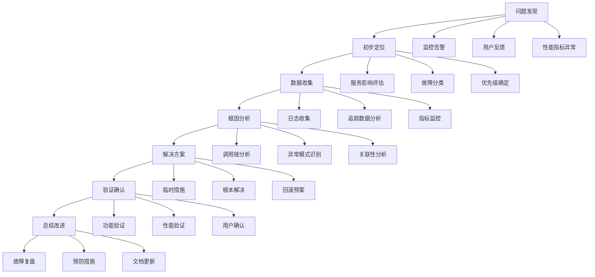

## 故障排查与性能瓶颈分析：基于分布式追踪的深度诊断

在复杂的微服务架构中，故障排查和性能瓶颈分析是保障系统稳定运行的关键环节。分布式追踪作为可观测性的核心组件，为这些问题的诊断提供了强大的数据支撑和分析能力。通过深入分析追踪数据，我们可以快速定位问题根源、识别性能瓶颈、优化系统性能。本章将深入探讨基于分布式追踪的故障排查与性能瓶颈分析方法，包括诊断流程、分析技巧、工具使用、案例研究以及最佳实践。

### 故障诊断流程

建立系统化的故障诊断流程是高效排查问题的基础。

#### 标准化诊断流程

标准化的故障诊断流程：



#### 详细诊断步骤

详细的故障诊断步骤：

```bash
# 故障诊断详细步骤
# 1. 问题发现阶段:
#    - 监控告警触发
#    - 用户反馈问题
#    - 性能指标异常
#    - 业务指标下降

# 2. 初步定位阶段:
#    - 确定影响范围
#    - 评估业务影响
#    - 分类故障类型
#    - 确定处理优先级

# 3. 数据收集阶段:
#    - 收集相关日志
#    - 获取追踪数据
#    - 查看监控指标
#    - 分析配置变更

# 4. 根因分析阶段:
#    - 分析调用链路
#    - 识别异常模式
#    - 进行关联分析
#    - 验证假设结论

# 5. 解决方案阶段:
#    - 制定修复计划
#    - 准备回滚方案
#    - 评估风险影响
#    - 确定实施时间

# 6. 验证确认阶段:
#    - 验证功能恢复
#    - 确认性能改善
#    - 监控指标正常
#    - 用户体验恢复

# 7. 总结改进阶段:
#    - 故障复盘总结
#    - 制定预防措施
#    - 更新文档知识
#    - 优化流程机制
```

### 基于追踪的故障分析

利用分布式追踪数据进行故障分析。

#### 错误传播分析

错误在分布式系统中的传播分析：

```bash
# 错误传播分析方法
# 1. 错误源头识别:
#    - 查找第一个错误Span
#    - 分析错误类型和原因
#    - 确定错误传播路径

# 2. 传播路径追踪:
#    - 分析调用链路
#    - 识别错误传播节点
#    - 确定影响范围

# 3. 传播模式分析:
#    - 串行传播分析
#    - 并行传播分析
#    - 循环传播分析

# 4. 传播阻断分析:
#    - 重试机制效果
#    - 熔断机制作用
#    - 超时机制影响
```

#### 异常模式识别

识别分布式系统中的异常模式：

```python
# 异常模式识别示例 (Python)
import pandas as pd
import numpy as np
from sklearn.ensemble import IsolationForest
from sklearn.preprocessing import StandardScaler

class AnomalyDetector:
    def __init__(self):
        self.model = IsolationForest(contamination=0.1, random_state=42)
        self.scaler = StandardScaler()
    
    def extract_features(self, trace_data):
        """从追踪数据中提取特征"""
        features = []
        for trace in trace_data:
            # 提取每个Trace的特征
            trace_features = {
                'duration': trace.get('duration', 0),
                'span_count': len(trace.get('spans', [])),
                'error_count': sum(1 for span in trace.get('spans', []) 
                                 if span.get('tags', {}).get('error') == 'true'),
                'service_count': len(set(span.get('service') 
                                       for span in trace.get('spans', []))),
                'max_depth': self.calculate_max_depth(trace),
                'avg_span_duration': np.mean([span.get('duration', 0) 
                                            for span in trace.get('spans', [])])
            }
            features.append(trace_features)
        return pd.DataFrame(features)
    
    def detect_anomalies(self, trace_data):
        """检测异常追踪"""
        # 提取特征
        features_df = self.extract_features(trace_data)
        
        # 标准化特征
        scaled_features = self.scaler.fit_transform(features_df)
        
        # 训练模型并预测
        self.model.fit(scaled_features)
        anomalies = self.model.predict(scaled_features)
        
        # 返回异常的Trace
        anomaly_traces = []
        for i, is_anomaly in enumerate(anomalies):
            if is_anomaly == -1:  # -1表示异常
                anomaly_traces.append(trace_data[i])
        
        return anomaly_traces
    
    def calculate_max_depth(self, trace):
        """计算调用链最大深度"""
        spans = trace.get('spans', [])
        if not spans:
            return 0
        
        # 构建父子关系映射
        parent_map = {span['spanId']: span.get('parentSpanId') 
                     for span in spans}
        
        # 计算每个Span的深度
        depths = {}
        def get_depth(span_id):
            if span_id in depths:
                return depths[span_id]
            parent_id = parent_map.get(span_id)
            if not parent_id:
                depths[span_id] = 1
                return 1
            depth = 1 + get_depth(parent_id)
            depths[span_id] = depth
            return depth
        
        # 返回最大深度
        return max(get_depth(span['spanId']) for span in spans)

# 使用示例
# detector = AnomalyDetector()
# anomalies = detector.detect_anomalies(trace_data)
# print(f"发现 {len(anomalies)} 个异常追踪")
```

### 性能瓶颈分析

深入分析系统性能瓶颈。

#### 瓶颈识别方法

性能瓶颈识别的核心方法：

```bash
# 性能瓶颈识别方法
# 1. 自上而下分析:
#    - 从整体响应时间开始
#    - 逐层分解到具体服务
#    - 识别耗时最长的环节

# 2. 自下而上分析:
#    - 从底层基础设施开始
#    - 逐步向上分析到应用层
#    - 识别资源瓶颈点

# 3. 对比分析:
#    - 正常与异常情况对比
#    - 不同时间段对比
#    - 不同版本对比

# 4. 趋势分析:
#    - 性能指标变化趋势
#    - 业务量与性能关系
#    - 系统负载与响应关系
```

#### 瓶颈量化分析

性能瓶颈的量化分析方法：

```python
# 性能瓶颈量化分析
import numpy as np
import matplotlib.pyplot as plt

class PerformanceBottleneckAnalyzer:
    def __init__(self, trace_data):
        self.trace_data = trace_data
    
    def analyze_service_performance(self):
        """分析各服务性能"""
        service_stats = {}
        
        for trace in self.trace_data:
            for span in trace.get('spans', []):
                service = span.get('service', 'unknown')
                duration = span.get('duration', 0)
                
                if service not in service_stats:
                    service_stats[service] = {
                        'durations': [],
                        'total_spans': 0,
                        'error_spans': 0
                    }
                
                service_stats[service]['durations'].append(duration)
                service_stats[service]['total_spans'] += 1
                
                if span.get('tags', {}).get('error') == 'true':
                    service_stats[service]['error_spans'] += 1
        
        # 计算统计指标
        for service, stats in service_stats.items():
            durations = stats['durations']
            stats['avg_duration'] = np.mean(durations)
            stats['p95_duration'] = np.percentile(durations, 95)
            stats['p99_duration'] = np.percentile(durations, 99)
            stats['error_rate'] = stats['error_spans'] / stats['total_spans']
        
        return service_stats
    
    def identify_bottlenecks(self, threshold_percentile=95):
        """识别性能瓶颈"""
        service_stats = self.analyze_service_performance()
        
        # 按P95耗时排序
        sorted_services = sorted(
            service_stats.items(),
            key=lambda x: x[1]['p95_duration'],
            reverse=True
        )
        
        bottlenecks = []
        for service, stats in sorted_services:
            # 识别瓶颈条件
            if (stats['p95_duration'] > np.percentile(
                [s['p95_duration'] for s in service_stats.values()],
                threshold_percentile
            )):
                bottlenecks.append({
                    'service': service,
                    'avg_duration': stats['avg_duration'],
                    'p95_duration': stats['p95_duration'],
                    'p99_duration': stats['p99_duration'],
                    'error_rate': stats['error_rate'],
                    'total_spans': stats['total_spans']
                })
        
        return bottlenecks
    
    def visualize_performance(self):
        """可视化性能数据"""
        service_stats = self.analyze_service_performance()
        
        services = list(service_stats.keys())
        avg_durations = [stats['avg_duration'] for stats in service_stats.values()]
        p95_durations = [stats['p95_duration'] for stats in service_stats.values()]
        error_rates = [stats['error_rate'] * 100 for stats in service_stats.values()]
        
        fig, (ax1, ax2) = plt.subplots(1, 2, figsize=(15, 6))
        
        # 平均耗时图表
        ax1.bar(services, avg_durations)
        ax1.set_title('Average Duration by Service')
        ax1.set_ylabel('Duration (ms)')
        ax1.tick_params(axis='x', rotation=45)
        
        # 错误率图表
        ax2.bar(services, error_rates)
        ax2.set_title('Error Rate by Service')
        ax2.set_ylabel('Error Rate (%)')
        ax2.tick_params(axis='x', rotation=45)
        
        plt.tight_layout()
        plt.show()

# 使用示例
# analyzer = PerformanceBottleneckAnalyzer(trace_data)
# bottlenecks = analyzer.identify_bottlenecks()
# analyzer.visualize_performance()
```

### 根因分析技术

深入的根因分析技术。

#### 依赖关系分析

服务间依赖关系分析：

```yaml
# 依赖关系分析方法
# 1. 直接依赖分析:
#    - 服务调用关系
#    - 数据流依赖
#    - 配置依赖关系

# 2. 间接依赖分析:
#    - 共享资源依赖
#    - 第三方服务依赖
#    - 基础设施依赖

# 3. 循环依赖分析:
#    - 识别循环调用
#    - 分析循环影响
#    - 提出解决方案

# 4. 依赖强度分析:
#    - 调用频次分析
#    - 数据传输量分析
#    - 响应时间影响分析
```

#### 时间序列分析

基于时间序列的根因分析：

```python
# 时间序列根因分析
import pandas as pd
from statsmodels.tsa.seasonal import seasonal_decompose
from statsmodels.tsa.stattools import grangercausalitytests

class TimeSeriesRootCauseAnalyzer:
    def __init__(self, metrics_data):
        self.metrics_data = pd.DataFrame(metrics_data)
        self.metrics_data['timestamp'] = pd.to_datetime(self.metrics_data['timestamp'])
        self.metrics_data.set_index('timestamp', inplace=True)
    
    def detect_anomalies(self, metric_name, threshold=2):
        """检测指标异常"""
        metric_series = self.metrics_data[metric_name]
        
        # 计算移动平均和标准差
        rolling_mean = metric_series.rolling(window=10).mean()
        rolling_std = metric_series.rolling(window=10).std()
        
        # 计算Z-score
        z_scores = abs(metric_series - rolling_mean) / rolling_std
        
        # 识别异常点
        anomalies = self.metrics_data[z_scores > threshold]
        
        return anomalies
    
    def granger_causality_test(self, cause_metric, effect_metric, max_lag=5):
        """格兰杰因果关系测试"""
        data = self.metrics_data[[cause_metric, effect_metric]].dropna()
        
        # 执行格兰杰因果关系测试
        result = grangercausalitytests(data, max_lag, verbose=False)
        
        # 提取p值
        p_values = [result[i+1][0]['ssr_ftest'][1] for i in range(max_lag)]
        
        return {
            'cause': cause_metric,
            'effect': effect_metric,
            'p_values': p_values,
            'is_causal': any(p < 0.05 for p in p_values)
        }
    
    def seasonal_decomposition(self, metric_name):
        """季节性分解"""
        metric_series = self.metrics_data[metric_name].dropna()
        
        # 执行季节性分解
        decomposition = seasonal_decompose(
            metric_series, 
            model='additive', 
            period=24  # 假设24小时周期
        )
        
        return {
            'trend': decomposition.trend,
            'seasonal': decomposition.seasonal,
            'residual': decomposition.resid,
            'observed': decomposition.observed
        }

# 使用示例
# analyzer = TimeSeriesRootCauseAnalyzer(metrics_data)
# anomalies = analyzer.detect_anomalies('response_time')
# causality = analyzer.granger_causality_test('cpu_usage', 'response_time')
# decomposition = analyzer.seasonal_decomposition('request_count')
```

### 工具使用技巧

掌握故障排查和性能分析工具的使用技巧。

#### Jaeger查询技巧

Jaeger高级查询技巧：

```bash
# Jaeger查询技巧
# 1. 基础查询:
#    查询特定服务的追踪
#    jaeger-query:16686/search?service=user-service

# 2. 高级查询:
#    查询特定操作的追踪
#    jaeger-query:16686/search?service=user-service&operation=getUserInfo

# 3. 时间范围查询:
#    查询特定时间范围的追踪
#    jaeger-query:16686/search?start=1609459200000000&end=1609545600000000

# 4. 标签查询:
#    查询包含特定标签的追踪
#    jaeger-query:16686/search?tags={"error":"true"}

# 5. 最小耗时查询:
#    查询耗时超过指定时间的追踪
#    jaeger-query:16686/search?minDuration=1000000

# 6. 组合查询:
#    多条件组合查询
#    jaeger-query:16686/search?service=user-service&operation=getUserInfo&tags={"error":"true"}&minDuration=500000
```

#### 命令行工具技巧

命令行工具使用技巧：

```bash
# 命令行工具技巧
# 1. kubectl追踪查询:
kubectl get traces -A
kubectl describe trace <trace-name> -n <namespace>

# 2. 日志分析:
kubectl logs -n <namespace> <pod-name> --since=1h | grep "error\|exception"
kubectl logs -n <namespace> -l app=<app-name> --tail=100

# 3. 资源监控:
kubectl top pods -n <namespace>
kubectl top nodes

# 4. 网络诊断:
kubectl exec -it <pod-name> -- nslookup <service-name>
kubectl exec -it <pod-name> -- curl -v http://<service-name>:<port>

# 5. 配置检查:
kubectl get virtualservices -A
kubectl get destinationrules -A
kubectl get gateways -A
```

### 案例研究

通过实际案例学习故障排查和性能分析方法。

#### 案例一：数据库连接池耗尽

数据库连接池耗尽故障分析：

```bash
# 故障现象:
# 用户反馈API响应缓慢，部分请求超时
# 监控显示数据库相关服务错误率上升

# 诊断过程:
# 1. 查看追踪数据:
#    - 发现大量数据库查询耗时异常
#    - 错误类型为"connection pool timeout"

# 2. 分析调用链路:
#    - 定位到user-service服务
#    - 发现数据库连接等待时间过长

# 3. 检查资源配置:
#    - 数据库连接池配置: max_connections=20
#    - 实际并发请求数: ~50

# 4. 根因分析:
#    - 连接池大小不足
#    - 未正确释放连接
#    - 查询效率低下

# 5. 解决方案:
#    - 增加连接池大小到100
#    - 优化查询SQL
#    - 添加连接泄漏检测

# 6. 验证效果:
#    - 错误率降至0.1%以下
#    - 平均响应时间从2s降至200ms
#    - 用户反馈问题解决
```

#### 案例二：第三方服务超时

第三方服务超时故障分析：

```bash
# 故障现象:
# 支付功能间歇性失败
# 错误日志显示"third-party service timeout"

# 诊断过程:
# 1. 追踪数据分析:
#    - 定位到payment-service调用external-payment-api
#    - 发现调用耗时从平均200ms飙升到5s+

# 2. 第三方服务监控:
#    - 联系第三方服务商
#    - 确认其服务存在性能问题

# 3. 缓解措施:
#    - 增加调用超时时间到10s
#    - 实施熔断机制
#    - 添加降级处理

# 4. 根本解决:
#    - 与第三方服务商协作优化
#    - 实施重试机制
#    - 增加缓存层减少调用

# 5. 预防措施:
#    - 建立第三方服务SLA监控
#    - 实施更完善的容错机制
#    - 定期评估第三方服务性能
```

### 最佳实践

在进行故障排查和性能分析时，需要遵循一系列最佳实践。

#### 故障处理规范

故障处理规范：

```bash
# 故障处理规范
# 1. 快速响应:
#    - 建立7x24小时值班制度
#    - 设置故障响应SLA
#    - 建立应急联系机制

# 2. 分级处理:
#    - P1: 严重影响业务，需立即处理
#    - P2: 影响部分业务，需尽快处理
#    - P3: 轻微影响，可计划处理
#    - P4: 一般问题，可后续处理

# 3. 文档记录:
#    - 详细记录故障处理过程
#    - 分析根本原因
#    - 制定预防措施
#    - 更新知识库

# 4. 持续改进:
#    - 定期回顾故障案例
#    - 优化监控告警
#    - 完善应急预案
#    - 提升团队技能
```

#### 性能优化实践

性能优化实践：

```bash
# 性能优化实践
# 1. 预防性优化:
#    - 定期性能评估
#    - 容量规划
#    - 压力测试

# 2. 实时监控:
#    - 关键指标监控
#    - 异常检测
#    - 趋势分析

# 3. 持续改进:
#    - 性能基线建立
#    - 优化效果评估
#    - 最佳实践分享

# 4. 工具链完善:
#    - 自动化分析工具
#    - 可视化监控面板
#    - 智能告警系统
```

### 总结

故障排查与性能瓶颈分析是保障分布式系统稳定运行的关键环节。通过建立标准化的诊断流程、掌握基于追踪数据的分析方法、运用专业的分析工具和技术、学习实际案例经验以及遵循最佳实践，我们可以构建高效的故障诊断和性能优化体系。

分布式追踪作为核心的诊断工具，为我们提供了深入洞察系统行为的能力。通过分析调用链路、识别异常模式、量化性能瓶颈、进行根因分析，我们能够快速定位问题并制定有效的解决方案。

随着云原生技术的不断发展和系统复杂性的增加，故障排查和性能分析将继续演进，在AI驱动的智能诊断、预测性维护、自动化优化等方面取得新的突破。通过持续学习和实践，我们可以不断提升诊断能力，为系统的稳定运行提供强有力的技术保障。

通过系统化的故障排查和性能分析，我们能够：
1. 快速响应和解决系统问题
2. 优化系统性能和用户体验
3. 预防潜在问题的发生
4. 提升运维效率和质量
5. 为业务的持续发展提供可靠的技术支撑

这不仅有助于保障当前系统的稳定运行，也为未来的技术演进和业务发展奠定了坚实的基础。