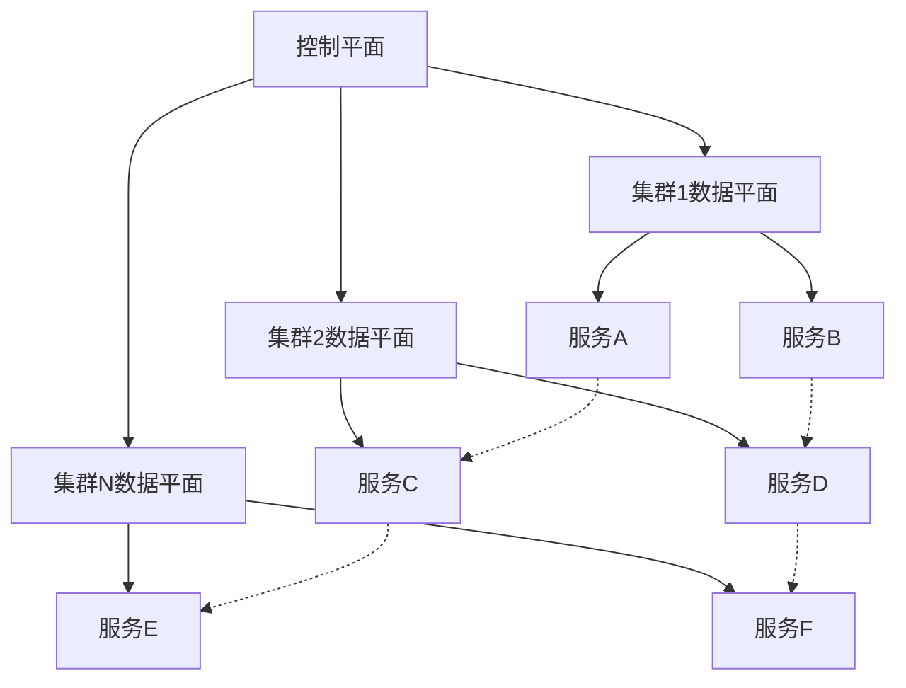

## 服务网格与多集群管理：构建跨集群的统一服务治理平台

在云原生时代，企业为了实现高可用性、灾难恢复、地理分布和负载分散等目标，越来越多地采用多集群部署策略。服务网格作为微服务通信的基础设施层，在多集群环境中发挥着至关重要的作用，它能够提供跨集群的服务发现、流量管理、安全控制和可观察性。本章将深入探讨服务网格在多集群管理中的应用，包括架构设计、流量管理、服务发现与路由以及多云环境中的实践。

### 多集群部署的背景与挑战

随着业务规模的扩大和复杂性的增加，单一集群已经无法满足企业对高可用性、性能和合规性的需求。多集群部署成为现代云原生架构的重要组成部分。

#### 多集群部署的驱动因素

企业采用多集群部署主要有以下几个驱动因素：

```yaml
# 多集群部署驱动因素
# 1. 高可用性与灾难恢复:
#    - 地理冗余部署
#    - 故障隔离
#    - 快速恢复能力

# 2. 性能优化:
#    - 地理位置就近访问
#    - 网络延迟优化
#    - 负载分散

# 3. 合规性要求:
#    - 数据主权法规
#    - 行业合规标准
#    - 数据本地化要求

# 4. 业务隔离:
#    - 开发、测试、生产环境隔离
#    - 多租户隔离
#    - 业务单元隔离

# 5. 技术多样性:
#    - 不同版本的Kubernetes集群
#    - 异构基础设施
#    - 混合云部署
```

#### 多集群管理面临的挑战

在多集群环境中，企业面临诸多挑战：

```yaml
# 多集群管理挑战
# 1. 服务发现与通信:
#    - 跨集群服务发现
#    - 服务间通信安全
#    - 网络连通性管理

# 2. 流量管理:
#    - 跨集群流量路由
#    - 负载均衡策略
#    - 故障转移机制

# 3. 安全性:
#    - 跨集群身份认证
#    - 端到端加密
#    - 访问控制策略

# 4. 可观察性:
#    - 统一监控视图
#    - 跨集群追踪
#    - 统一日志管理

# 5. 运维复杂性:
#    - 配置一致性
#    - 版本同步
#    - 故障排查困难
```

### 服务网格在多集群中的价值

服务网格为解决多集群管理挑战提供了强有力的工具和能力。

#### 统一的服务治理

服务网格通过控制平面和数据平面的协同工作，为多集群环境提供统一的服务治理能力：



#### 跨集群流量管理

服务网格提供了强大的跨集群流量管理能力：

```yaml
# 跨集群流量管理能力
# 1. 统一路由策略:
#    - 基于地理位置的路由
#    - 基于延迟的路由
#    - 基于健康的路由

# 2. 故障转移:
#    - 自动故障检测
#    - 优雅的故障转移
#    - 服务降级策略

# 3. 负载均衡:
#    - 跨集群负载均衡
#    - 智能负载分配
#    - 性能优化调度
```

### 多集群架构模式

在多集群环境中，有几种常见的架构模式可供选择。

#### 主从架构模式

主从架构模式是最简单的多集群架构：

```yaml
# 主从架构模式
# 1. 架构特点:
#    - 一个主集群负责控制平面
#    - 多个从集群负责数据平面
#    - 主集群管理所有配置和策略

# 2. 优势:
#    - 架构简单清晰
#    - 配置管理集中
#    - 运维复杂度较低

# 3. 劣势:
#    - 主集群单点故障风险
#    - 跨地域延迟较高
#    - 扩展性受限
```

#### 多主架构模式

多主架构模式提供更好的高可用性和扩展性：

```yaml
# 多主架构模式
# 1. 架构特点:
#    - 每个集群都有完整的控制平面
#    - 集群间通过同步机制保持一致
#    - 无单点故障风险

# 2. 优势:
#    - 高可用性
#    - 低延迟访问
#    - 良好的扩展性

# 3. 劣势:
#    - 架构复杂
#    - 配置同步挑战
#    - 运维复杂度高
```

### 本章内容概览

在本章中，我们将深入探讨以下关键主题：

1. **多集群部署与服务网格的架构设计** - 详细介绍多集群环境下的服务网格架构模式和设计原则

2. **多集群间的流量管理与通信** - 深入分析跨集群流量管理策略、路由规则和通信机制

3. **跨集群服务发现与路由** - 探讨跨集群服务发现机制、服务注册与发现流程以及路由策略

4. **多云环境中的服务网格应用** - 分析多云环境下的服务网格部署策略、挑战和最佳实践

通过本章的学习，读者将能够：
- 理解多集群部署的背景和挑战
- 掌握服务网格在多集群管理中的核心价值
- 熟悉多集群架构模式和设计原则
- 实施跨集群的服务治理和流量管理策略
- 在多云环境中成功部署和管理服务网格

让我们开始深入探讨服务网格与多集群管理的各个方面，构建一个跨集群的统一服务治理平台。