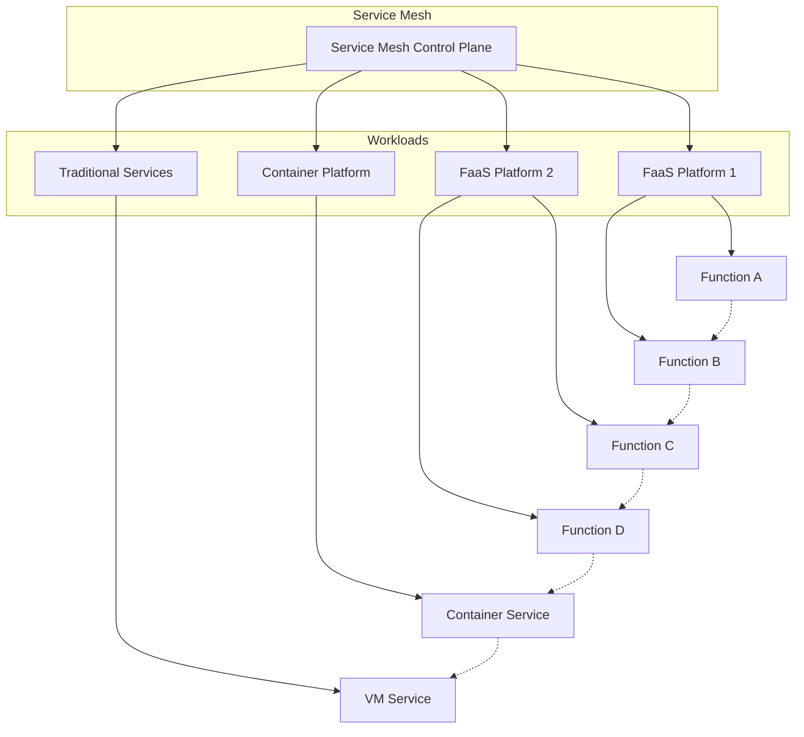

## 服务网格与无服务器架构：构建弹性可扩展的现代化应用平台

随着云计算技术的快速发展，无服务器架构（Serverless）已成为现代应用开发的重要趋势。无服务器架构通过将基础设施管理完全交给云平台，让开发者能够专注于业务逻辑的实现，从而大幅提升开发效率和降低运营成本。然而，无服务器架构在服务间通信、可观察性、安全性和流量管理等方面也面临着新的挑战。服务网格作为专门处理服务间通信的基础设施层，为无服务器架构提供了强有力的支撑，帮助解决这些挑战。本章将深入探讨服务网格与无服务器架构的结合应用，包括基本概念、集成方案、最佳实践以及未来发展趋势。

### 无服务器架构概述

无服务器架构是一种云计算执行模型，其中云服务商动态管理机器资源的分配和供应，开发者只需关注业务逻辑的实现。

#### 无服务器架构的核心特征

无服务器架构具有以下几个核心特征：

```yaml
# 无服务器架构核心特征
# 1. 事件驱动:
#    - 基于事件触发执行
#    - 自动响应业务事件
#    - 实时处理能力

# 2. 弹性伸缩:
#    - 自动扩缩容
#    - 按需分配资源
#    - 无容量规划负担

# 3. 按需付费:
#    - 仅对实际执行时间付费
#    - 无空闲资源成本
#    - 成本优化显著

# 4. 无服务器管理:
#    - 无需管理服务器
#    - 自动处理运维任务
#    - 专注业务逻辑

# 5. 高可用性:
#    - 内置高可用设计
#    - 自动故障恢复
#    - 地理分布部署
```

#### 无服务器架构的类型

无服务器架构主要包括以下几种类型：

```yaml
# 无服务器架构类型
# 1. Function as a Service (FaaS):
#    - 事件驱动的函数执行
#    - 短生命周期执行单元
#    - 典型代表: AWS Lambda, Azure Functions, Google Cloud Functions

# 2. Backend as a Service (BaaS):
#    - 第三方托管的服务
#    - 通用功能即服务
#    - 典型代表: Firebase, Auth0, Stripe

# 3. Container as a Service (CaaS):
#    - 无服务器容器运行
#    - 更长生命周期支持
#    - 典型代表: AWS Fargate, Google Cloud Run

# 4. Database as a Service (DBaaS):
#    - 托管数据库服务
#    - 自动备份和扩展
#    - 典型代表: Amazon RDS, Google Cloud SQL
```

### 无服务器架构的挑战

尽管无服务器架构具有诸多优势，但在实际应用中也面临着一些挑战。

#### 服务间通信挑战

无服务器函数间的服务通信面临特殊挑战：

```yaml
# 服务间通信挑战
# 1. 短生命周期:
#    - 函数执行时间有限
#    - 连接建立开销大
#    - 状态管理困难

# 2. 冷启动问题:
#    - 首次调用延迟高
#    - 资源初始化耗时
#    - 影响用户体验

# 3. 网络通信:
#    - 跨函数调用复杂
#    - 网络延迟不可控
#    - 安全通信需求

# 4. 服务发现:
#    - 动态服务实例
#    - 地址管理复杂
#    - 版本兼容问题
```

#### 可观察性挑战

无服务器架构的可观察性面临独特挑战：

```yaml
# 可观察性挑战
# 1. 分布式追踪:
#    - 函数调用链路追踪
#    - 跨服务上下文传递
#    - 性能瓶颈定位

# 2. 监控指标:
#    - 函数执行指标收集
#    - 资源使用情况监控
#    - 性能基准建立

# 3. 日志管理:
#    - 分布式日志收集
#    - 结构化日志处理
#    - 日志分析和查询

# 4. 告警机制:
#    - 实时异常检测
#    - 故障快速响应
#    - 告警准确性保证
```

#### 安全性挑战

无服务器架构的安全性面临新的挑战：

```yaml
# 安全性挑战
# 1. 身份认证:
#    - 函数间身份验证
#    - 访问权限控制
#    - 密钥安全管理

# 2. 数据保护:
#    - 数据传输加密
#    - 数据存储安全
#    - 敏感信息保护

# 3. 网络安全:
#    - 网络边界防护
#    - DDoS攻击防护
#    - 恶意代码检测

# 4. 合规性:
#    - 数据主权合规
#    - 行业标准遵循
#    - 审计日志记录
```

### 服务网格在无服务器架构中的价值

服务网格为无服务器架构提供了重要的价值和能力。

#### 统一的服务治理

服务网格为无服务器函数提供统一的服务治理能力：



#### 流量管理能力

服务网格为无服务器函数提供强大的流量管理能力：

```yaml
# 流量管理能力
# 1. 智能路由:
#    - 基于内容的路由
#    - A/B测试支持
#    - 金丝雀发布

# 2. 负载均衡:
#    - 自适应负载均衡
#    - 地理位置感知
#    - 性能优化调度

# 3. 故障处理:
#    - 超时控制
#    - 重试机制
#    - 断路器模式

# 4. 流量控制:
#    - 限流策略
#    - 熔断机制
#    - 流量镜像
```

#### 安全增强能力

服务网格为无服务器架构提供全面的安全增强能力：

```yaml
# 安全增强能力
# 1. 通信加密:
#    - mTLS双向认证
#    - 端到端加密
#    - 证书自动管理

# 2. 身份认证:
#    - 统一身份管理
#    - JWT令牌验证
#    - OAuth2集成

# 3. 访问控制:
#    - 细粒度权限控制
#    - RBAC策略管理
#    - 动态授权决策

# 4. 安全审计:
#    - 访问日志记录
#    - 安全事件监控
#    - 合规性报告
```

### 本章内容概览

在本章中，我们将深入探讨以下关键主题：

1. **无服务器架构的基本概念** - 详细介绍无服务器架构的核心概念、特征和类型

2. **服务网格在无服务器架构中的应用** - 深入分析服务网格如何为无服务器架构提供支撑

3. **通过服务网格管理无服务器函数** - 探讨具体的集成方案和管理方法

4. **结合服务网格与无服务器架构实现弹性与可扩展性** - 分析如何通过两者的结合实现更好的弹性和可扩展性

通过本章的学习，读者将能够：
- 理解无服务器架构的核心概念和特征
- 掌握无服务器架构面临的主要挑战
- 理解服务网格在无服务器架构中的价值
- 实施服务网格与无服务器架构的集成方案
- 通过服务网格管理无服务器函数
- 构建弹性可扩展的现代化应用平台

让我们开始深入探讨服务网格与无服务器架构的各个方面，构建一个弹性可扩展的现代化应用平台。