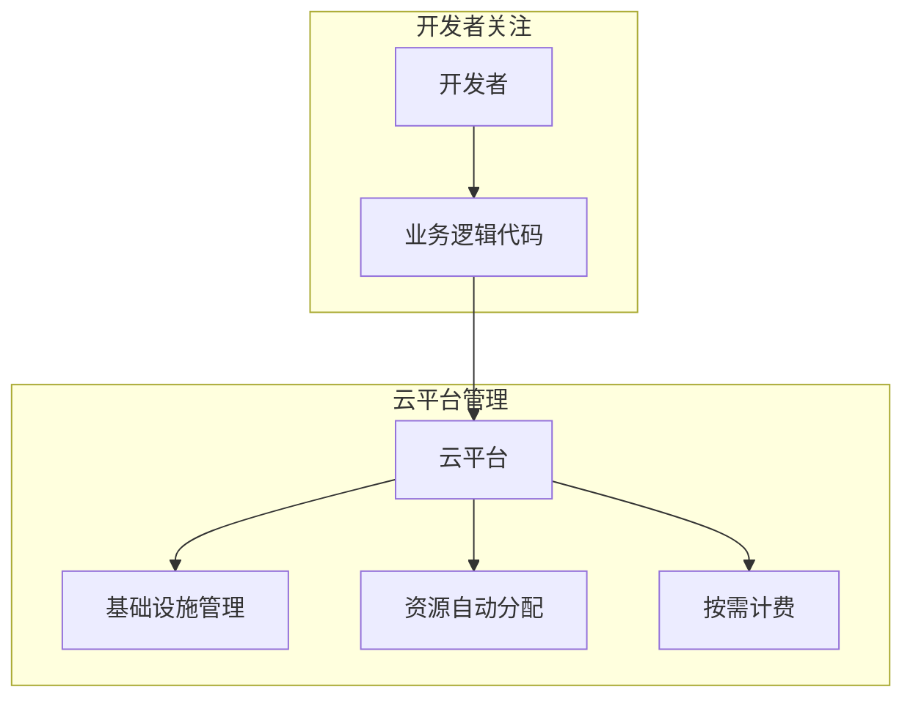
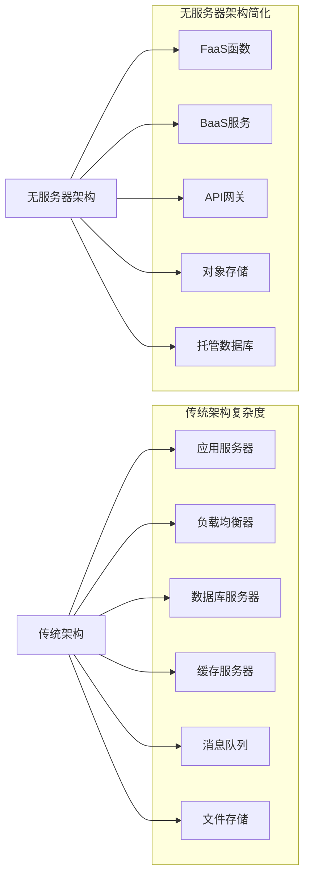

## 无服务器架构基本概念：理解现代化应用开发的新范式

无服务器架构（Serverless Architecture）作为云计算领域的重要创新，正在重新定义应用开发和部署的方式。它通过将基础设施管理完全交给云平台，让开发者能够专注于业务逻辑的实现，从而大幅提升开发效率和降低运营成本。本章将深入探讨无服务器架构的基本概念、核心特征、技术组成以及与传统架构的区别，帮助读者全面理解这一现代化应用开发的新范式。

### 无服务器架构的定义

无服务器架构是一种云计算执行模型，其中云服务商动态管理机器资源的分配和供应，开发者只需关注业务逻辑的实现，而无需管理服务器等基础设施。

#### 准确理解"无服务器"

"无服务器"这一术语容易引起误解，它并不意味着真的没有服务器，而是指：

```yaml
# "无服务器"的准确含义
# 1. 无服务器管理:
#    - 开发者无需管理服务器
#    - 云平台自动管理基础设施
#    - 专注业务逻辑开发

# 2. 按需分配:
#    - 根据请求动态分配资源
#    - 无请求时不占用资源
#    - 自动扩缩容能力

# 3. 事件驱动:
#    - 基于事件触发执行
#    - 自动响应业务事件
#    - 实时处理能力

# 4. 无状态设计:
#    - 函数执行环境无状态
#    - 数据持久化外部存储
#    - 状态管理解耦
```

#### 无服务器架构的核心理念

无服务器架构的核心理念是"只为你运行的代码付费"：



### 无服务器架构的核心特征

无服务器架构具有多个区别于传统架构的核心特征。

#### 事件驱动执行

无服务器架构基于事件驱动模型，函数在特定事件触发时执行：

```yaml
# 事件驱动执行特征
# 1. 触发机制:
#    - HTTP请求触发
#    - 定时任务触发
#    - 消息队列触发
#    - 数据库变更触发
#    - 文件上传触发

# 2. 响应模式:
#    - 同步响应
#    - 异步处理
#    - 流式处理
#    - 批量处理

# 3. 执行环境:
#    - 短生命周期
#    - 临时运行时
#    - 资源隔离环境
```

典型的事件驱动配置示例：

```yaml
# AWS Lambda事件触发配置
# 1. API Gateway触发:
{
  "handler": "index.handler",
  "runtime": "nodejs18.x",
  "events": [
    {
      "http": {
        "path": "/users",
        "method": "get"
      }
    }
  ]
}
---
# 2. S3触发:
{
  "handler": "index.processFile",
  "runtime": "python3.9",
  "events": [
    {
      "s3": {
        "bucket": "my-bucket",
        "event": "s3:ObjectCreated:*"
      }
    }
  ]
}
---
# 3. 定时触发:
{
  "handler": "index.scheduledTask",
  "runtime": "go1.x",
  "events": [
    {
      "schedule": "rate(10 minutes)"
    }
  ]
}
```

#### 自动弹性伸缩

无服务器架构具备自动弹性伸缩能力，能够根据负载自动调整资源：

```yaml
# 自动弹性伸缩特征
# 1. 扩展能力:
#    - 并发执行支持
#    - 秒级扩展响应
#    - 无限扩展潜力

# 2. 收缩机制:
#    - 无请求时自动收缩
#    - 资源自动回收
#    - 成本优化显著

# 3. 资源管理:
#    - 动态资源分配
#    - 按需资源使用
#    - 无资源浪费
```

自动扩缩容配置示例：

```yaml
# 自动扩缩容配置
# 1. AWS Lambda并发控制:
{
  "functionName": "my-function",
  "reservedConcurrentExecutions": 100,
  "provisionedConcurrentExecutions": 20
}
---
# 2. Google Cloud Functions扩缩容:
{
  "name": "projects/my-project/locations/us-central1/functions/my-function",
  "maxInstances": 3000,
  "minInstances": 0
}
---
# 3. Azure Functions扩缩容:
{
  "properties": {
    "scale": {
      "minInstanceCount": 0,
      "maxInstanceCount": 200
    }
  }
}
```

#### 按需付费模式

无服务器架构采用按需付费模式，仅对实际使用的资源计费：

```yaml
# 按需付费特征
# 1. 计费维度:
#    - 执行时间计费
#    - 资源使用计费
#    - 请求次数计费
#    - 数据传输计费

# 2. 成本优势:
#    - 无空闲成本
#    - 精确成本控制
#    - 成本可预测性

# 3. 优化策略:
#    - 执行时间优化
#    - 资源使用优化
#    - 请求合并处理
```

按需计费模型示例：

```yaml
# 按需计费模型
# 1. AWS Lambda计费:
#    - 请求费用: $0.20/百万次请求
#    - 计算费用: $0.0000166667/GB-秒
#    - 示例: 100万次请求，每次执行100ms，内存128MB
#      总费用 = $0.20 + (1000000 * 0.1 * 0.128 * $0.0000166667) = $0.41

# 2. Google Cloud Functions计费:
#    - 请求费用: $0.40/百万次请求
#    - 计算费用: $0.0000025/GB-秒
#    - 示例: 100万次请求，每次执行100ms，内存256MB
#      总费用 = $0.40 + (1000000 * 0.1 * 0.256 * $0.0000025) = $0.46

# 3. Azure Functions计费:
#    - 执行时间: $0.000016/GB-秒
#    - 执行次数: $0.20/百万次
#    - 示例: 100万次请求，每次执行100ms，内存128MB
#      总费用 = $0.20 + (1000000 * 0.1 * 0.128 * $0.000016) = $0.41
```

### 无服务器架构的技术组成

无服务器架构由多个技术组件构成，共同提供完整的计算服务。

#### Function as a Service (FaaS)

FaaS是无服务器架构的核心组件，提供函数执行能力：

```yaml
# FaaS核心特性
# 1. 函数管理:
#    - 函数部署和版本管理
#    - 环境变量配置
#    - 依赖包管理

# 2. 执行环境:
#    - 多语言支持
#    - 运行时隔离
#    - 资源限制控制

# 3. 触发机制:
#    - 多种触发源支持
#    - 事件订阅管理
#    - 触发条件配置
```

FaaS平台对比：

```yaml
# 主流FaaS平台对比
# 1. AWS Lambda:
#    - 支持语言: Node.js, Python, Java, C#, Go, Ruby
#    - 最大执行时间: 15分钟
#    - 最大内存: 10240 MB
#    - 并发执行: 支持
#    - 冷启动: 100-500ms

# 2. Google Cloud Functions:
#    - 支持语言: Node.js, Python, Go, Java, .NET, Ruby, PHP
#    - 最大执行时间: 540秒
#    - 最大内存: 8192 MB
#    - 并发执行: 支持
#    - 冷启动: 200-800ms

# 3. Azure Functions:
#    - 支持语言: C#, Java, JavaScript, PowerShell, Python, TypeScript
#    - 最大执行时间: 10分钟
#    - 最大内存: 15360 MB
#    - 并发执行: 支持
#    - 冷启动: 100-600ms

# 4. IBM Cloud Functions:
#    - 支持语言: Node.js, Python, Swift, PHP, Java
#    - 最大执行时间: 5分钟
#    - 最大内存: 4096 MB
#    - 并发执行: 支持
#    - 冷启动: 100-400ms
```

#### Backend as a Service (BaaS)

BaaS提供后端服务的托管能力：

```yaml
# BaaS核心服务
# 1. 数据存储:
#    - 文档数据库
#    - 关系数据库
#    - 对象存储
#    - 缓存服务

# 2. 身份认证:
#    - 用户注册登录
#    - 社交登录集成
#    - 权限管理
#    - 多因素认证

# 3. 消息推送:
#    - 实时消息推送
#    - 多平台支持
#    - 消息模板管理
#    - 用户分群推送

# 4. 分析服务:
#    - 用户行为分析
#    - 业务指标监控
#    - 数据可视化
#    - 实时数据处理
```

典型BaaS服务示例：

```yaml
# 典型BaaS服务
# 1. Firebase:
#    - 实时数据库: Firestore, Realtime Database
#    - 身份认证: Authentication
#    - 云函数: Cloud Functions
#    - 托管: Hosting
#    - 消息推送: Cloud Messaging

# 2. AWS Amplify:
#    - 数据存储: DynamoDB, S3
#    - 身份认证: Cognito
#    - API服务: AppSync
#    - 推送通知: Pinpoint
#    - 分析服务: Pinpoint

# 3. Azure Mobile Apps:
#    - 数据存储: Cosmos DB
#    - 身份认证: Azure AD
#    - 推送通知: Notification Hubs
#    - 离线同步: Offline Sync
#    - 文件存储: Blob Storage
```

### 无服务器架构与传统架构的对比

无服务器架构与传统架构在多个方面存在显著差异。

#### 架构复杂度对比

架构复杂度的对比分析：



#### 运维责任对比

运维责任的分配对比：

```yaml
# 运维责任对比
# 1. 传统架构运维责任:
#    - 服务器管理: 开发团队
#    - 操作系统维护: 运维团队
#    - 网络配置: 网络团队
#    - 安全防护: 安全团队
#    - 容量规划: 架构团队
#    - 监控告警: 运维团队
#    - 故障处理: 运维团队

# 2. 无服务器架构运维责任:
#    - 业务逻辑: 开发团队
#    - 代码部署: 开发团队
#    - 服务器管理: 云服务商
#    - 操作系统维护: 云服务商
#    - 网络配置: 云服务商
#    - 安全防护: 云服务商+开发团队
#    - 容量规划: 云服务商
#    - 监控告警: 开发团队+云服务商
#    - 故障处理: 云服务商
```

#### 成本模型对比

成本模型的对比分析：

```yaml
# 成本模型对比
# 1. 传统架构成本:
#    - 固定成本: 服务器租赁费用
#    - 可变成本: 带宽费用、存储费用
#    - 人力成本: 运维团队成本
#    - 间接成本: 故障损失、扩容成本
#    - 总体特征: 预付成本高、资源利用率低

# 2. 无服务器架构成本:
#    - 固定成本: 几乎为零
#    - 可变成本: 执行费用、请求费用
#    - 人力成本: 运维成本显著降低
#    - 间接成本: 几乎为零
#    - 总体特征: 按需付费、成本可预测
```

### 无服务器架构的应用场景

无服务器架构适用于多种应用场景。

#### 事件处理场景

事件驱动的处理场景非常适合无服务器架构：

```yaml
# 事件处理场景
# 1. 文件处理:
#    - 图片缩放和优化
#    - 视频转码处理
#    - 文档格式转换
#    - 数据提取和分析

# 2. 数据处理:
#    - 实时数据流处理
#    - 批量数据处理
#    - ETL数据管道
#    - 日志分析处理

# 3. 消息处理:
#    - 消息队列处理
#    - 通知消息发送
#    - 邮件发送服务
#    - 短信推送服务
```

文件处理示例：

```yaml
# 文件处理示例
# 1. 图片处理函数:
functions:
  imageProcessor:
    handler: src/imageProcessor.handler
    events:
      - s3:
          bucket: my-image-bucket
          event: s3:ObjectCreated:*
    environment:
      OUTPUT_BUCKET: processed-images-bucket
      IMAGE_QUALITY: 85
---
# 2. 视频转码函数:
functions:
  videoTranscoder:
    handler: src/videoTranscoder.handler
    events:
      - s3:
          bucket: video-upload-bucket
          event: s3:ObjectCreated:*
    timeout: 900  # 15分钟超时
    memorySize: 3008  # 最大内存
```

#### Web应用场景

Web应用场景也是无服务器架构的重要应用领域：

```yaml
# Web应用场景
# 1. API服务:
#    - RESTful API接口
#    - GraphQL API服务
#    - 微服务API网关
#    - 第三方集成API

# 2. Web应用:
#    - 静态网站托管
#    - 单页应用(SPA)
#    - 服务端渲染(SSR)
#    - 渐进式Web应用(PWA)

# 3. 移动后端:
#    - 移动应用API
#    - 用户认证服务
#    - 推送通知服务
#    - 数据同步服务
```

API服务示例：

```yaml
# API服务示例
# 1. 用户管理API:
functions:
  getUser:
    handler: src/user/get.handler
    events:
      - http:
          path: /users/{id}
          method: get
          cors: true
  createUser:
    handler: src/user/create.handler
    events:
      - http:
          path: /users
          method: post
          cors: true
  updateUser:
    handler: src/user/update.handler
    events:
      - http:
          path: /users/{id}
          method: put
          cors: true
---
# 2. 订单管理API:
functions:
  getOrders:
    handler: src/order/list.handler
    events:
      - http:
          path: /orders
          method: get
          cors: true
          authorizer: aws_iam
  createOrder:
    handler: src/order/create.handler
    events:
      - http:
          path: /orders
          method: post
          cors: true
          authorizer: aws_iam
```

#### 定时任务场景

定时任务场景也非常适合无服务器架构：

```yaml
# 定时任务场景
# 1. 数据同步:
#    - 数据库同步任务
#    - 第三方API数据同步
#    - 报表生成任务
#    - 数据备份任务

# 2. 系统维护:
#    - 日志清理任务
#    - 缓存清理任务
#    - 系统健康检查
#    - 资源回收任务

# 3. 业务处理:
#    - 定期业务计算
#    - 用户通知任务
#    - 数据统计分析
#    - 批量处理任务
```

定时任务示例：

```yaml
# 定时任务示例
# 1. 数据备份任务:
functions:
  dailyBackup:
    handler: src/backup/daily.handler
    events:
      - schedule: cron(0 2 * * ? *)
    timeout: 3600  # 1小时超时
    memorySize: 512
---
# 2. 报表生成任务:
functions:
  weeklyReport:
    handler: src/report/weekly.handler
    events:
      - schedule: cron(0 0 ? * MON *)
    timeout: 1800  # 30分钟超时
    memorySize: 1024
    environment:
      REPORT_RECIPIENTS: admin@example.com
```

### 无服务器架构的发展趋势

无服务器架构正在快速发展，呈现出以下趋势：

#### 技术发展趋势

技术层面的发展趋势：

```yaml
# 技术发展趋势
# 1. 标准化:
#    - 开放标准制定
#    - 跨平台兼容性
#    - 互操作性增强

# 2. 性能优化:
#    - 冷启动优化
#    - 执行性能提升
#    - 资源利用优化

# 3. 功能增强:
#    - 更长执行时间
#    - 更大内存支持
#    - 更多语言支持

# 4. 集成能力:
#    - 更多服务集成
#    - 更好的开发工具
#    - 更强的监控能力
```

#### 应用发展趋势

应用层面的发展趋势：

```yaml
# 应用发展趋势
# 1. 应用场景扩展:
#    - 从边缘应用向核心应用扩展
#    - 从简单任务向复杂业务扩展
#    - 从试点应用向生产环境扩展

# 2. 企业采用:
#    - 从互联网公司向传统企业扩展
#    - 从大型企业向中小企业扩展
#    - 从技术团队向业务团队扩展

# 3. 生态系统:
#    - 开源工具生态丰富
#    - 第三方服务集成增加
#    - 开发者社区活跃
```

### 总结

无服务器架构作为现代化应用开发的新范式，通过事件驱动、自动弹性伸缩、按需付费等核心特征，为开发者提供了更加高效、经济的开发模式。通过FaaS和BaaS等技术组件的协同工作，无服务器架构能够满足事件处理、Web应用、定时任务等多种应用场景的需求。

关键要点包括：
1. 理解"无服务器"的真实含义和核心理念
2. 掌握无服务器架构的核心特征和优势
3. 了解FaaS和BaaS等技术组件的特性和差异
4. 认识无服务器架构与传统架构的区别和优势
5. 熟悉无服务器架构的典型应用场景
6. 了解无服务器架构的发展趋势和未来方向

随着云计算技术的不断发展，无服务器架构将继续演进，在性能优化、功能增强、标准化等方面取得新的突破。通过持续学习和实践，我们可以不断提升无服务器架构的应用能力，为业务发展提供强有力的技术支撑。

通过系统性的理解和应用无服务器架构，我们能够：
1. 提升应用开发效率和交付速度
2. 降低基础设施成本和运维复杂度
3. 实现应用的高可用性和弹性扩展
4. 专注于业务逻辑创新和价值创造
5. 支持业务的快速迭代和创新发展

这不仅有助于当前项目的高效实施，也为未来的技术演进和业务发展奠定了坚实的基础。