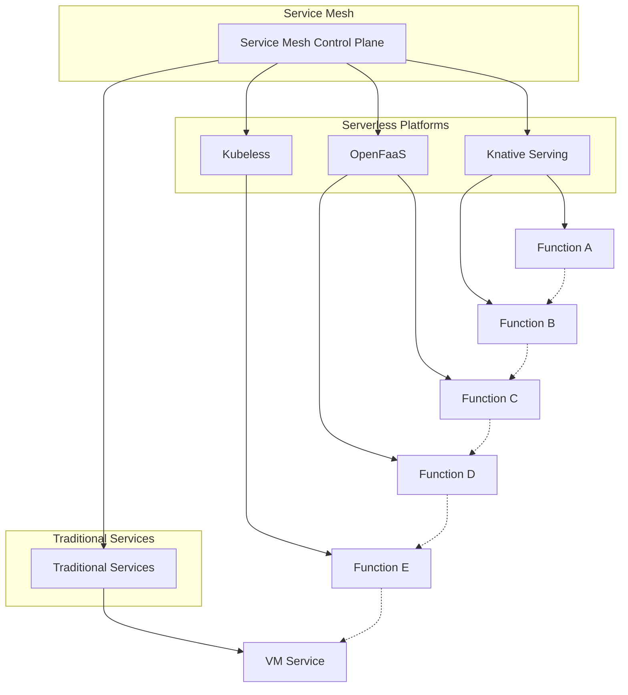

## 服务网格在无服务器架构中的应用：为函数即服务提供企业级能力

随着无服务器架构的广泛应用，企业在享受其带来的敏捷性和成本优势的同时，也面临着服务间通信、可观察性、安全性和流量管理等挑战。服务网格作为专门处理服务间通信的基础设施层，为无服务器架构提供了强有力的支持，帮助企业解决这些挑战并实现企业级应用能力。本章将深入探讨服务网格在无服务器架构中的应用，包括集成方案、技术实现、优势价值以及最佳实践。

### 无服务器架构的挑战与需求

无服务器架构在带来便利的同时，也引入了新的挑战，这些挑战正是服务网格可以解决的。

#### 服务间通信挑战

无服务器函数间的服务通信面临特殊挑战：

```yaml
# 服务间通信挑战
# 1. 短生命周期:
#    - 函数执行时间有限（通常几秒到几分钟）
#    - 连接建立开销相对较大
#    - 难以维护长连接和会话状态

# 2. 冷启动问题:
#    - 首次调用延迟高（通常100ms-1s）
#    - 资源初始化耗时
#    - 影响用户体验和系统性能

# 3. 网络通信:
#    - 跨函数调用复杂度增加
#    - 网络延迟不可控
#    - 需要安全的通信机制

# 4. 服务发现:
#    - 动态服务实例管理
#    - 地址管理复杂
#    - 版本兼容性问题
```

#### 可观察性需求

无服务器架构对可观察性提出了更高要求：

```yaml
# 可观察性需求
# 1. 分布式追踪:
#    - 函数调用链路追踪
#    - 跨服务上下文传递
#    - 性能瓶颈定位

# 2. 监控指标:
#    - 函数执行指标收集
#    - 资源使用情况监控
#    - 性能基准建立

# 3. 日志管理:
#    - 分布式日志收集
#    - 结构化日志处理
#    - 日志分析和查询

# 4. 告警机制:
#    - 实时异常检测
#    - 故障快速响应
#    - 告警准确性保证
```

#### 安全性需求

无服务器架构的安全性需求更加复杂：

```yaml
# 安全性需求
# 1. 身份认证:
#    - 函数间身份验证
#    - 访问权限控制
#    - 密钥安全管理

# 2. 数据保护:
#    - 数据传输加密
#    - 数据存储安全
#    - 敏感信息保护

# 3. 网络安全:
#    - 网络边界防护
#    - DDoS攻击防护
#    - 恶意代码检测

# 4. 合规性:
#    - 数据主权合规
#    - 行业标准遵循
#    - 审计日志记录
```

### 服务网格的核心价值

服务网格为无服务器架构提供了重要的价值和能力。

#### 统一的服务治理

服务网格为无服务器函数提供统一的服务治理能力：



#### 流量管理能力

服务网格为无服务器函数提供强大的流量管理能力：

```yaml
# 流量管理能力
# 1. 智能路由:
#    - 基于内容的路由
#    - A/B测试支持
#    - 金丝雀发布

# 2. 负载均衡:
#    - 自适应负载均衡
#    - 地理位置感知
#    - 性能优化调度

# 3. 故障处理:
#    - 超时控制
#    - 重试机制
#    - 断路器模式

# 4. 流量控制:
#    - 限流策略
#    - 熔断机制
#    - 流量镜像
```

流量管理配置示例：

```yaml
# 流量管理配置示例
# 1. 虚拟服务配置:
apiVersion: networking.istio.io/v1alpha3
kind: VirtualService
metadata:
  name: serverless-function-routing
spec:
  hosts:
  - user-service.serverless.example.com
  http:
  - match:
    - headers:
        user-type:
          exact: "premium"
    route:
    - destination:
        host: premium-user-function.serverless.svc.cluster.local
  - route:
    - destination:
        host: standard-user-function.serverless.svc.cluster.local
      weight: 90
    - destination:
        host: backup-user-function.serverless.svc.cluster.local
      weight: 10
---
# 2. 目标规则配置:
apiVersion: networking.istio.io/v1alpha3
kind: DestinationRule
metadata:
  name: serverless-function-dr
spec:
  host: user-function.serverless.svc.cluster.local
  trafficPolicy:
    connectionPool:
      tcp:
        maxConnections: 100
        connectTimeout: 30ms
      http:
        http1MaxPendingRequests: 1000
        maxRequestsPerConnection: 10
    outlierDetection:
      consecutive5xxErrors: 7
      interval: 30s
      baseEjectionTime: 30s
```

#### 安全增强能力

服务网格为无服务器架构提供全面的安全增强能力：

```yaml
# 安全增强能力
# 1. 通信加密:
#    - mTLS双向认证
#    - 端到端加密
#    - 证书自动管理

# 2. 身份认证:
#    - 统一身份管理
#    - JWT令牌验证
#    - OAuth2集成

# 3. 访问控制:
#    - 细粒度权限控制
#    - RBAC策略管理
#    - 动态授权决策

# 4. 安全审计:
#    - 访问日志记录
#    - 安全事件监控
#    - 合规性报告
```

安全配置示例：

```yaml
# 安全配置示例
# 1. mTLS配置:
apiVersion: security.istio.io/v1beta1
kind: PeerAuthentication
metadata:
  name: serverless-mtls
  namespace: serverless
spec:
  mtls:
    mode: STRICT
---
# 2. 授权策略:
apiVersion: security.istio.io/v1beta1
kind: AuthorizationPolicy
metadata:
  name: serverless-authz
  namespace: serverless
spec:
  selector:
    matchLabels:
      app: user-function
  rules:
  - from:
    - source:
        principals: ["cluster.local/ns/serverless/sa/function-sa"]
    to:
    - operation:
        methods: ["GET", "POST"]
        paths: ["/api/*"]
    when:
    - key: request.auth.claims[groups]
      values: ["functions", "admins"]
```

### 集成方案与技术实现

服务网格与无服务器架构的集成有多种方案和技术实现。

#### Knative与Istio集成

Knative作为Kubernetes上的无服务器平台，与Istio服务网格天然集成：

```yaml
# Knative与Istio集成配置
# 1. Knative服务配置:
apiVersion: serving.knative.dev/v1
kind: Service
metadata:
  name: hello-serverless
  namespace: serverless
spec:
  template:
    metadata:
      annotations:
        autoscaling.knative.dev/minScale: "1"
        autoscaling.knative.dev/maxScale: "10"
    spec:
      containers:
      - image: gcr.io/my-project/hello-serverless:latest
        ports:
        - containerPort: 8080
        env:
        - name: TARGET
          value: "Serverless World"
---
# 2. Istio网关配置:
apiVersion: networking.istio.io/v1alpha3
kind: Gateway
metadata:
  name: serverless-gateway
  namespace: serverless
spec:
  selector:
    istio: ingressgateway
  servers:
  - port:
      number: 80
      name: http
      protocol: HTTP
    hosts:
    - "serverless.example.com"
---
# 3. 虚拟服务配置:
apiVersion: networking.istio.io/v1alpha3
kind: VirtualService
metadata:
  name: serverless-vs
  namespace: serverless
spec:
  hosts:
  - serverless.example.com
  gateways:
  - serverless-gateway
  http:
  - match:
    - uri:
        prefix: /hello
    route:
    - destination:
        host: hello-serverless.serverless.svc.cluster.local
        port:
          number: 80
```

#### OpenFaaS与服务网格集成

OpenFaaS作为流行的开源无服务器平台，也可以与服务网格集成：

```yaml
# OpenFaaS与服务网格集成
# 1. 函数部署配置:
apiVersion: openfaas.com/v1
kind: Function
metadata:
  name: image-processor
  namespace: openfaas-fn
spec:
  name: image-processor
  image: functions/image-processor:latest
  labels:
    com.openfaas.scale.min: "1"
    com.openfaas.scale.max: "20"
  annotations:
    prometheus.io.scrape: "true"
    prometheus.io.port: "8081"
---
# 2. 服务网格配置:
apiVersion: networking.istio.io/v1alpha3
kind: ServiceEntry
metadata:
  name: openfaas-functions
  namespace: openfaas
spec:
  hosts:
  - "*.openfaas-fn.svc.cluster.local"
  location: MESH_INTERNAL
  ports:
  - number: 8080
    name: http
    protocol: HTTP
  resolution: DNS
```

#### AWS Lambda与App Mesh集成

AWS Lambda与AWS App Mesh的集成方案：

```yaml
# AWS Lambda与App Mesh集成
# 1. App Mesh虚拟节点:
{
  "meshName": "serverless-mesh",
  "virtualNodeName": "lambda-function",
  "spec": {
    "listeners": [
      {
        "portMapping": {
          "port": 80,
          "protocol": "http"
        }
      }
    ],
    "serviceDiscovery": {
      "awsCloudMap": {
        "namespaceName": "serverless.local",
        "serviceName": "lambda-function"
      }
    }
  }
}
---
# 2. Lambda函数配置:
{
  "FunctionName": "serverless-function",
  "Handler": "index.handler",
  "Runtime": "nodejs18.x",
  "Environment": {
    "Variables": {
      "APP_MESH_ENDPOINT": "serverless-mesh.local:8080",
      "ENVOY_LOG_LEVEL": "info"
    }
  }
}
```

### 可观察性增强

服务网格显著增强了无服务器架构的可观察性。

#### 分布式追踪

服务网格为无服务器函数提供完整的分布式追踪能力：

```yaml
# 分布式追踪配置
# 1. Jaeger集成:
apiVersion: jaegertracing.io/v1
kind: Jaeger
metadata:
  name: serverless-jaeger
  namespace: istio-system
spec:
  strategy: production
  collector:
    maxReplicas: 3
  storage:
    type: memory
    options:
      memory:
        max-traces: 100000
---
# 2. 追踪采样配置:
apiVersion: v1
kind: ConfigMap
metadata:
  name: serverless-tracing-config
  namespace: istio-system
data:
  config.yaml: |-
    tracing:
      sampling: 100
      zipkin:
        address: zipkin.istio-system:9411
```

#### 监控指标收集

服务网格提供全面的监控指标收集能力：

```yaml
# 监控指标配置
# 1. Prometheus监控:
apiVersion: monitoring.coreos.com/v1
kind: ServiceMonitor
metadata:
  name: serverless-monitor
  namespace: monitoring
spec:
  selector:
    matchLabels:
      app: serverless-function
  endpoints:
  - port: http-metrics
    path: /metrics
    interval: 30s
---
# 2. 自定义指标:
apiVersion: monitoring.coreos.com/v1
kind: PrometheusRule
metadata:
  name: serverless-alerts
  namespace: monitoring
spec:
  groups:
  - name: serverless.rules
    rules:
    - alert: HighFunctionErrorRate
      expr: |
        sum(rate(serverless_function_errors_total[5m])) / 
        sum(rate(serverless_function_invocations_total[5m])) * 100 > 5
      for: 5m
      labels:
        severity: warning
      annotations:
        summary: "High function error rate detected"
        description: "Function error rate is above 5%"
```

#### 日志管理

服务网格提供统一的日志管理能力：

```yaml
# 日志管理配置
# 1. Fluentd配置:
apiVersion: v1
kind: ConfigMap
metadata:
  name: serverless-fluentd-config
  namespace: logging
data:
  fluent.conf: |-
    <source>
      @type tail
      path /var/log/containers/*serverless*.log
      pos_file /var/log/serverless.log.pos
      tag serverless.*
      format json
      time_key time
      time_format %Y-%m-%dT%H:%M:%S.%NZ
    </source>
    
    <filter serverless.**>
      @type kubernetes_metadata
    </filter>
    
    <match serverless.**>
      @type elasticsearch
      host elasticsearch.logging.svc.cluster.local
      port 9200
      logstash_format true
    </match>
---
# 2. 日志聚合:
apiVersion: apps/v1
kind: Deployment
metadata:
  name: serverless-log-aggregator
  namespace: logging
spec:
  replicas: 2
  selector:
    matchLabels:
      app: log-aggregator
  template:
    metadata:
      labels:
        app: log-aggregator
    spec:
      containers:
      - name: fluentd
        image: fluent/fluentd:v1.14
        volumeMounts:
        - name: config
          mountPath: /fluentd/etc
        - name: varlog
          mountPath: /var/log
      volumes:
      - name: config
        configMap:
          name: serverless-fluentd-config
      - name: varlog
        hostPath:
          path: /var/log
```

### 性能优化与成本控制

服务网格帮助优化无服务器架构的性能和成本。

#### 冷启动优化

通过服务网格优化函数冷启动性能：

```yaml
# 冷启动优化配置
# 1. 预热策略:
apiVersion: apps/v1
kind: Deployment
metadata:
  name: function-warmup
  namespace: serverless
spec:
  replicas: 2
  selector:
    matchLabels:
      app: function-warmup
  template:
    metadata:
      labels:
        app: function-warmup
    spec:
      containers:
      - name: warmup
        image: curlimages/curl
        command:
        - /bin/sh
        - -c
        - |
          while true; do
            curl -s http://user-function.serverless.svc.cluster.local/health
            sleep 60
          done
---
# 2. 连接池优化:
apiVersion: networking.istio.io/v1alpha3
kind: DestinationRule
metadata:
  name: function-connection-pool
  namespace: serverless
spec:
  host: user-function.serverless.svc.cluster.local
  trafficPolicy:
    connectionPool:
      tcp:
        maxConnections: 1000
        connectTimeout: 10ms
        tcpKeepalive:
          time: 7200s
          interval: 75s
      http:
        http1MaxPendingRequests: 10000
        maxRequestsPerConnection: 100
        maxRetries: 3
```

#### 资源优化

通过服务网格优化资源使用：

```yaml
# 资源优化配置
# 1. 资源限制:
apiVersion: v1
kind: ResourceQuota
metadata:
  name: serverless-quota
  namespace: serverless
spec:
  hard:
    requests.cpu: "4"
    requests.memory: 8Gi
    limits.cpu: "8"
    limits.memory: 16Gi
---
# 2. 优先级配置:
apiVersion: scheduling.k8s.io/v1
kind: PriorityClass
metadata:
  name: serverless-priority
value: 1000000
globalDefault: false
description: "Priority class for serverless functions"
```

### 最佳实践与建议

在无服务器架构中应用服务网格的最佳实践。

#### 部署最佳实践

部署过程中的最佳实践：

```bash
# 部署最佳实践
# 1. 渐进式部署:
#    - 先在测试环境验证
#    - 逐步扩展到生产环境
#    - 监控关键指标

# 2. 版本管理:
#    - 使用版本控制管理配置
#    - 实施蓝绿部署策略
#    - 准备回滚方案

# 3. 自动化部署:
#    - 使用GitOps工具
#    - 实施CI/CD流水线
#    - 自动化测试验证
```

#### 配置管理最佳实践

配置管理的最佳实践：

```bash
# 配置管理最佳实践
# 1. 环境隔离:
#    - 不同环境使用不同配置
#    - 命名空间隔离
#    - 标签和注解管理

# 2. 配置验证:
#    - 预部署验证
#    - 金丝雀发布
#    - 回滚机制

# 3. 安全配置:
#    - 保护敏感配置
#    - 使用Secret管理
#    - 定期审查权限
```

#### 性能优化建议

性能优化的建议：

```bash
# 性能优化建议
# 1. 网络优化:
#    - 减少跨函数调用
#    - 优化网络路径
#    - 使用缓存减少调用

# 2. 资源优化:
#    - 合理设置资源请求和限制
#    - 优化函数执行时间
#    - 实施自动扩缩容

# 3. 监控优化:
#    - 合理设置采样率
#    - 优化指标收集
#    - 实施告警分级
```

### 案例研究

通过实际案例学习服务网格在无服务器架构中的应用。

#### 案例一：电商平台订单处理

电商平台订单处理系统的无服务器架构案例：

```bash
# 电商平台案例
# 1. 业务需求:
#    - 高并发订单处理
#    - 实时库存更新
#    - 多种支付方式支持

# 2. 架构设计:
#    - 订单创建函数
#    - 库存检查函数
#    - 支付处理函数
#    - 通知发送函数

# 3. 服务网格应用:
#    - 流量管理确保订单处理顺序
#    - 安全认证保护支付信息
#    - 可观察性监控系统性能
#    - 故障处理保障系统稳定

# 4. 实施效果:
#    - 订单处理时间减少30%
#    - 系统可用性提升至99.99%
#    - 运维成本降低40%
```

#### 案例二：媒体内容处理

媒体内容处理平台的无服务器架构案例：

```bash
# 媒体内容处理案例
# 1. 业务需求:
#    - 大量媒体文件处理
#    - 多种格式转换支持
#    - 实时处理能力要求

# 2. 架构设计:
#    - 文件上传触发函数
#    - 图片处理函数
#    - 视频转码函数
#    - 内容分析函数

# 3. 服务网格应用:
#    - 负载均衡处理高并发
#    - 流量控制防止系统过载
#    - 安全传输保护媒体内容
#    - 分布式追踪定位性能瓶颈

# 4. 实施效果:
#    - 处理能力提升50%
#    - 处理时间减少40%
#    - 系统稳定性显著提升
```

### 未来发展趋势

服务网格在无服务器架构中的未来发展趋势。

#### 技术发展趋势

技术层面的发展趋势：

```yaml
# 技术发展趋势
# 1. 标准化:
#    - 服务网格接口标准化
#    - 无服务器平台集成标准
#    - 跨平台互操作性

# 2. 智能化:
#    - AI驱动的流量管理
#    - 自动化故障处理
#    - 预测性性能优化

# 3. 简化化:
#    - 简化部署和管理
#    - 降低运维复杂度
#    - 提升用户体验
```

#### 应用发展趋势

应用层面的发展趋势：

```yaml
# 应用发展趋势
# 1. 应用场景扩展:
#    - 从边缘应用向核心应用扩展
#    - 从简单任务向复杂业务扩展
#    - 从试点应用向生产环境扩展

# 2. 企业采用:
#    - 从互联网公司向传统企业扩展
#    - 从大型企业向中小企业扩展
#    - 从技术团队向业务团队扩展

# 3. 生态系统:
#    - 开源工具生态丰富
#    - 第三方服务集成增加
#    - 开发者社区活跃
```

### 总结

服务网格在无服务器架构中的应用为企业提供了强大的企业级能力。通过统一的服务治理、流量管理、安全增强和可观察性，服务网格有效解决了无服务器架构面临的服务间通信、安全性和可观察性等挑战。

关键要点包括：
1. 理解无服务器架构面临的核心挑战和需求
2. 掌握服务网格为无服务器架构提供的核心价值
3. 熟悉Knative、OpenFaaS等平台与服务网格的集成方案
4. 实施分布式追踪、监控指标和日志管理等可观察性增强
5. 通过连接池优化、资源管理等手段优化性能和成本
6. 遵循部署、配置和性能优化的最佳实践
7. 了解服务网格在无服务器架构中的未来发展趋势

随着云原生技术的不断发展，服务网格与无服务器架构的结合将继续演进，在标准化、智能化、简化化等方面取得新的突破。通过持续学习和实践，我们可以不断提升服务网格在无服务器架构中的应用能力，为企业数字化转型提供强有力的技术支撑。

通过系统性的服务网格应用，我们能够：
1. 为无服务器函数提供企业级服务治理能力
2. 实现高可用性和弹性的服务通信
3. 保障服务间通信的安全性和可靠性
4. 建立全面的监控和故障排查能力
5. 支持业务的快速创新和扩展发展

这不仅有助于当前系统的高效运行，也为未来的技术演进和业务发展奠定了坚实的基础。