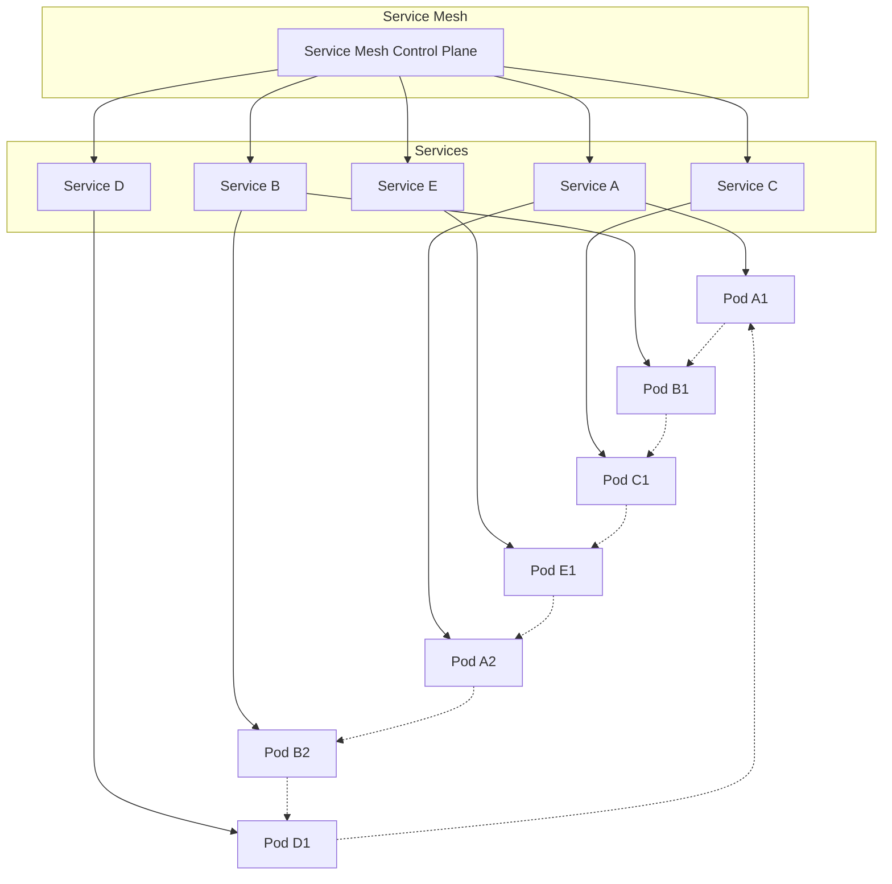

## 服务网格与微服务治理：构建统一的服务治理体系

随着企业数字化转型的深入推进，微服务架构已成为构建现代化应用的主流选择。微服务架构通过将复杂的单体应用拆分为多个独立的服务，显著提升了系统的可维护性、可扩展性和开发效率。然而，随着服务数量的增加，微服务治理的复杂性也急剧上升，服务发现、流量管理、安全控制、可观察性等问题成为企业面临的重要挑战。服务网格作为专门处理服务间通信的基础设施层，为微服务治理提供了强有力的解决方案。本章将深入探讨服务网格与微服务治理的结合应用，包括治理需求、核心能力、实施策略以及最佳实践。

### 微服务治理的挑战

微服务架构在带来灵活性和可扩展性的同时，也引入了新的治理挑战。

#### 服务发现与注册

在微服务架构中，服务实例动态变化，服务发现成为关键挑战：

```yaml
# 服务发现挑战
# 1. 动态性:
#    - 服务实例频繁启停
#    - IP地址动态分配
#    - 负载均衡地址管理

# 2. 多样性:
#    - 不同语言开发的服务
#    - 不同框架实现的服务
#    - 不同部署环境的服务

# 3. 复杂性:
#    - 服务依赖关系复杂
#    - 服务版本管理困难
#    - 健康状态实时监控
```

#### 流量管理

微服务间的流量管理变得异常复杂：

```yaml
# 流量管理挑战
# 1. 路由复杂性:
#    - 基于内容的路由
#    - 版本路由策略
#    - A/B测试需求

# 2. 负载均衡:
#    - 多种负载均衡算法
#    - 地理位置感知
#    - 性能优化调度

# 3. 故障处理:
#    - 超时控制
#    - 重试机制
#    - 断路器模式
```

#### 安全控制

微服务架构的安全控制面临新的挑战：

```yaml
# 安全控制挑战
# 1. 身份认证:
#    - 服务间身份验证
#    - 访问权限控制
#    - 密钥安全管理

# 2. 数据保护:
#    - 数据传输加密
#    - 数据存储安全
#    - 敏感信息保护

# 3. 网络安全:
#    - 网络边界防护
#    - DDoS攻击防护
#    - 恶意代码检测
```

### 服务网格的核心价值

服务网格为微服务治理提供了重要的价值和能力。

#### 统一的服务治理

服务网格为微服务提供统一的治理能力：



#### 流量治理能力

服务网格为微服务提供强大的流量治理能力：

```yaml
# 流量治理能力
# 1. 智能路由:
#    - 基于内容的路由
#    - A/B测试支持
#    - 金丝雀发布

# 2. 负载均衡:
#    - 自适应负载均衡
#    - 地理位置感知
#    - 性能优化调度

# 3. 故障处理:
#    - 超时控制
#    - 重试机制
#    - 断路器模式

# 4. 流量控制:
#    - 限流策略
#    - 熔断机制
#    - 流量镜像
```

#### 安全增强能力

服务网格为微服务架构提供全面的安全增强能力：

```yaml
# 安全增强能力
# 1. 通信加密:
#    - mTLS双向认证
#    - 端到端加密
#    - 证书自动管理

# 2. 身份认证:
#    - 统一身份管理
#    - JWT令牌验证
#    - OAuth2集成

# 3. 访问控制:
#    - 细粒度权限控制
#    - RBAC策略管理
#    - 动态授权决策

# 4. 安全审计:
#    - 访问日志记录
#    - 安全事件监控
#    - 合规性报告
```

### 本章内容概览

在本章中，我们将深入探讨以下关键主题：

1. **微服务治理的核心需求** - 详细介绍微服务治理面临的主要挑战和需求

2. **服务网格的治理能力** - 深入分析服务网格在服务发现、路由、熔断、限流等方面的能力

3. **微服务版本管理与治理策略** - 探讨微服务版本管理的最佳实践和治理策略

4. **服务网格与微服务生命周期管理** - 分析如何通过服务网格管理微服务的完整生命周期

通过本章的学习，读者将能够：
- 理解微服务治理的核心需求和挑战
- 掌握服务网格提供的治理能力
- 实施微服务版本管理和治理策略
- 通过服务网格管理微服务生命周期
- 构建统一的服务治理体系

让我们开始深入探讨服务网格与微服务治理的各个方面，构建一个统一的服务治理体系。