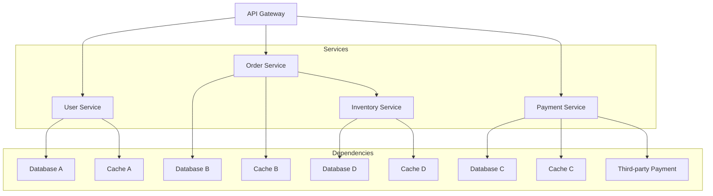
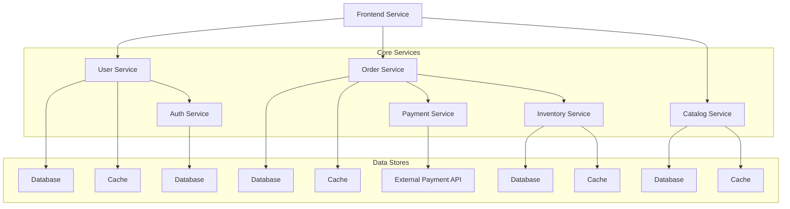

## 微服务治理的核心需求：理解现代化服务治理的关键挑战

随着企业数字化转型的深入推进，微服务架构已成为构建现代化应用的主流选择。微服务架构通过将复杂的单体应用拆分为多个独立的服务，显著提升了系统的可维护性、可扩展性和开发效率。然而，随着服务数量的增加，微服务治理的复杂性也急剧上升。本章将深入探讨微服务治理的核心需求，包括服务发现、流量管理、安全控制、可观察性等关键挑战，帮助读者全面理解现代化服务治理的复杂性和重要性。

### 微服务架构的治理挑战

微服务架构在带来灵活性和可扩展性的同时，也引入了新的治理挑战。

#### 服务发现与注册挑战

在微服务架构中，服务实例动态变化，服务发现成为关键挑战：

```yaml
# 服务发现挑战
# 1. 动态性挑战:
#    - 服务实例频繁启停
#    - IP地址动态分配
#    - 负载均衡地址管理

# 2. 多样性挑战:
#    - 不同语言开发的服务
#    - 不同框架实现的服务
#    - 不同部署环境的服务

# 3. 复杂性挑战:
#    - 服务依赖关系复杂
#    - 服务版本管理困难
#    - 健康状态实时监控
```

服务发现的复杂性示例：



#### 流量管理挑战

微服务间的流量管理变得异常复杂：

```yaml
# 流量管理挑战
# 1. 路由复杂性:
#    - 基于内容的路由
#    - 版本路由策略
#    - A/B测试需求

# 2. 负载均衡:
#    - 多种负载均衡算法
#    - 地理位置感知
#    - 性能优化调度

# 3. 故障处理:
#    - 超时控制
#    - 重试机制
#    - 断路器模式

# 4. 流量控制:
#    - 限流策略
#    - 熔断机制
#    - 流量镜像
```

流量管理配置示例：

```yaml
# 复杂的流量管理配置
# 1. 基于内容的路由:
apiVersion: networking.istio.io/v1alpha3
kind: VirtualService
metadata:
  name: content-based-routing
spec:
  hosts:
  - user-service.example.com
  http:
  - match:
    - headers:
        user-type:
          exact: "premium"
    route:
    - destination:
        host: premium-user-service.svc.cluster.local
  - match:
    - headers:
        user-type:
          exact: "standard"
    route:
    - destination:
        host: standard-user-service.svc.cluster.local
  - route:
    - destination:
        host: default-user-service.svc.cluster.local
---
# 2. 版本路由:
apiVersion: networking.istio.io/v1alpha3
kind: VirtualService
metadata:
  name: version-based-routing
spec:
  hosts:
  - order-service.example.com
  http:
  - match:
    - headers:
        version:
          exact: "v2"
    route:
    - destination:
        host: order-service.svc.cluster.local
        subset: v2
  - route:
    - destination:
        host: order-service.svc.cluster.local
        subset: v1
```

#### 安全控制挑战

微服务架构的安全控制面临新的挑战：

```yaml
# 安全控制挑战
# 1. 身份认证:
#    - 服务间身份验证
#    - 访问权限控制
#    - 密钥安全管理

# 2. 数据保护:
#    - 数据传输加密
#    - 数据存储安全
#    - 敏感信息保护

# 3. 网络安全:
#    - 网络边界防护
#    - DDoS攻击防护
#    - 恶意代码检测

# 4. 合规性:
#    - 数据主权合规
#    - 行业标准遵循
#    - 审计日志记录
```

安全控制配置示例：

```yaml
# 安全控制配置
# 1. mTLS配置:
apiVersion: security.istio.io/v1beta1
kind: PeerAuthentication
metadata:
  name: default
  namespace: istio-system
spec:
  mtls:
    mode: STRICT
---
# 2. 授权策略:
apiVersion: security.istio.io/v1beta1
kind: AuthorizationPolicy
metadata:
  name: user-service-authz
  namespace: production
spec:
  selector:
    matchLabels:
      app: user-service
  rules:
  - from:
    - source:
        principals: ["cluster.local/ns/production/sa/user-service-sa"]
    to:
    - operation:
        methods: ["GET", "POST"]
        paths: ["/api/*"]
    when:
    - key: request.auth.claims[groups]
      values: ["users", "admins"]
```

### 可观察性需求

微服务架构对可观察性提出了更高要求：

```yaml
# 可观察性需求
# 1. 分布式追踪:
#    - 服务调用链路追踪
#    - 跨服务上下文传递
#    - 性能瓶颈定位

# 2. 监控指标:
#    - 服务执行指标收集
#    - 资源使用情况监控
#    - 性能基准建立

# 3. 日志管理:
#    - 分布式日志收集
#    - 结构化日志处理
#    - 日志分析和查询

# 4. 告警机制:
#    - 实时异常检测
#    - 故障快速响应
#    - 告警准确性保证
```

可观察性配置示例：

```yaml
# 可观察性配置
# 1. Prometheus监控:
apiVersion: monitoring.coreos.com/v1
kind: ServiceMonitor
metadata:
  name: microservices-monitor
  namespace: monitoring
spec:
  selector:
    matchLabels:
      app: microservice
  endpoints:
  - port: http-metrics
    path: /metrics
    interval: 30s
---
# 2. 分布式追踪:
apiVersion: jaegertracing.io/v1
kind: Jaeger
metadata:
  name: microservices-jaeger
  namespace: istio-system
spec:
  strategy: production
  collector:
    maxReplicas: 3
  storage:
    type: memory
    options:
      memory:
        max-traces: 100000
```

### 服务治理的核心需求

基于上述挑战，微服务治理的核心需求包括：

#### 统一的服务治理

需要统一的治理平台来管理所有微服务：

```yaml
# 统一服务治理需求
# 1. 服务发现:
#    - 统一的服务注册与发现
#    - 跨平台服务寻址
#    - 服务健康状态管理

# 2. 流量管理:
#    - 统一的路由策略
#    - 一致的负载均衡
#    - 标准化的故障处理

# 3. 安全控制:
#    - 统一的身份认证
#    - 一致的访问控制
#    - 标准化的安全策略

# 4. 可观察性:
#    - 统一的监控指标
#    - 集中的日志管理
#    - 完整的调用链追踪
```

#### 自动化运维需求

需要自动化运维能力来降低管理复杂度：

```yaml
# 自动化运维需求
# 1. 自动扩缩容:
#    - 基于负载的自动扩缩容
#    - 资源使用优化
#    - 成本控制管理

# 2. 故障自愈:
#    - 自动故障检测
#    - 故障自动恢复
#    - 健康状态监控

# 3. 配置管理:
#    - 统一配置管理
#    - 配置版本控制
#    - 配置自动更新

# 4. 部署管理:
#    - 自动化部署
#    - 蓝绿部署支持
#    - 金丝雀发布支持
```

#### 策略执行一致性

需要确保策略在所有服务中一致执行：

```yaml
# 策略执行一致性需求
# 1. 安全策略:
#    - 统一认证授权
#    - 一致加密标准
#    - 统一访问控制

# 2. 流量策略:
#    - 统一路由规则
#    - 一致负载均衡
#    - 标准故障处理

# 3. 监控策略:
#    - 统一指标收集
#    - 一致日志格式
#    - 标准告警规则

# 4. 治理策略:
#    - 统一服务标准
#    - 一致治理规则
#    - 标准合规要求
```

### 治理复杂性分析

微服务治理的复杂性主要体现在以下几个方面：

#### 服务间依赖复杂性

服务间的依赖关系复杂且动态变化：



#### 配置管理复杂性

不同服务的配置管理变得复杂：

```yaml
# 配置管理复杂性
# 1. 环境差异:
#    - 开发环境配置
#    - 测试环境配置
#    - 生产环境配置

# 2. 服务差异:
#    - 不同服务配置需求
#    - 配置参数差异
#    - 依赖配置不同

# 3. 版本差异:
#    - 不同版本配置
#    - 配置兼容性
#    - 配置迁移管理
```

#### 故障排查复杂性

故障排查在微服务架构中变得更加困难：

```yaml
# 故障排查复杂性
# 1. 故障传播:
#    - 故障连锁反应
#    - 错误传播路径
#    - 根因定位困难

# 2. 调试困难:
#    - 分布式调试
#    - 日志收集困难
#    - 状态一致性

# 3. 性能分析:
#    - 性能瓶颈定位
#    - 调用链分析
#    - 资源使用分析
```

### 治理需求的优先级

根据业务影响和实现难度，微服务治理需求可以分为不同优先级：

#### 高优先级需求

直接影响系统稳定性和用户体验的需求：

```yaml
# 高优先级需求
# 1. 服务发现:
#    - 服务注册与发现
#    - 健康检查机制
#    - 负载均衡策略

# 2. 安全控制:
#    - 身份认证
#    - 访问控制
#    - 数据加密

# 3. 故障处理:
#    - 超时控制
#    - 重试机制
#    - 断路器模式

# 4. 监控告警:
#    - 关键指标监控
#    - 异常检测
#    - 告警通知
```

#### 中优先级需求

影响系统可维护性和运维效率的需求：

```yaml
# 中优先级需求
# 1. 流量管理:
#    - 路由策略
#    - 负载均衡
#    - A/B测试

# 2. 配置管理:
#    - 统一配置
#    - 版本控制
#    - 动态更新

# 3. 部署管理:
#    - 自动化部署
#    - 蓝绿部署
#    - 金丝雀发布

# 4. 日志管理:
#    - 日志收集
#    - 日志分析
#    - 日志存储
```

#### 低优先级需求

长期优化和改进类需求：

```yaml
# 低优先级需求
# 1. 性能优化:
#    - 资源优化
#    - 缓存策略
#    - 数据库优化

# 2. 成本控制:
#    - 资源使用优化
#    - 成本分析
#    - 预算管理

# 3. 合规管理:
#    - 审计日志
#    - 合规检查
#    - 报告生成

# 4. 治理优化:
#    - 流程优化
#    - 工具改进
#    - 最佳实践
```

### 治理需求的技术实现

不同治理需求的技术实现方案：

#### 服务发现技术实现

服务发现的技术实现方案：

```yaml
# 服务发现技术实现
# 1. Kubernetes DNS:
apiVersion: v1
kind: Service
metadata:
  name: user-service
  namespace: production
spec:
  selector:
    app: user-service
  ports:
  - name: http
    port: 80
    targetPort: 8080
---
# 2. 服务网格集成:
apiVersion: networking.istio.io/v1alpha3
kind: ServiceEntry
metadata:
  name: external-service
spec:
  hosts:
  - api.external.com
  location: MESH_EXTERNAL
  ports:
  - number: 443
    name: https
    protocol: HTTPS
  resolution: DNS
```

#### 流量管理技术实现

流量管理的技术实现方案：

```yaml
# 流量管理技术实现
# 1. 虚拟服务:
apiVersion: networking.istio.io/v1alpha3
kind: VirtualService
metadata:
  name: traffic-management
spec:
  hosts:
  - user-service.example.com
  http:
  - route:
    - destination:
        host: user-service-v1.production.svc.cluster.local
      weight: 90
    - destination:
        host: user-service-v2.production.svc.cluster.local
      weight: 10
---
# 2. 目标规则:
apiVersion: networking.istio.io/v1alpha3
kind: DestinationRule
metadata:
  name: user-service-dr
spec:
  host: user-service.production.svc.cluster.local
  trafficPolicy:
    loadBalancer:
      simple: LEAST_CONN
    connectionPool:
      tcp:
        maxConnections: 100
      http:
        http1MaxPendingRequests: 1000
    outlierDetection:
      consecutive5xxErrors: 7
      interval: 30s
      baseEjectionTime: 30s
```

#### 安全控制技术实现

安全控制的技术实现方案：

```yaml
# 安全控制技术实现
# 1. 请求认证:
apiVersion: security.istio.io/v1beta1
kind: RequestAuthentication
metadata:
  name: jwt-auth
  namespace: production
spec:
  selector:
    matchLabels:
      app: user-service
  jwtRules:
  - issuer: "https://accounts.google.com"
    jwksUri: "https://www.googleapis.com/oauth2/v3/certs"
---
# 2. 授权策略:
apiVersion: security.istio.io/v1beta1
kind: AuthorizationPolicy
metadata:
  name: user-service-authz
  namespace: production
spec:
  selector:
    matchLabels:
      app: user-service
  rules:
  - from:
    - source:
        principals: ["cluster.local/ns/production/sa/user-service-sa"]
    to:
    - operation:
        methods: ["GET", "POST"]
        paths: ["/api/*"]
```

### 总结

微服务治理的核心需求源于微服务架构的复杂性和动态性。随着服务数量的增加，服务发现、流量管理、安全控制、可观察性等挑战变得越来越突出。企业需要一个统一的治理平台来应对这些挑战，确保系统的稳定性、安全性和可维护性。

关键要点包括：
1. 理解微服务架构带来的治理挑战
2. 掌握服务发现、流量管理、安全控制等核心需求
3. 认识可观察性在微服务治理中的重要性
4. 了解治理需求的优先级划分
5. 熟悉不同治理需求的技术实现方案

通过深入理解微服务治理的核心需求，我们可以更好地设计和实施服务治理策略，为企业的数字化转型提供强有力的技术支撑。在后续章节中，我们将探讨如何通过服务网格来满足这些治理需求，构建统一的服务治理体系。

通过系统性的需求分析和理解，我们能够：
1. 识别微服务治理的关键挑战
2. 制定合理的治理策略和优先级
3. 选择合适的技术实现方案
4. 构建可扩展的治理架构
5. 支持业务的持续创新和发展

这不仅有助于当前系统的高效运行，也为未来的技术演进和业务发展奠定了坚实的基础。