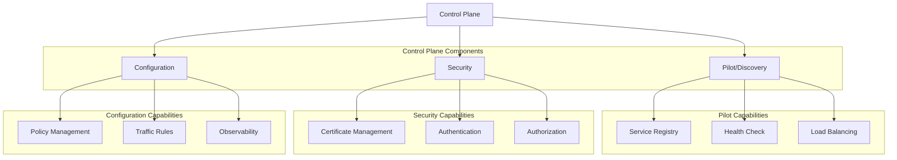

## 服务网格的治理能力：为微服务提供全面的治理解决方案

服务网格作为专门处理服务间通信的基础设施层，为微服务架构提供了全面的治理能力。通过将治理逻辑从应用代码中解耦，服务网格实现了统一的服务发现、流量管理、安全控制和可观察性，有效解决了微服务治理中的复杂性问题。本章将深入探讨服务网格的核心治理能力，包括服务发现、路由管理、熔断限流、安全控制等方面，帮助读者全面理解服务网格如何为微服务提供强大的治理支持。

### 服务网格治理架构

服务网格通过控制平面和数据平面的协同工作，为微服务提供统一的治理能力。

#### 控制平面能力

控制平面是服务网格的大脑，负责管理和配置治理策略：



#### 数据平面能力

数据平面负责实际处理服务间的通信和治理策略执行：

```yaml
# 数据平面能力
# 1. 代理功能:
#    - 流量拦截和转发
#    - 协议转换和处理
#    - 负载均衡和路由

# 2. 安全功能:
#    - mTLS加密通信
#    - 身份认证和授权
#    - 访问控制执行

# 3. 监控功能:
#    - 指标收集和上报
#    - 日志记录和分析
#    - 分布式追踪支持

# 4. 策略执行:
#    - 流量控制策略
#    - 故障处理策略
#    - 资源限制策略
```

### 服务发现能力

服务网格提供强大的服务发现能力，自动管理服务实例的注册和发现。

#### 动态服务发现

服务网格自动发现和管理服务实例：

```yaml
# 动态服务发现配置
# 1. Kubernetes服务发现:
apiVersion: v1
kind: Service
metadata:
  name: user-service
  namespace: production
  labels:
    app: user-service
    version: v1
spec:
  selector:
    app: user-service
  ports:
  - name: http
    port: 80
    targetPort: 8080
---
# 2. 外部服务发现:
apiVersion: networking.istio.io/v1alpha3
kind: ServiceEntry
metadata:
  name: external-api
spec:
  hosts:
  - api.external.com
  location: MESH_EXTERNAL
  ports:
  - number: 443
    name: https
    protocol: HTTPS
  resolution: DNS
  endpoints:
  - address: api.external.com
    ports:
      https: 443
---
# 3. 工作负载发现:
apiVersion: networking.istio.io/v1alpha3
kind: WorkloadEntry
metadata:
  name: vm-user-service
  namespace: production
spec:
  address: 10.10.10.10
  ports:
    http: 8080
  labels:
    app: user-service
    instance-id: vm-123
  network: vm-network
  locality: us-west1/us-west1-a
```

#### 健康检查机制

服务网格提供自动化的健康检查机制：

```yaml
# 健康检查配置
# 1. Pod健康检查:
apiVersion: v1
kind: Pod
metadata:
  name: user-service-7d5bcbf8f8-abcde
  labels:
    app: user-service
    version: v1
spec:
  containers:
  - name: user-service
    image: user-service:v1
    ports:
    - containerPort: 8080
    livenessProbe:
      httpGet:
        path: /health
        port: 8080
      initialDelaySeconds: 30
      periodSeconds: 10
    readinessProbe:
      httpGet:
        path: /ready
        port: 8080
      initialDelaySeconds: 5
      periodSeconds: 5
---
# 2. 自定义健康检查:
apiVersion: networking.istio.io/v1alpha3
kind: WorkloadGroup
metadata:
  name: user-service-group
  namespace: production
spec:
  metadata:
    labels:
      app: user-service
  template:
    ports:
      http: 8080
    serviceAccount: user-service-sa
  probe:
    initialDelaySeconds: 5
    timeoutSeconds: 3
    periodSeconds: 30
    successThreshold: 1
    failureThreshold: 3
    httpGet:
      path: /health
      port: 8080
```

### 流量治理能力

服务网格提供全面的流量治理能力，包括路由、负载均衡、故障处理等。

#### 智能路由能力

服务网格支持多种智能路由策略：

```yaml
# 智能路由配置
# 1. 基于内容的路由:
apiVersion: networking.istio.io/v1alpha3
kind: VirtualService
metadata:
  name: content-based-routing
  namespace: production
spec:
  hosts:
  - user-service.example.com
  gateways:
  - user-gateway
  http:
  - match:
    - headers:
        user-type:
          exact: "premium"
    route:
    - destination:
        host: premium-user-service.production.svc.cluster.local
  - match:
    - headers:
        user-type:
          exact: "standard"
    route:
    - destination:
        host: standard-user-service.production.svc.cluster.local
  - route:
    - destination:
        host: default-user-service.production.svc.cluster.local
---
# 2. 版本路由:
apiVersion: networking.istio.io/v1alpha3
kind: VirtualService
metadata:
  name: version-based-routing
  namespace: production
spec:
  hosts:
  - order-service.example.com
  http:
  - match:
    - headers:
        version:
          exact: "v2"
    route:
    - destination:
        host: order-service.production.svc.cluster.local
        subset: v2
  - route:
    - destination:
        host: order-service.production.svc.cluster.local
        subset: v1
---
# 3. A/B测试路由:
apiVersion: networking.istio.io/v1alpha3
kind: VirtualService
metadata:
  name: ab-testing-routing
  namespace: production
spec:
  hosts:
  - catalog-service.example.com
  http:
  - match:
    - headers:
        cookie:
          regex: "^(.*?;)?(experiment=run-together)(;.*)?$"
    route:
    - destination:
        host: catalog-service-v2.production.svc.cluster.local
  - route:
    - destination:
        host: catalog-service-v1.production.svc.cluster.local
      weight: 90
    - destination:
        host: catalog-service-v2.production.svc.cluster.local
      weight: 10
```

#### 负载均衡能力

服务网格提供多种负载均衡算法：

```yaml
# 负载均衡配置
# 1. 基础负载均衡:
apiVersion: networking.istio.io/v1alpha3
kind: DestinationRule
metadata:
  name: basic-load-balancing
  namespace: production
spec:
  host: user-service.production.svc.cluster.local
  trafficPolicy:
    loadBalancer:
      simple: LEAST_CONN
---
# 2. 地理位置负载均衡:
apiVersion: networking.istio.io/v1alpha3
kind: DestinationRule
metadata:
  name: geo-load-balancing
  namespace: production
spec:
  host: global-service.production.svc.cluster.local
  trafficPolicy:
    loadBalancer:
      localityLbSetting:
        enabled: true
        distribute:
        - from: us-central1/*
          to:
            "us-central1/*": 80
            "us-west1/*": 20
        - from: us-west1/*
          to:
            "us-west1/*": 80
            "us-central1/*": 20
---
# 3. 一致性哈希负载均衡:
apiVersion: networking.istio.io/v1alpha3
kind: DestinationRule
metadata:
  name: consistent-hash-lb
  namespace: production
spec:
  host: session-service.production.svc.cluster.local
  trafficPolicy:
    loadBalancer:
      consistentHash:
        httpHeaderName: x-user-id
```

#### 故障处理能力

服务网格提供完善的故障处理机制：

```yaml
# 故障处理配置
# 1. 超时和重试:
apiVersion: networking.istio.io/v1alpha3
kind: VirtualService
metadata:
  name: fault-tolerance
  namespace: production
spec:
  hosts:
  - payment-service.example.com
  http:
  - route:
    - destination:
        host: payment-service.production.svc.cluster.local
    timeout: 5s
    retries:
      attempts: 3
      perTryTimeout: 2s
      retryOn: connect-failure,refused-stream,5xx
---
# 2. 断路器:
apiVersion: networking.istio.io/v1alpha3
kind: DestinationRule
metadata:
  name: circuit-breaker
  namespace: production
spec:
  host: inventory-service.production.svc.cluster.local
  trafficPolicy:
    connectionPool:
      tcp:
        maxConnections: 100
        connectTimeout: 30ms
      http:
        http1MaxPendingRequests: 1000
        maxRequestsPerConnection: 10
    outlierDetection:
      consecutive5xxErrors: 5
      interval: 60s
      baseEjectionTime: 60s
      maxEjectionPercent: 20
```

### 安全治理能力

服务网格提供全面的安全治理能力，保障服务间通信的安全性。

#### 身份认证能力

服务网格提供强大的身份认证机制：

```yaml
# 身份认证配置
# 1. mTLS认证:
apiVersion: security.istio.io/v1beta1
kind: PeerAuthentication
metadata:
  name: mtls-auth
  namespace: production
spec:
  mtls:
    mode: STRICT
---
# 2. 请求认证:
apiVersion: security.istio.io/v1beta1
kind: RequestAuthentication
metadata:
  name: jwt-auth
  namespace: production
spec:
  selector:
    matchLabels:
      app: user-service
  jwtRules:
  - issuer: "https://accounts.google.com"
    jwksUri: "https://www.googleapis.com/oauth2/v3/certs"
---
# 3. OIDC认证:
apiVersion: security.istio.io/v1beta1
kind: RequestAuthentication
metadata:
  name: oidc-auth
  namespace: production
spec:
  selector:
    matchLabels:
      app: api-gateway
  jwtRules:
  - issuer: "https://login.microsoftonline.com/{tenant-id}/v2.0"
    jwksUri: "https://login.microsoftonline.com/{tenant-id}/discovery/v2.0/keys"
    fromHeaders:
    - name: Authorization
      prefix: "Bearer "
```

#### 访问控制能力

服务网格提供细粒度的访问控制能力：

```yaml
# 访问控制配置
# 1. 授权策略:
apiVersion: security.istio.io/v1beta1
kind: AuthorizationPolicy
metadata:
  name: user-service-authz
  namespace: production
spec:
  selector:
    matchLabels:
      app: user-service
  rules:
  - from:
    - source:
        principals: ["cluster.local/ns/production/sa/user-service-sa"]
    to:
    - operation:
        methods: ["GET", "POST"]
        paths: ["/api/*"]
    when:
    - key: request.auth.claims[groups]
      values: ["users", "admins"]
---
# 2. RBAC配置:
apiVersion: security.istio.io/v1beta1
kind: AuthorizationPolicy
metadata:
  name: rbac-policy
  namespace: production
spec:
  selector:
    matchLabels:
      app: order-service
  rules:
  - from:
    - source:
        namespaces: ["frontend"]
    to:
    - operation:
        methods: ["POST"]
        paths: ["/orders"]
  - from:
    - source:
        namespaces: ["backend"]
    to:
    - operation:
        methods: ["GET", "PUT", "DELETE"]
        paths: ["/orders/*"]
```

#### 数据加密能力

服务网格提供端到端的数据加密能力：

```yaml
# 数据加密配置
# 1. 传输加密:
apiVersion: networking.istio.io/v1alpha3
kind: DestinationRule
metadata:
  name: tls-encryption
  namespace: production
spec:
  host: "*.production.svc.cluster.local"
  trafficPolicy:
    tls:
      mode: ISTIO_MUTUAL
---
# 2. 端到端加密:
apiVersion: networking.istio.io/v1alpha3
kind: DestinationRule
metadata:
  name: end-to-end-encryption
  namespace: production
spec:
  host: payment-service.production.svc.cluster.local
  trafficPolicy:
    portLevelSettings:
    - port:
        number: 443
      tls:
        mode: SIMPLE
        sni: payment-api.external.com
        caCertificates: /etc/ssl/certs/ca-certificates.crt
```

### 可观察性能力

服务网格提供全面的可观察性能力，帮助监控和诊断微服务系统。

#### 监控指标能力

服务网格提供丰富的监控指标：

```yaml
# 监控指标配置
# 1. Prometheus监控:
apiVersion: monitoring.coreos.com/v1
kind: ServiceMonitor
metadata:
  name: microservices-monitor
  namespace: monitoring
spec:
  selector:
    matchLabels:
      app: microservice
  endpoints:
  - port: http-metrics
    path: /metrics
    interval: 30s
---
# 2. 自定义指标:
apiVersion: monitoring.coreos.com/v1
kind: PrometheusRule
metadata:
  name: microservices-alerts
  namespace: monitoring
spec:
  groups:
  - name: microservices.rules
    rules:
    - alert: HighServiceLatency
      expr: |
        histogram_quantile(0.95, sum(rate(istio_request_duration_milliseconds_bucket[5m])) by (le, destination_service)) > 1000
      for: 5m
      labels:
        severity: warning
      annotations:
        summary: "High service latency detected"
        description: "Service latency is above 1000ms for service {{ $labels.destination_service }}"
```

#### 分布式追踪能力

服务网格提供完整的分布式追踪能力：

```yaml
# 分布式追踪配置
# 1. Jaeger集成:
apiVersion: jaegertracing.io/v1
kind: Jaeger
metadata:
  name: microservices-jaeger
  namespace: istio-system
spec:
  strategy: production
  collector:
    maxReplicas: 3
    resources:
      limits:
        cpu: 100m
        memory: 128Mi
  storage:
    type: memory
    options:
      memory:
        max-traces: 100000
---
# 2. 追踪采样:
apiVersion: v1
kind: ConfigMap
metadata:
  name: tracing-config
  namespace: istio-system
data:
  config.yaml: |-
    tracing:
      sampling: 100
      zipkin:
        address: zipkin.istio-system:9411
```

#### 日志管理能力

服务网格提供统一的日志管理能力：

```yaml
# 日志管理配置
# 1. Fluentd配置:
apiVersion: v1
kind: ConfigMap
metadata:
  name: microservices-logging
  namespace: logging
data:
  fluent.conf: |-
    <source>
      @type tail
      path /var/log/containers/*production*.log
      pos_file /var/log/production.log.pos
      tag production.*
      format json
      time_key time
      time_format %Y-%m-%dT%H:%M:%S.%NZ
    </source>
    
    <filter production.**>
      @type kubernetes_metadata
    </filter>
    
    <match production.**>
      @type elasticsearch
      host elasticsearch.logging.svc.cluster.local
      port 9200
      logstash_format true
    </match>
---
# 2. 日志聚合:
apiVersion: apps/v1
kind: Deployment
metadata:
  name: log-aggregator
  namespace: logging
spec:
  replicas: 2
  selector:
    matchLabels:
      app: log-aggregator
  template:
    metadata:
      labels:
        app: log-aggregator
    spec:
      containers:
      - name: fluentd
        image: fluent/fluentd:v1.14
        volumeMounts:
        - name: config
          mountPath: /fluentd/etc
        - name: varlog
          mountPath: /var/log
      volumes:
      - name: config
        configMap:
          name: microservices-logging
      - name: varlog
        hostPath:
          path: /var/log
```

### 治理策略管理

服务网格提供统一的治理策略管理能力。

#### 策略配置管理

统一的策略配置管理：

```yaml
# 策略配置管理
# 1. 配置映射:
apiVersion: v1
kind: ConfigMap
metadata:
  name: governance-config
  namespace: istio-system
data:
  traffic-policy: |-
    defaultRetryAttempts: 3
    defaultTimeout: 30s
    defaultLoadBalancer: LEAST_CONN
  security-policy: |-
    mtlsMode: STRICT
    defaultAuthType: JWT
    auditLogLevel: INFO
---
# 2. 策略应用:
apiVersion: networking.istio.io/v1alpha3
kind: EnvoyFilter
metadata:
  name: custom-governance-policy
  namespace: istio-system
spec:
  configPatches:
  - applyTo: NETWORK_FILTER
    match:
      context: SIDECAR_OUTBOUND
      listener:
        filterChain:
          filter:
            name: "envoy.filters.network.http_connection_manager"
    patch:
      operation: MERGE
      value:
        typed_config:
          "@type": "type.googleapis.com/envoy.extensions.filters.network.http_connection_manager.v3.HttpConnectionManager"
          common_http_protocol_options:
            idle_timeout: 30s
```

#### 策略版本管理

策略的版本管理和回滚：

```yaml
# 策略版本管理
# 1. 策略版本控制:
apiVersion: v1
kind: ConfigMap
metadata:
  name: traffic-policy-v1
  namespace: istio-system
data:
  policy.yaml: |-
    apiVersion: networking.istio.io/v1alpha3
    kind: VirtualService
    metadata:
      name: user-service-vs
    spec:
      hosts:
      - user-service.production.svc.cluster.local
      http:
      - route:
        - destination:
            host: user-service.production.svc.cluster.local
        timeout: 5s
---
apiVersion: v1
kind: ConfigMap
metadata:
  name: traffic-policy-v2
  namespace: istio-system
data:
  policy.yaml: |-
    apiVersion: networking.istio.io/v1alpha3
    kind: VirtualService
    metadata:
      name: user-service-vs
    spec:
      hosts:
      - user-service.production.svc.cluster.local
      http:
      - route:
        - destination:
            host: user-service.production.svc.cluster.local
        timeout: 10s
        retries:
          attempts: 3
          perTryTimeout: 3s
```

### 最佳实践与建议

服务网格治理能力的最佳实践。

#### 配置管理最佳实践

配置管理的最佳实践：

```bash
# 配置管理最佳实践
# 1. 版本控制:
#    - 使用Git管理配置
#    - 实施分支策略
#    - 自动化部署流程

# 2. 环境隔离:
#    - 不同环境使用不同配置
#    - 命名空间隔离
#    - 标签和注解管理

# 3. 配置验证:
#    - 预部署验证
#    - 金丝雀发布
#    - 回滚机制
```

#### 性能优化建议

性能优化的建议：

```bash
# 性能优化建议
# 1. 资源优化:
#    - 合理设置资源请求和限制
#    - 优化Sidecar资源配置
#    - 实施自动扩缩容

# 2. 网络优化:
#    - 减少跨服务调用
#    - 优化网络路径
#    - 使用缓存减少调用

# 3. 监控优化:
#    - 合理设置采样率
#    - 优化指标收集
#    - 实施告警分级
```

#### 安全最佳实践

安全方面的最佳实践：

```bash
# 安全最佳实践
# 1. 通信安全:
#    - 启用mTLS
#    - 定期轮换证书
#    - 验证服务身份

# 2. 访问控制:
#    - 实施RBAC策略
#    - 限制服务访问
#    - 审计访问日志

# 3. 配置安全:
#    - 保护敏感配置
#    - 使用Secret管理
#    - 定期审查权限
```

### 总结

服务网格通过控制平面和数据平面的协同工作，为微服务架构提供了全面的治理能力。从服务发现、流量管理到安全控制和可观察性，服务网格实现了统一的治理策略执行，有效解决了微服务治理中的复杂性问题。

关键要点包括：
1. 理解服务网格的控制平面和数据平面架构
2. 掌握服务发现、健康检查等基础能力
3. 熟悉智能路由、负载均衡、故障处理等流量治理能力
4. 了解身份认证、访问控制、数据加密等安全治理能力
5. 掌握监控指标、分布式追踪、日志管理等可观察性能力
6. 实施统一的治理策略管理和版本控制
7. 遵循配置管理、性能优化和安全最佳实践

通过充分发挥服务网格的治理能力，我们可以构建一个稳定、安全、可观察的微服务系统，为企业的数字化转型提供强有力的技术支撑。

通过系统性的治理能力应用，我们能够：
1. 实现统一的服务治理体系
2. 提升服务间通信的安全性和可靠性
3. 建立全面的监控和故障排查能力
4. 优化系统性能和资源利用
5. 支持业务的快速创新和扩展发展

这不仅有助于当前系统的高效运行，也为未来的技术演进和业务发展奠定了坚实的基础。