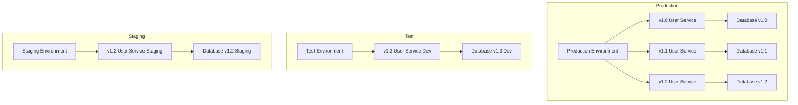
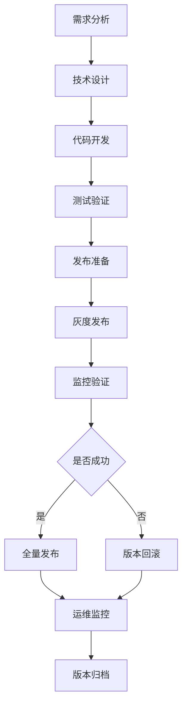

## 微服务版本管理与治理策略：实现平滑的服务演进与升级

在微服务架构中，服务版本管理是确保系统稳定性和持续演进的关键环节。随着业务需求的不断变化和技术的持续发展，微服务需要频繁更新和升级。如何在不影响现有业务的情况下平滑地进行服务版本演进，成为企业面临的重要挑战。服务网格为微服务版本管理提供了强大的支持，通过流量管理、金丝雀发布、蓝绿部署等机制，实现平滑的服务升级和版本控制。本章将深入探讨微服务版本管理的最佳实践和治理策略，帮助读者构建稳定可靠的服务演进体系。

### 微服务版本管理的挑战

微服务版本管理面临着独特的挑战，这些挑战需要通过合理的策略和技术手段来解决。

#### 版本兼容性挑战

微服务版本间的兼容性问题是版本管理的核心挑战：

```yaml
# 版本兼容性挑战
# 1. API兼容性:
#    - 向后兼容性要求
#    - 接口变更管理
#    - 版本迁移策略

# 2. 数据兼容性:
#    - 数据库模式变更
#    - 数据迁移处理
#    - 状态一致性保证

# 3. 依赖兼容性:
#    - 第三方服务依赖
#    - 库版本兼容性
#    - 运行时环境要求
```

API兼容性示例：

```yaml
# API兼容性示例
# 1. 向后兼容的API变更:
#    Version 1.0:
GET /api/users/{id}
Response:
{
  "id": "123",
  "name": "John Doe",
  "email": "john@example.com"
}

#    Version 2.0 (向后兼容):
GET /api/users/{id}
Response:
{
  "id": "123",
  "name": "John Doe",
  "email": "john@example.com",
  "profile": {
    "age": 30,
    "location": "New York"
  }
}

# 2. 非兼容性变更:
#    Version 1.0:
POST /api/users
{
  "name": "John Doe",
  "email": "john@example.com"
}

#    Version 2.0 (非兼容):
POST /api/users
{
  "personalInfo": {
    "name": "John Doe",
    "email": "john@example.com"
  },
  "preferences": {
    "notifications": true
  }
}
```

#### 部署复杂性挑战

多版本服务的部署和管理变得复杂：

```yaml
# 部署复杂性挑战
# 1. 多环境部署:
#    - 开发环境版本管理
#    - 测试环境版本管理
#    - 生产环境版本管理

# 2. 灰度发布:
#    - 用户分群策略
#    - 流量分配控制
#    - 回滚机制设计

# 3. 依赖管理:
#    - 服务间依赖版本
#    - 库依赖版本控制
#    - 环境依赖管理
```

部署复杂性示例：



### 版本管理策略

有效的版本管理需要采用合理的策略和方法。

#### 语义化版本控制

采用语义化版本控制规范管理服务版本：

```yaml
# 语义化版本控制
# 1. 版本格式:
#    MAJOR.MINOR.PATCH
#    - MAJOR: 不兼容的API变更
#    - MINOR: 向后兼容的功能新增
#    - PATCH: 向后兼容的问题修复

# 2. 版本发布策略:
#    - 主版本发布: 重大功能更新
#    - 次版本发布: 功能增强和改进
#    - 补丁版本发布: Bug修复和优化

# 3. 版本标签管理:
#    - Git标签管理
#    - Docker镜像标签
#    - Kubernetes资源标签
```

语义化版本控制示例：

```yaml
# 语义化版本控制示例
# 1. 版本发布历史:
#    v1.0.0 - 初始版本发布
#    v1.0.1 - 修复用户查询Bug
#    v1.0.2 - 优化数据库查询性能
#    v1.1.0 - 新增用户权限管理功能
#    v1.1.1 - 修复权限验证Bug
#    v2.0.0 - 重构API接口，不兼容变更

# 2. Docker镜像标签:
apiVersion: apps/v1
kind: Deployment
metadata:
  name: user-service
spec:
  replicas: 3
  selector:
    matchLabels:
      app: user-service
  template:
    metadata:
      labels:
        app: user-service
        version: v1.2.3
    spec:
      containers:
      - name: user-service
        image: user-service:v1.2.3
        ports:
        - containerPort: 8080
```

#### 多版本并存策略

支持多版本服务并存以实现平滑升级：

```yaml
# 多版本并存策略
# 1. 服务标签:
#    - 版本标签管理
#    - 环境标签管理
#    - 功能标签管理

# 2. 路由策略:
#    - 基于版本的路由
#    - 基于用户的路由
#    - 基于功能的路由

# 3. 资源隔离:
#    - 命名空间隔离
#    - 集群隔离
#    - 网络策略隔离
```

多版本并存配置示例：

```yaml
# 多版本并存配置
# 1. 不同版本的Deployment:
apiVersion: apps/v1
kind: Deployment
metadata:
  name: user-service-v1
  labels:
    app: user-service
    version: v1.0.0
spec:
  replicas: 2
  selector:
    matchLabels:
      app: user-service
      version: v1.0.0
  template:
    metadata:
      labels:
        app: user-service
        version: v1.0.0
    spec:
      containers:
      - name: user-service
        image: user-service:v1.0.0
---
apiVersion: apps/v1
kind: Deployment
metadata:
  name: user-service-v2
  labels:
    app: user-service
    version: v2.0.0
spec:
  replicas: 3
  selector:
    matchLabels:
      app: user-service
      version: v2.0.0
  template:
    metadata:
      labels:
        app: user-service
        version: v2.0.0
    spec:
      containers:
      - name: user-service
        image: user-service:v2.0.0
---
# 2. 统一服务定义:
apiVersion: v1
kind: Service
metadata:
  name: user-service
spec:
  selector:
    app: user-service
  ports:
  - port: 80
    targetPort: 8080
```

### 发布策略

采用合适的发布策略确保服务升级的平滑性。

#### 蓝绿部署

蓝绿部署策略实现零停机升级：

```yaml
# 蓝绿部署策略
# 1. 部署架构:
#    - 蓝色环境: 当前生产环境
#    - 绿色环境: 新版本预发布环境
#    - 路由切换: 瞬间切换流量

# 2. 实施步骤:
#    - 准备绿色环境
#    - 部署新版本到绿色环境
#    - 测试验证绿色环境
#    - 切换流量到绿色环境
#    - 监控绿色环境运行
#    - 清理蓝色环境

# 3. 优势与风险:
#    - 优势: 零停机时间、快速回滚
#    - 风险: 资源消耗翻倍、数据一致性
```

蓝绿部署配置示例：

```yaml
# 蓝绿部署配置
# 1. 蓝色环境:
apiVersion: apps/v1
kind: Deployment
metadata:
  name: user-service-blue
  labels:
    app: user-service
    color: blue
spec:
  replicas: 3
  selector:
    matchLabels:
      app: user-service
      color: blue
  template:
    metadata:
      labels:
        app: user-service
        color: blue
    spec:
      containers:
      - name: user-service
        image: user-service:v1.0.0
---
# 2. 绿色环境:
apiVersion: apps/v1
kind: Deployment
metadata:
  name: user-service-green
  labels:
    app: user-service
    color: green
spec:
  replicas: 3
  selector:
    matchLabels:
      app: user-service
      color: green
  template:
    metadata:
      labels:
        app: user-service
        color: green
    spec:
      containers:
      - name: user-service
        image: user-service:v2.0.0
---
# 3. 路由配置:
apiVersion: networking.istio.io/v1alpha3
kind: VirtualService
metadata:
  name: user-service-blue-green
spec:
  hosts:
  - user-service.example.com
  http:
  - route:
    - destination:
        host: user-service.green.svc.cluster.local
```

#### 金丝雀发布

金丝雀发布策略实现渐进式升级：

```yaml
# 金丝雀发布策略
# 1. 发布流程:
#    - 部署少量新版本实例
#    - 逐步增加新版本流量比例
#    - 监控新版本运行状态
#    - 根据监控结果调整流量
#    - 完成全量发布或回滚

# 2. 流量控制:
#    - 基于权重的流量分配
#    - 基于用户特征的流量分配
#    - 基于地理位置的流量分配

# 3. 监控指标:
#    - 错误率监控
#    - 延迟监控
#    - 资源使用监控
#    - 业务指标监控
```

金丝雀发布配置示例：

```yaml
# 金丝雀发布配置
# 1. 服务网格配置:
apiVersion: networking.istio.io/v1alpha3
kind: VirtualService
metadata:
  name: user-service-canary
spec:
  hosts:
  - user-service.example.com
  http:
  - route:
    - destination:
        host: user-service-v1.svc.cluster.local
      weight: 90
    - destination:
        host: user-service-v2.svc.cluster.local
      weight: 10
---
# 2. 目标规则:
apiVersion: networking.istio.io/v1alpha3
kind: DestinationRule
metadata:
  name: user-service-dr
spec:
  host: user-service.svc.cluster.local
  subsets:
  - name: v1
    labels:
      version: v1.0.0
  - name: v2
    labels:
      version: v2.0.0
---
# 3. 逐步增加流量:
apiVersion: networking.istio.io/v1alpha3
kind: VirtualService
metadata:
  name: user-service-canary
spec:
  hosts:
  - user-service.example.com
  http:
  - route:
    - destination:
        host: user-service-v1.svc.cluster.local
      weight: 70
    - destination:
        host: user-service-v2.svc.cluster.local
      weight: 30
```

#### A/B测试

A/B测试策略验证新功能效果：

```yaml
# A/B测试策略
# 1. 测试设计:
#    - 用户分群策略
#    - 功能对比设计
#    - 指标定义和收集

# 2. 流量分配:
#    - 基于Cookie的分配
#    - 基于用户ID的分配
#    - 基于请求头的分配

# 3. 数据分析:
#    - 统计显著性分析
#    - 业务指标对比
#    - 用户体验评估
```

A/B测试配置示例：

```yaml
# A/B测试配置
# 1. 基于Cookie的路由:
apiVersion: networking.istio.io/v1alpha3
kind: VirtualService
metadata:
  name: user-service-abtest
spec:
  hosts:
  - user-service.example.com
  http:
  - match:
    - headers:
        cookie:
          regex: "^(.*?;)?(experiment=new-ui)(;.*)?$"
    route:
    - destination:
        host: user-service-new-ui.svc.cluster.local
  - route:
    - destination:
        host: user-service-old-ui.svc.cluster.local
---
# 2. 基于用户ID的路由:
apiVersion: networking.istio.io/v1alpha3
kind: VirtualService
metadata:
  name: user-service-abtest-userid
spec:
  hosts:
  - user-service.example.com
  http:
  - match:
    - headers:
        x-user-id:
          regex: "^[0-4].*$"
    route:
    - destination:
        host: user-service-version-a.svc.cluster.local
  - match:
    - headers:
        x-user-id:
          regex: "^[5-9].*$"
    route:
    - destination:
        host: user-service-version-b.svc.cluster.local
```

### 版本回滚策略

建立完善的版本回滚机制确保系统稳定性。

#### 自动回滚机制

基于监控指标的自动回滚机制：

```yaml
# 自动回滚机制
# 1. 监控指标:
#    - 错误率阈值
#    - 延迟阈值
#    - 资源使用阈值
#    - 业务指标阈值

# 2. 回滚触发:
#    - 自动检测异常
#    - 智能决策回滚
#    - 快速执行回滚

# 3. 回滚执行:
#    - 流量切换回滚
#    - 配置回滚
#    - 数据回滚
```

自动回滚配置示例：

```yaml
# 自动回滚配置
# 1. 监控告警:
apiVersion: monitoring.coreos.com/v1
kind: PrometheusRule
metadata:
  name: version-rollout-alerts
  namespace: monitoring
spec:
  groups:
  - name: version-rollout.rules
    rules:
    - alert: HighErrorRateInNewVersion
      expr: |
        sum(rate(istio_requests_total{destination_service="user-service", response_code=~"5.*", version="v2.0.0"}[5m])) / 
        sum(rate(istio_requests_total{destination_service="user-service", version="v2.0.0"}[5m])) * 100 > 5
      for: 2m
      labels:
        severity: critical
      annotations:
        summary: "High error rate detected in new version"
        description: "Error rate is above 5% for version v2.0.0"
---
# 2. 自动回滚脚本:
apiVersion: batch/v1
kind: Job
metadata:
  name: auto-rollback-job
spec:
  template:
    spec:
      containers:
      - name: rollback
        image: curlimages/curl
        command:
        - /bin/sh
        - -c
        - |
          # 检查错误率
          ERROR_RATE=$(curl -s http://prometheus:9090/api/v1/query?query=...)
          if [ "$ERROR_RATE" -gt "5" ]; then
            # 执行回滚
            curl -X PUT http://istio-api/virtualservices/user-service-canary -d '{
              "http": [{
                "route": [{
                  "destination": {"host": "user-service-v1.svc.cluster.local"},
                  "weight": 100
                }]
              }]
            }'
          fi
      restartPolicy: Never
```

#### 手动回滚机制

提供手动回滚能力以应对复杂场景：

```yaml
# 手动回滚机制
# 1. 回滚操作:
#    - 流量切换回滚
#    - 配置回滚
#    - 数据库回滚

# 2. 回滚验证:
#    - 功能验证
#    - 性能验证
#    - 安全验证

# 3. 回滚记录:
#    - 操作日志记录
#    - 回滚原因记录
#    - 影响范围记录
```

手动回滚操作示例：

```bash
# 手动回滚操作示例
# 1. 查看当前版本状态:
kubectl get deployments -l app=user-service
kubectl get virtualservices user-service-canary -o yaml

# 2. 执行流量回滚:
kubectl patch virtualservice user-service-canary -p '{"spec":{"http":[{"route":[{"destination":{"host":"user-service-v1.svc.cluster.local"},"weight":100},{"destination":{"host":"user-service-v2.svc.cluster.local"},"weight":0}]}}' --type=merge

# 3. 验证回滚结果:
kubectl get virtualservices user-service-canary -o yaml
curl -H "Host: user-service.example.com" http://gateway-ip/health
```

### 治理策略实施

建立完善的版本治理策略确保服务演进的规范性。

#### 版本治理流程

标准化的版本治理流程：

```yaml
# 版本治理流程
# 1. 版本规划:
#    - 需求分析和评审
#    - 技术方案设计
#    - 风险评估和预案

# 2. 版本开发:
#    - 代码开发和测试
#    - 集成测试验证
#    - 性能测试评估

# 3. 版本发布:
#    - 发布计划制定
#    - 灰度发布执行
#    - 监控和验证

# 4. 版本运维:
#    - 运行状态监控
#    - 问题处理和优化
#    - 版本归档和清理
```

版本治理流程图：



#### 版本治理规范

建立版本治理的规范和标准：

```yaml
# 版本治理规范
# 1. 版本命名规范:
#    - 语义化版本控制
#    - 预发布版本标识
#    - 构建元数据包含

# 2. 发布时间规范:
#    - 定期发布计划
#    - 紧急发布流程
#    - 发布窗口管理

# 3. 质量标准规范:
#    - 代码质量要求
#    - 测试覆盖率要求
#    - 性能指标要求
```

版本治理规范示例：

```yaml
# 版本治理规范示例
# 1. 版本命名规范:
#    正式版本: v1.2.3
#    预发布版本: v1.2.3-alpha.1, v1.2.3-beta.2
#    构建版本: v1.2.3+20231201.abc123

# 2. 发布时间规范:
#    主版本发布: 每季度一次
#    次版本发布: 每月一次
#    补丁版本发布: 每周一次或按需

# 3. 质量标准规范:
#    代码覆盖率: >= 80%
#    性能指标: P95延迟 < 100ms
#    错误率: < 0.1%
```

### 监控与告警

建立完善的版本监控和告警体系。

#### 版本监控指标

关键的版本监控指标：

```yaml
# 版本监控指标
# 1. 性能指标:
#    - 请求延迟(P50, P95, P99)
#    - 吞吐量(QPS, TPS)
#    - 资源使用率(CPU, 内存)

# 2. 可靠性指标:
#    - 错误率(4xx, 5xx)
#    - 成功率
#    - 超时率

# 3. 业务指标:
#    - 业务成功率
#    - 用户体验指标
#    - 收入相关指标
```

版本监控配置示例：

```yaml
# 版本监控配置
# 1. Prometheus监控:
apiVersion: monitoring.coreos.com/v1
kind: ServiceMonitor
metadata:
  name: version-monitor
  namespace: monitoring
spec:
  selector:
    matchLabels:
      app: microservice
  endpoints:
  - port: http-metrics
    path: /metrics
    interval: 30s
    relabelings:
    - sourceLabels: [__meta_kubernetes_pod_label_version]
      targetLabel: version
---
# 2. 版本对比告警:
apiVersion: monitoring.coreos.com/v1
kind: PrometheusRule
metadata:
  name: version-comparison-alerts
  namespace: monitoring
spec:
  groups:
  - name: version-comparison.rules
    rules:
    - alert: VersionPerformanceDegradation
      expr: |
        histogram_quantile(0.95, sum(rate(istio_request_duration_milliseconds_bucket{version="v2.0.0"}[5m])) by (le)) > 
        histogram_quantile(0.95, sum(rate(istio_request_duration_milliseconds_bucket{version="v1.0.0"}[5m])) by (le)) * 1.2
      for: 5m
      labels:
        severity: warning
      annotations:
        summary: "New version performance degradation detected"
        description: "Version v2.0.0 latency is 20% higher than v1.0.0"
```

#### 版本告警策略

分层次的版本告警策略：

```yaml
# 版本告警策略
# 1. 告警级别:
#    - Critical: 严重影响业务
#    - Warning: 需要关注的问题
#    - Info: 参考信息

# 2. 告警触发:
#    - 阈值告警
#    - 趋势告警
#    - 异常检测告警

# 3. 告警处理:
#    - 自动处理
#    - 人工干预
#    - 升级处理
```

版本告警配置示例：

```yaml
# 版本告警配置
# 1. 关键指标告警:
apiVersion: monitoring.coreos.com/v1
kind: PrometheusRule
metadata:
  name: critical-version-alerts
  namespace: monitoring
spec:
  groups:
  - name: critical-version.rules
    rules:
    - alert: CriticalErrorRate
      expr: |
        sum(rate(istio_requests_total{response_code=~"5.*", version="v2.0.0"}[5m])) / 
        sum(rate(istio_requests_total{version="v2.0.0"}[5m])) * 100 > 1
      for: 1m
      labels:
        severity: critical
      annotations:
        summary: "Critical error rate in version v2.0.0"
        description: "5xx error rate is above 1% for version v2.0.0"
---
# 2. 性能退化告警:
apiVersion: monitoring.coreos.com/v1
kind: PrometheusRule
metadata:
  name: performance-degradation-alerts
  namespace: monitoring
spec:
  groups:
  - name: performance-degradation.rules
    rules:
    - alert: HighLatency
      expr: |
        histogram_quantile(0.95, sum(rate(istio_request_duration_milliseconds_bucket{version="v2.0.0"}[5m])) by (le)) > 1000
      for: 2m
      labels:
        severity: warning
      annotations:
        summary: "High latency in version v2.0.0"
        description: "P95 latency is above 1000ms for version v2.0.0"
```

### 最佳实践与建议

微服务版本管理的最佳实践和建议。

#### 开发最佳实践

开发阶段的最佳实践：

```bash
# 开发最佳实践
# 1. API设计:
#    - 遵循向后兼容原则
#    - 提供API版本管理
#    - 文档化API变更

# 2. 代码质量:
#    - 单元测试覆盖率>80%
#    - 集成测试覆盖核心场景
#    - 性能测试验证关键路径

# 3. 部署准备:
#    - 容器化部署配置
#    - 健康检查端点
#    - 配置外部化管理
```

#### 运维最佳实践

运维阶段的最佳实践：

```bash
# 运维最佳实践
# 1. 发布管理:
#    - 制定发布计划和时间窗口
#    - 准备回滚方案和预案
#    - 实施渐进式发布策略

# 2. 监控告警:
#    - 建立多维度监控体系
#    - 设置合理的告警阈值
#    - 实施自动化响应机制

# 3. 故障处理:
#    - 建立标准故障处理流程
#    - 准备应急响应预案
#    - 定期演练故障场景
```

#### 安全最佳实践

安全方面的最佳实践：

```bash
# 安全最佳实践
# 1. 版本安全:
#    - 定期安全扫描和评估
#    - 及时应用安全补丁
#    - 实施漏洞管理流程

# 2. 访问控制:
#    - 最小权限原则
#    - 定期审查访问权限
#    - 实施多因素认证

# 3. 数据保护:
#    - 数据加密传输和存储
#    - 敏感信息脱敏处理
#    - 定期备份和恢复测试
```

### 案例研究

通过实际案例学习微服务版本管理与治理策略。

#### 案例一：电商平台版本升级

电商平台的服务版本升级案例：

```bash
# 电商平台版本升级案例
# 1. 业务需求:
#    - 用户服务API重构
#    - 订单服务性能优化
#    - 支付服务安全增强

# 2. 升级策略:
#    - 采用金丝雀发布策略
#    - 分阶段逐步升级
#    - 实时监控关键指标

# 3. 实施效果:
#    - 零停机时间完成升级
#    - 性能提升30%
#    - 错误率降低50%
#    - 用户满意度提升
```

#### 案例二：金融服务版本回滚

金融服务的版本回滚案例：

```bash
# 金融服务版本回滚案例
# 1. 问题发现:
#    - 新版本上线后错误率上升
#    - 用户投诉增加
#    - 系统性能下降

# 2. 回滚处理:
#    - 自动告警触发
#    - 快速流量切换
#    - 数据一致性验证

# 3. 处理结果:
#    - 5分钟内完成回滚
#    - 系统恢复正常运行
#    - 业务影响最小化
#    - 根因分析和改进
```

### 总结

微服务版本管理与治理策略是确保系统稳定性和持续演进的关键。通过合理的版本控制、发布策略、回滚机制和治理规范，我们可以实现平滑的服务升级和版本控制，最大程度地降低业务风险。

关键要点包括：
1. 理解微服务版本管理的核心挑战和需求
2. 采用语义化版本控制和多版本并存策略
3. 实施蓝绿部署、金丝雀发布和A/B测试等发布策略
4. 建立完善的自动和手动回滚机制
5. 制定标准化的版本治理流程和规范
6. 构建全面的监控告警体系
7. 遵循开发、运维和安全最佳实践

通过系统性的版本管理和治理策略实施，我们能够：
1. 实现平滑的服务升级和版本演进
2. 最大程度降低业务风险和影响
3. 提升系统的稳定性和可靠性
4. 支持业务的快速创新和迭代发展
5. 建立规范化的服务治理体系

这不仅有助于当前系统的稳定运行，也为未来的技术演进和业务发展奠定了坚实的基础。