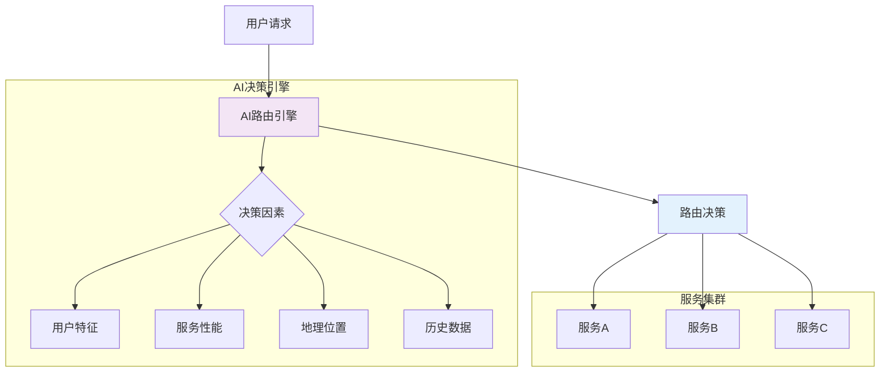
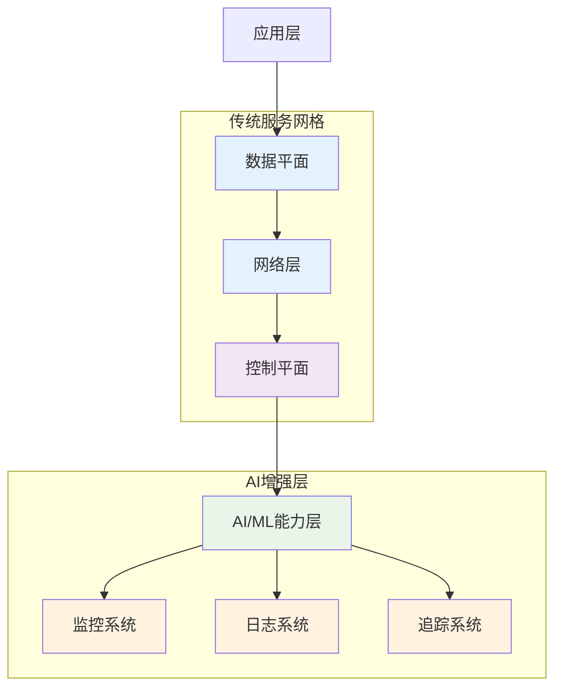
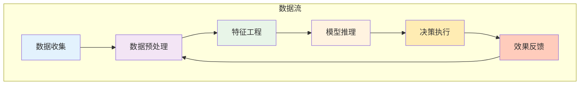
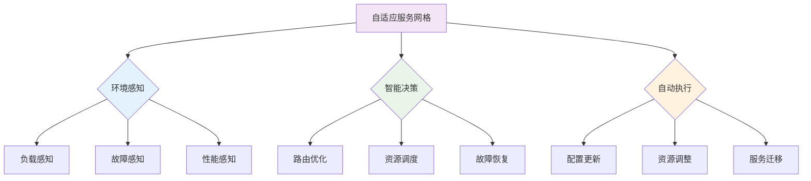

## 服务网格与人工智能、机器学习的结合：探索AI驱动的服务治理新范式

随着人工智能（AI）和机器学习（ML）技术的快速发展，这些技术正在逐步渗透到IT基础设施的各个层面，服务网格作为云原生生态系统的重要组成部分，也开始与AI/ML技术深度融合。通过将AI/ML能力集成到服务网格中，可以实现更智能、更自适应的服务治理，提升系统的自动化水平和运维效率。本章将深入探讨服务网格与AI/ML技术的结合方式、应用场景以及未来发展趋势。

### AI/ML技术在服务网格中的价值

AI/ML技术为服务网格带来了新的能力和价值，主要体现在以下几个方面：

#### 智能化流量管理

AI/ML技术可以基于历史数据和实时状态，实现更智能的流量管理决策：

```yaml
# 智能化流量管理示例
# 1. 基于机器学习的路由决策:
apiVersion: networking.istio.io/v1alpha3
kind: VirtualService
metadata:
  name: ai-driven-routing
spec:
  hosts:
  - user-service
  http:
  - route:
    - destination:
        host: user-service-v1
      weight: 70
    - destination:
        host: user-service-v2
      weight: 30
    # AI模型动态调整权重
    retries:
      attempts: 3
      perTryTimeout: 2s
      retryOn: connect-failure,refused-stream,gateway-error
---
# 2. 预测性负载均衡:
apiVersion: networking.istio.io/v1alpha3
kind: DestinationRule
metadata:
  name: predictive-lb
spec:
  host: user-service
  trafficPolicy:
    loadBalancer:
      simple: LEAST_REQUEST
    connectionPool:
      tcp:
        maxConnections: 1000
      http:
        http1MaxPendingRequests: 10000
    outlierDetection:
      # 基于ML模型的异常检测
      consecutive5xxErrors: 5
      interval: 30s
      baseEjectionTime: 30s
```

#### 自适应故障处理

AI/ML技术可以帮助服务网格实现自适应的故障处理机制：

```yaml
# 自适应故障处理配置
# 1. 智能重试策略:
apiVersion: networking.istio.io/v1alpha3
kind: VirtualService
metadata:
  name: adaptive-retry
spec:
  hosts:
  - payment-service
  http:
  - route:
    - destination:
        host: payment-service
    retries:
      # 基于历史成功率的动态重试
      attempts: 3
      perTryTimeout: 2s
      retryOn: connect-failure,refused-stream,gateway-error
---
# 2. 动态超时设置:
apiVersion: networking.istio.io/v1alpha3
kind: VirtualService
metadata:
  name: dynamic-timeout
spec:
  hosts:
  - order-service
  http:
  - route:
    - destination:
        host: order-service
    timeout: 5s  # 基于ML预测的动态超时
```

#### 预测性运维

AI/ML技术可以实现预测性运维，提前发现和处理潜在问题：

```yaml
# 预测性运维配置示例
# 1. 异常预测告警:
apiVersion: monitoring.coreos.com/v1
kind: PrometheusRule
metadata:
  name: predictive-alerts
spec:
  groups:
  - name: predictive.rules
    rules:
    - alert: PredictiveHighErrorRate
      expr: |
        # 基于时间序列预测的异常检测
        predict_linear(istio_requests_total{response_code=~"5.*"}[5m], 600) > 10
      for: 1m
      labels:
        severity: warning
      annotations:
        summary: "Predictive high error rate detected"
---
# 2. 性能瓶颈预测:
apiVersion: monitoring.coreos.com/v1
kind: PrometheusRule
metadata:
  name: performance-prediction
spec:
  groups:
  - name: performance.rules
    rules:
    - alert: PredictiveHighLatency
      expr: |
        # 基于历史数据的延迟预测
        predict_linear(histogram_quantile(0.95, sum(rate(istio_request_duration_milliseconds_bucket[5m])) by (le)), 600) > 1000
      for: 1m
      labels:
        severity: warning
      annotations:
        summary: "Predictive high latency detected"
```

### AI/ML在服务网格中的应用场景

AI/ML技术在服务网格中有多个应用场景，涵盖了服务治理的各个方面。

#### 智能路由决策

基于AI/ML的智能路由决策可以根据多种因素动态调整流量分配：



智能路由配置示例：

```yaml
# 智能路由配置
# 1. 基于用户特征的路由:
apiVersion: networking.istio.io/v1alpha3
kind: VirtualService
metadata:
  name: user-based-routing
spec:
  hosts:
  - recommendation-service
  http:
  - match:
    - headers:
        user-segment:
          exact: "premium"
    route:
    - destination:
        host: recommendation-v2
  - match:
    - headers:
        user-segment:
          exact: "standard"
    route:
    - destination:
        host: recommendation-v1
  - route:
    - destination:
        host: recommendation-default
---
# 2. 基于地理位置的路由:
apiVersion: networking.istio.io/v1alpha3
kind: VirtualService
metadata:
  name: geo-based-routing
spec:
  hosts:
  - user-service
  http:
  - match:
    - headers:
        geo-location:
          exact: "us-east"
    route:
    - destination:
        host: user-service-us-east
  - match:
    - headers:
        geo-location:
          exact: "eu-west"
    route:
    - destination:
        host: user-service-eu-west
```

#### 异常检测与根因分析

AI/ML技术可以实现更精准的异常检测和根因分析：

```yaml
# 异常检测配置
# 1. 基于机器学习的异常检测:
apiVersion: monitoring.coreos.com/v1
kind: PrometheusRule
metadata:
  name: ml-anomaly-detection
spec:
  groups:
  - name: anomaly-detection.rules
    rules:
    - alert: MLAnomalyDetected
      expr: |
        # 使用机器学习模型检测异常
        ml_anomaly_score(istio_requests_total) > 0.8
      for: 1m
      labels:
        severity: critical
      annotations:
        summary: "ML-based anomaly detected"
---
# 2. 根因分析配置:
apiVersion: v1
kind: ConfigMap
metadata:
  name: root-cause-analysis-config
  namespace: istio-system
data:
  config.yaml: |-
    rootCauseAnalysis:
      enabled: true
      algorithms:
        - name: "correlation-analysis"
          enabled: true
        - name: "causal-inference"
          enabled: true
        - name: "clustering"
          enabled: true
```

#### 自动化容量规划

AI/ML技术可以帮助实现自动化容量规划：

```yaml
# 自动化容量规划配置
# 1. 资源预测配置:
apiVersion: autoscaling/v2
kind: HorizontalPodAutoscaler
metadata:
  name: ai-driven-hpa
spec:
  scaleTargetRef:
    apiVersion: apps/v1
    kind: Deployment
    name: user-service
  minReplicas: 3
  maxReplicas: 20
  metrics:
  - type: Resource
    resource:
      name: cpu
      target:
        type: Utilization
        averageUtilization: 70
  # 基于AI预测的动态调整
  behavior:
    scaleDown:
      stabilizationWindowSeconds: 300
      policies:
      - type: Percent
        value: 10
        periodSeconds: 60
    scaleUp:
      stabilizationWindowSeconds: 60
      policies:
      - type: Percent
        value: 50
        periodSeconds: 60
---
# 2. 预测性扩缩容:
apiVersion: autoscaling/v2
kind: HorizontalPodAutoscaler
metadata:
  name: predictive-hpa
spec:
  scaleTargetRef:
    apiVersion: apps/v1
    kind: Deployment
    name: order-service
  minReplicas: 2
  maxReplicas: 15
  metrics:
  - type: External
    external:
      metric:
        name: predicted_load
      target:
        type: Value
        value: "100"
```

### AI/ML驱动的服务网格架构

AI/ML驱动的服务网格架构需要在传统架构基础上增加AI/ML能力层：



#### AI/ML能力组件

AI/ML驱动的服务网格包含以下核心组件：

```yaml
# AI/ML能力组件配置
# 1. 机器学习模型管理:
apiVersion: v1
kind: ConfigMap
metadata:
  name: ml-models-config
  namespace: istio-system
data:
  models.yaml: |-
    models:
      - name: "traffic-prediction"
        version: "1.0"
        path: "/models/traffic-prediction-v1.0.pkl"
        type: "regression"
      - name: "anomaly-detection"
        version: "1.2"
        path: "/models/anomaly-detection-v1.2.pkl"
        type: "classification"
      - name: "root-cause-analysis"
        version: "2.1"
        path: "/models/root-cause-analysis-v2.1.pkl"
        type: "clustering"
---
# 2. AI决策引擎:
apiVersion: apps/v1
kind: Deployment
metadata:
  name: ai-decision-engine
  namespace: istio-system
spec:
  replicas: 2
  selector:
    matchLabels:
      app: ai-decision-engine
  template:
    metadata:
      labels:
        app: ai-decision-engine
    spec:
      containers:
      - name: ai-decision-engine
        image: servicemesh/ai-decision-engine:latest
        ports:
        - containerPort: 8080
        resources:
          requests:
            cpu: 200m
            memory: 512Mi
          limits:
            cpu: 500m
            memory: 1Gi
        env:
        - name: MODEL_REGISTRY_URL
          value: "http://model-registry:8080"
        - name: PROMETHEUS_URL
          value: "http://prometheus:9090"
```

#### 数据处理流程

AI/ML驱动的服务网格需要处理大量的观测数据：



### 实施案例与最佳实践

通过实际案例了解AI/ML在服务网格中的应用。

#### 案例一：电商平台智能推荐优化

某电商平台通过AI驱动的服务网格优化推荐系统：

```bash
# 电商平台智能推荐优化案例
# 1. 实施背景:
#    - 推荐系统响应时间长
#    - 用户点击率低
#    - 资源利用率不均衡

# 2. 解决方案:
#    - 基于用户行为的智能路由
#    - 动态资源分配
#    - 实时性能优化

# 3. 实施效果:
#    - 推荐响应时间降低40%
#    - 用户点击率提升25%
#    - 资源利用率提高30%
```

智能推荐配置：

```yaml
# 智能推荐配置示例
# 1. 基于用户行为的路由:
apiVersion: networking.istio.io/v1alpha3
kind: VirtualService
metadata:
  name: ai-recommendation-routing
spec:
  hosts:
  - recommendation-service
  http:
  - match:
    - headers:
        user-behavior-score:
          regex: "^[8-9].*$"
    route:
    - destination:
        host: recommendation-advanced
  - match:
    - headers:
        user-behavior-score:
          regex: "^[5-7].*$"
    route:
    - destination:
        host: recommendation-standard
  - route:
    - destination:
        host: recommendation-basic
---
# 2. 动态资源分配:
apiVersion: autoscaling/v2
kind: HorizontalPodAutoscaler
metadata:
  name: recommendation-hpa
spec:
  scaleTargetRef:
    apiVersion: apps/v1
    kind: Deployment
    name: recommendation-service
  minReplicas: 5
  maxReplicas: 30
  metrics:
  - type: External
    external:
      metric:
        name: predicted_user_load
      target:
        type: Value
        value: "1000"
```

#### 案例二：金融服务异常检测

某金融服务公司通过AI驱动的服务网格实现智能异常检测：

```bash
# 金融服务异常检测案例
# 1. 实施背景:
#    - 交易系统异常检测困难
#    - 误报率高
#    - 响应时间长

# 2. 解决方案:
#    - 基于机器学习的异常检测
#    - 实时风险评估
#    - 自动化响应机制

# 3. 实施效果:
#    - 异常检测准确率提升50%
#    - 误报率降低70%
#    - 响应时间缩短80%
```

异常检测配置：

```yaml
# 异常检测配置示例
# 1. 机器学习异常检测:
apiVersion: monitoring.coreos.com/v1
kind: PrometheusRule
metadata:
  name: ml-fraud-detection
spec:
  groups:
  - name: fraud-detection.rules
    rules:
    - alert: MLFraudDetected
      expr: |
        # 基于机器学习模型的欺诈检测
        ml_fraud_score(transaction_metrics) > 0.9
      for: 30s
      labels:
        severity: critical
      annotations:
        summary: "ML-based fraud detected"
        description: "Fraudulent transaction detected with high confidence"
---
# 2. 自动化响应:
apiVersion: batch/v1
kind: Job
metadata:
  name: fraud-response-job
spec:
  template:
    spec:
      containers:
      - name: fraud-response
        image: servicemesh/fraud-response:latest
        command:
        - /bin/sh
        - -c
        - |
          # 自动化欺诈响应
          curl -X POST http://fraud-response-service/trigger \
            -H "Content-Type: application/json" \
            -d '{"action": "block_transaction", "confidence": 0.95}'
      restartPolicy: Never
```

### 技术挑战与解决方案

AI/ML在服务网格中的应用也面临一些技术挑战。

#### 模型管理挑战

AI/ML模型的管理是一个重要挑战：

```bash
# 模型管理挑战及解决方案
# 1. 挑战:
#    - 模型版本管理复杂
#    - 模型部署困难
#    - 模型更新不及时

# 2. 解决方案:
#    - 建立模型注册中心
#    - 实施CI/CD流水线
#    - 自动化模型更新
```

模型管理配置：

```yaml
# 模型管理配置示例
# 1. 模型注册中心:
apiVersion: apps/v1
kind: Deployment
metadata:
  name: model-registry
  namespace: istio-system
spec:
  replicas: 1
  selector:
    matchLabels:
      app: model-registry
  template:
    metadata:
      labels:
        app: model-registry
    spec:
      containers:
      - name: model-registry
        image: ml-model-registry:latest
        ports:
        - containerPort: 8080
        volumeMounts:
        - name: models-storage
          mountPath: /models
      volumes:
      - name: models-storage
        persistentVolumeClaim:
          claimName: models-pvc
---
# 2. 模型更新策略:
apiVersion: v1
kind: ConfigMap
metadata:
  name: model-update-policy
  namespace: istio-system
data:
  policy.yaml: |-
    updateStrategy:
      type: "rolling"
      maxSurge: 1
      maxUnavailable: 0
    validation:
      enabled: true
      threshold: 0.95
```

#### 数据质量挑战

AI/ML模型的效果很大程度上依赖于数据质量：

```bash
# 数据质量挑战及解决方案
# 1. 挑战:
#    - 数据噪声多
#    - 数据缺失严重
#    - 数据分布不均衡

# 2. 解决方案:
#    - 实施数据清洗机制
#    - 建立数据质量监控
#    - 采用鲁棒性算法
```

数据质量管理配置：

```yaml
# 数据质量管理配置示例
# 1. 数据质量监控:
apiVersion: monitoring.coreos.com/v1
kind: PrometheusRule
metadata:
  name: data-quality-rules
spec:
  groups:
  - name: data-quality.rules
    rules:
    - alert: DataQualityIssue
      expr: |
        # 数据质量指标监控
        data_quality_score < 0.8
      for: 5m
      labels:
        severity: warning
      annotations:
        summary: "Data quality issue detected"
---
# 2. 数据清洗配置:
apiVersion: v1
kind: ConfigMap
metadata:
  name: data-cleaning-config
  namespace: istio-system
data:
  cleaning.yaml: |-
    cleaningRules:
      - name: "remove_outliers"
        enabled: true
        parameters:
          threshold: 3
      - name: "fill_missing_values"
        enabled: true
        method: "interpolation"
      - name: "normalize_data"
        enabled: true
        method: "min-max"
```

### 未来发展趋势

AI/ML与服务网格的结合将继续发展，呈现出以下趋势：

#### 边缘AI集成

边缘计算与AI的结合将推动服务网格向边缘AI方向发展：

```yaml
# 边缘AI集成示例
# 1. 边缘AI节点配置:
apiVersion: apps/v1
kind: DaemonSet
metadata:
  name: edge-ai-node
  namespace: istio-system
spec:
  selector:
    matchLabels:
      app: edge-ai-node
  template:
    metadata:
      labels:
        app: edge-ai-node
    spec:
      containers:
      - name: edge-ai-node
        image: servicemesh/edge-ai:latest
        resources:
          requests:
            cpu: 100m
            memory: 256Mi
          limits:
            cpu: 200m
            memory: 512Mi
        volumeMounts:
        - name: model-cache
          mountPath: /models
      volumes:
      - name: model-cache
        emptyDir: {}
---
# 2. 边缘AI路由策略:
apiVersion: networking.istio.io/v1alpha3
kind: VirtualService
metadata:
  name: edge-ai-routing
spec:
  hosts:
  - user-service
  http:
  - match:
    - headers:
        device-type:
          exact: "edge"
    route:
    - destination:
        host: edge-ai-service
  - route:
    - destination:
        host: cloud-ai-service
```

#### 联邦学习应用

联邦学习技术将使服务网格能够在保护隐私的前提下共享AI模型：

```yaml
# 联邦学习配置示例
# 1. 联邦学习协调器:
apiVersion: apps/v1
kind: Deployment
metadata:
  name: federated-learning-coordinator
  namespace: istio-system
spec:
  replicas: 1
  selector:
    matchLabels:
      app: federated-learning-coordinator
  template:
    metadata:
      labels:
        app: federated-learning-coordinator
    spec:
      containers:
      - name: coordinator
        image: servicemesh/federated-learning-coordinator:latest
        ports:
        - containerPort: 8080
        env:
        - name: FEDERATED_ROUNDS
          value: "100"
        - name: PARTICIPANTS
          value: "cluster1,cluster2,cluster3"
---
# 2. 联邦学习参与者:
apiVersion: apps/v1
kind: Deployment
metadata:
  name: federated-learning-participant
  namespace: istio-system
spec:
  replicas: 1
  selector:
    matchLabels:
      app: federated-learning-participant
  template:
    metadata:
      labels:
        app: federated-learning-participant
    spec:
      containers:
      - name: participant
        image: servicemesh/federated-learning-participant:latest
        env:
        - name: COORDINATOR_URL
          value: "http://federated-learning-coordinator:8080"
        - name: LOCAL_DATA_PATH
          value: "/data/local"
```

#### 自适应架构演进

AI/ML将推动服务网格向自适应架构演进：



### 总结

AI/ML技术与服务网格的结合为服务治理带来了革命性的变化，通过智能化的流量管理、自适应的故障处理、预测性的运维等能力，显著提升了系统的自动化水平和运维效率。

关键要点包括：
1. 理解AI/ML技术在服务网格中的价值和应用场景
2. 掌握智能路由决策、异常检测、自动化容量规划等核心技术
3. 学习AI/ML驱动的服务网格架构设计和实现方法
4. 了解实际案例中的最佳实践和实施效果
5. 认识技术挑战并掌握相应的解决方案
6. 把握边缘AI集成、联邦学习应用等未来发展趋势

通过系统性的技术融合和创新实践，我们可以：
1. 实现更智能、更自适应的服务治理
2. 提升系统的可靠性和性能表现
3. 降低运维复杂度和人力成本
4. 支持业务的快速发展和创新需求
5. 构建面向未来的智能化基础设施

随着AI/ML技术的不断进步和服务网格的持续演进，两者的深度融合将为云原生生态系统带来更多可能性，推动IT基础设施向更高层次的智能化发展。企业和技术团队需要积极拥抱这一趋势，通过持续学习和实践，掌握AI驱动的服务网格技术，为数字化转型和业务创新提供强有力的技术支撑。