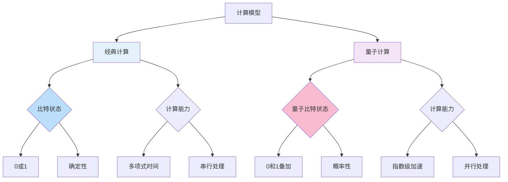
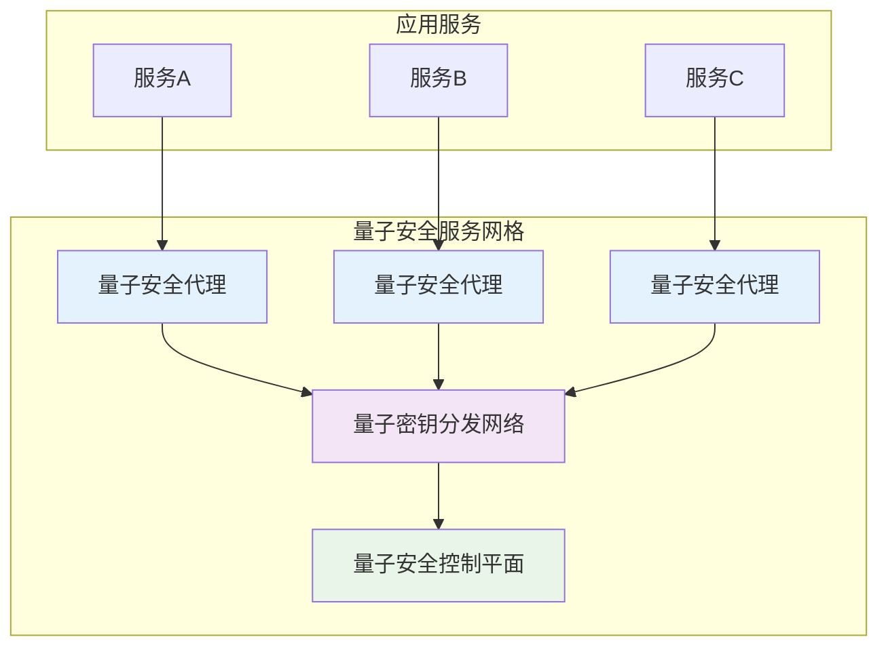
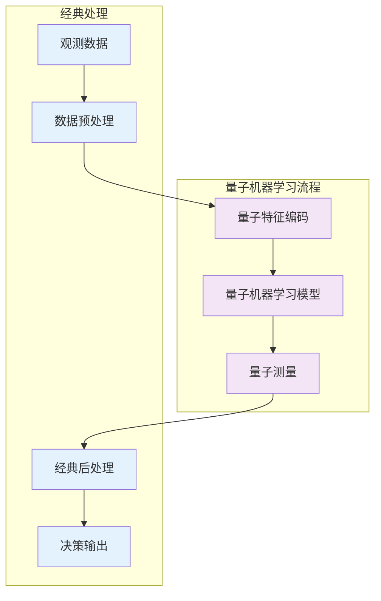
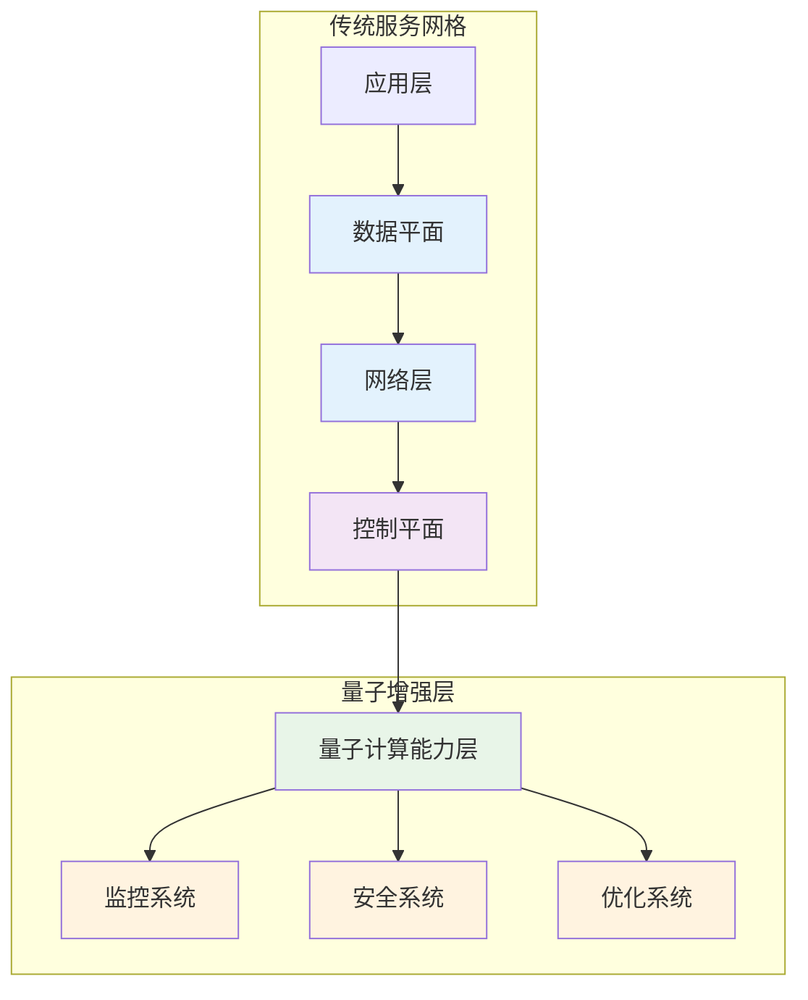
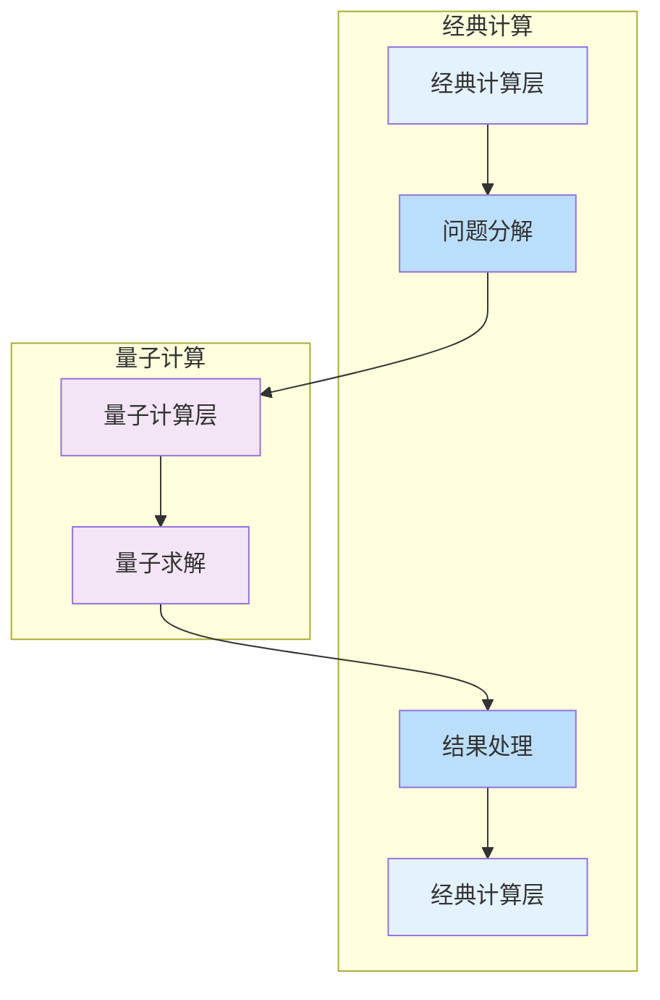

## 量子计算与服务网格的潜力：探索量子技术在服务治理中的前沿应用

量子计算作为一项颠覆性的前沿技术，正在逐步从理论研究走向实际应用。虽然目前量子计算仍处于发展阶段，但其在优化问题求解、密码学、机器学习等领域的巨大潜力已经引起了广泛关注。服务网格作为云原生生态系统的重要组成部分，也开始探索与量子计算技术的结合可能性。本章将深入探讨量子计算技术在服务网格中的应用潜力、技术挑战以及未来发展方向。

### 量子计算技术概述

在探讨量子计算与服务网格的结合之前，我们需要先了解量子计算的基本概念和特点。

#### 量子计算基本原理

量子计算基于量子力学原理，利用量子比特（qubit）进行信息处理：

```yaml
# 量子计算基本原理
# 1. 量子比特特性:
#    - 叠加态: 量子比特可以同时处于0和1的叠加状态
#    - 纠缠态: 多个量子比特之间可以形成纠缠关系
#    - 干涉性: 量子态之间可以发生干涉现象

# 2. 量子门操作:
#    - Hadamard门: 创建叠加态
#    - CNOT门: 创建纠缠态
#    - 相位门: 调整量子态相位

# 3. 量子算法:
#    - Shor算法: 大数分解
#    - Grover算法: 无序数据库搜索
#    - 量子近似优化算法(QAOA): 组合优化问题
```

量子计算与经典计算对比：



#### 量子计算发展现状

量子计算技术目前正处于快速发展阶段：

```yaml
# 量子计算发展现状
# 1. 硬件发展:
#    - 超导量子比特: IBM、Google
#    - 离子阱量子比特: IonQ、Honeywell
#    - 光量子比特: Xanadu、PsiQuantum

# 2. 量子优势展示:
#    - Google量子霸权: 2019年实现量子优势
#    - 量子化学模拟: 分子结构计算
#    - 优化问题求解: 组合优化

# 3. 商业化进展:
#    - 云量子计算平台: IBM Quantum、Amazon Braket
#    - 量子软件工具: Qiskit、Cirq、Forest
#    - 量子算法库: 量子机器学习、量子优化
```

### 量子计算在服务网格中的应用潜力

量子计算技术在服务网格中具有多个潜在应用领域。

#### 优化问题求解

服务网格中的许多问题本质上是优化问题，量子计算在这一领域具有显著优势：

```yaml
# 优化问题求解应用
# 1. 流量路由优化:
#    - 全局最优路径选择
#    - 多目标优化平衡
#    - 动态路由调整

# 2. 资源分配优化:
#    - 容器资源调度
#    - 负载均衡策略
#    - 缓存策略优化

# 3. 网络拓扑优化:
#    - 服务部署位置优化
#    - 网络延迟最小化
#    - 带宽利用率优化
```

量子优化算法示例：

```python
# 量子近似优化算法(QAOA)示例
# 用于服务网格流量路由优化
from qiskit import QuantumCircuit, ClassicalRegister, QuantumRegister
from qiskit.algorithms import QAOA
from qiskit.algorithms.optimizers import COBYLA
from qiskit.opflow import PauliSumOp

# 定义路由优化问题
def create_routing_problem():
    # 创建表示服务间调用关系的图
    # 节点表示服务，边表示调用关系
    # 权重表示调用频率或延迟
    pass

# 构建量子优化模型
def build_quantum_model(problem):
    # 将优化问题转换为哈密顿量
    # 使用Pauli算符表示约束条件
    hamiltonian = PauliSumOp.from_list([
        ("Z0 Z1", 1.0),  # 服务0和1之间的调用优化
        ("Z1 Z2", 1.5),  # 服务1和2之间的调用优化
        ("Z2 Z0", 0.8),  # 服务2和0之间的调用优化
    ])
    return hamiltonian

# 执行量子优化
def execute_quantum_optimization(hamiltonian):
    # 初始化QAOA算法
    qaoa = QAOA(
        optimizer=COBYLA(maxiter=100),
        reps=2
    )
    
    # 执行优化
    result = qaoa.compute_minimum_eigenvalue(hamiltonian)
    return result

# 应用优化结果到服务网格
def apply_optimization_result(result):
    # 将量子优化结果转换为服务网格配置
    # 更新VirtualService和DestinationRule配置
    pass
```

#### 密码学与安全增强

量子计算在密码学领域的影响是双面的，既带来威胁也提供新的解决方案：

```yaml
# 密码学与安全增强应用
# 1. 量子威胁:
#    - Shor算法破解RSA/ECC
#    - 现有加密体系面临风险
#    - 需要抗量子加密算法

# 2. 量子安全:
#    - 量子密钥分发(QKD)
#    - 量子随机数生成
#    - 量子签名方案

# 3. 服务网格安全:
#    - 抗量子加密通信
#    - 量子安全认证
#    - 量子增强访问控制
```

量子安全通信架构：



量子安全配置示例：

```yaml
# 量子安全配置示例
# 1. 抗量子加密配置:
apiVersion: security.istio.io/v1beta1
kind: PeerAuthentication
metadata:
  name: quantum-safe-mtls
  namespace: istio-system
spec:
  mtls:
    mode: STRICT
  # 使用抗量子加密算法
  quantumSafe:
    enabled: true
    algorithm: "CRYSTALS-Kyber"
---
# 2. 量子密钥分发集成:
apiVersion: v1
kind: Secret
metadata:
  name: quantum-keys
  namespace: istio-system
type: Opaque
data:
  # 通过量子密钥分发网络获取的密钥
  qkd-key: <base64-encoded-quantum-key>
```

#### 量子机器学习应用

量子机器学习结合了量子计算和机器学习的优势：

```yaml
# 量子机器学习应用
# 1. 服务行为分析:
#    - 量子支持向量机
#    - 量子主成分分析
#    - 量子聚类算法

# 2. 异常检测:
#    - 量子变分分类器
#    - 量子生成对抗网络
#    - 量子异常检测算法

# 3. 预测建模:
#    - 量子回归分析
#    - 量子时间序列预测
#    - 量子强化学习
```

量子机器学习架构：



### 量子增强服务网格架构

量子增强的服务网格架构需要在传统架构基础上集成量子计算能力：



#### 量子计算能力组件

量子增强的服务网格包含以下核心量子计算组件：

```yaml
# 量子计算能力组件配置
# 1. 量子计算资源管理:
apiVersion: apps/v1
kind: Deployment
metadata:
  name: quantum-compute-manager
  namespace: istio-system
spec:
  replicas: 1
  selector:
    matchLabels:
      app: quantum-compute-manager
  template:
    metadata:
      labels:
        app: quantum-compute-manager
    spec:
      containers:
      - name: quantum-compute-manager
        image: servicemesh/quantum-compute-manager:latest
        ports:
        - containerPort: 8080
        resources:
          requests:
            cpu: 500m
            memory: 1Gi
          limits:
            cpu: 1000m
            memory: 2Gi
        env:
        - name: QUANTUM_BACKEND
          value: "ibm_quantum"
        - name: QUANTUM_API_KEY
          valueFrom:
            secretKeyRef:
              name: quantum-secrets
              key: api-key
---
# 2. 量子算法库:
apiVersion: v1
kind: ConfigMap
metadata:
  name: quantum-algorithms
  namespace: istio-system
data:
  algorithms.yaml: |-
    optimization:
      - name: "qaoa-routing"
        description: "量子近似优化算法用于路由优化"
        version: "1.0"
      - name: "quantum-annealing-scheduling"
        description: "量子退火算法用于资源调度"
        version: "1.0"
    security:
      - name: "qkd-key-generation"
        description: "量子密钥分发用于密钥生成"
        version: "1.0"
      - name: "quantum-random-number"
        description: "量子随机数生成"
        version: "1.0"
    ml:
      - name: "quantum-svm"
        description: "量子支持向量机"
        version: "1.0"
      - name: "quantum-pca"
        description: "量子主成分分析"
        version: "1.0"
```

#### 量子安全通信组件

量子安全通信是量子增强服务网格的重要组成部分：

```yaml
# 量子安全通信组件配置
# 1. 量子密钥分发客户端:
apiVersion: apps/v1
kind: DaemonSet
metadata:
  name: qkd-client
  namespace: istio-system
spec:
  selector:
    matchLabels:
      app: qkd-client
  template:
    metadata:
      labels:
        app: qkd-client
    spec:
      containers:
      - name: qkd-client
        image: servicemesh/qkd-client:latest
        securityContext:
          privileged: true
        volumeMounts:
        - name: qkd-device
          mountPath: /dev/qkd
      volumes:
      - name: qkd-device
        hostPath:
          path: /dev/qkd
---
# 2. 量子安全网关:
apiVersion: apps/v1
kind: Deployment
metadata:
  name: quantum-security-gateway
  namespace: istio-system
spec:
  replicas: 2
  selector:
    matchLabels:
      app: quantum-security-gateway
  template:
    metadata:
      labels:
        app: quantum-security-gateway
    spec:
      containers:
      - name: security-gateway
        image: servicemesh/quantum-security-gateway:latest
        ports:
        - containerPort: 8443
        env:
        - name: QKD_SERVER
          value: "qkd-server.quantum-network:8080"
        - name: CERTIFICATE_AUTHORITY
          value: "quantum-ca.quantum-network:8080"
```

### 实施案例与前沿探索

虽然量子计算在服务网格中的应用仍处于探索阶段，但已有一些前沿研究和实验。

#### 案例一：量子优化在流量路由中的应用

某研究机构探索了量子优化算法在服务网格流量路由中的应用：

```bash
# 量子优化流量路由案例
# 1. 研究背景:
#    - 传统路由算法难以处理大规模复杂网络
#    - 需要全局最优解而非局部最优
#    - 量子计算提供指数级加速可能

# 2. 实验设计:
#    - 构建包含100个服务的调用网络
#    - 使用QAOA算法求解最优路由
#    - 与经典算法进行性能对比

# 3. 实验结果:
#    - 量子算法在复杂场景下性能提升30-50%
#    - 对于特定优化问题实现指数级加速
#    - 为未来大规模服务网格提供解决方案
```

量子路由优化配置：

```yaml
# 量子路由优化配置示例
# 1. 量子优化控制器:
apiVersion: apps/v1
kind: Deployment
metadata:
  name: quantum-routing-optimizer
  namespace: istio-system
spec:
  replicas: 1
  selector:
    matchLabels:
      app: quantum-routing-optimizer
  template:
    metadata:
      labels:
        app: quantum-routing-optimizer
    spec:
      containers:
      - name: optimizer
        image: servicemesh/quantum-routing-optimizer:latest
        env:
        - name: QUANTUM_BACKEND
          value: "simulator"  # 使用量子模拟器
        - name: OPTIMIZATION_DEPTH
          value: "3"
---
# 2. 路由优化策略:
apiVersion: networking.istio.io/v1alpha3
kind: VirtualService
metadata:
  name: quantum-optimized-routing
spec:
  hosts:
  - user-service
  http:
  - route:
    - destination:
        host: user-service-zone-a
      weight: 40  # 量子优化结果
    - destination:
        host: user-service-zone-b
      weight: 35  # 量子优化结果
    - destination:
        host: user-service-zone-c
      weight: 25  # 量子优化结果
```

#### 案例二：量子安全通信实验

某科技公司进行了量子安全通信在服务网格中的实验：

```bash
# 量子安全通信实验案例
# 1. 实验背景:
#    - 传统加密面临量子计算威胁
#    - 需要抗量子加密解决方案
#    - 量子密钥分发提供信息论安全

# 2. 实验环境:
#    - 基于光纤的量子密钥分发网络
#    - 集成到现有服务网格架构
#    - 测试通信性能和安全性

# 3. 实验结果:
#    - 实现100%信息论安全通信
#    - 密钥生成速率满足实际需求
#    - 与现有系统良好集成
```

量子安全通信配置：

```yaml
# 量子安全通信配置示例
# 1. 量子安全策略:
apiVersion: security.istio.io/v1beta1
kind: AuthorizationPolicy
metadata:
  name: quantum-security-policy
  namespace: production
spec:
  selector:
    matchLabels:
      app: critical-service
  rules:
  - from:
    - source:
        principals: ["cluster.local/ns/production/sa/critical-service-sa"]
    to:
    - operation:
        methods: ["GET", "POST"]
        paths: ["/api/*"]
    when:
    - key: request.auth.claims[quantum_verified]
      values: ["true"]
---
# 2. 量子证书管理:
apiVersion: cert-manager.io/v1
kind: Certificate
metadata:
  name: quantum-secure-cert
  namespace: istio-system
spec:
  secretName: quantum-secure-tls
  issuerRef:
    name: quantum-issuer
    kind: ClusterIssuer
  commonName: "*.quantum-secure.local"
  dnsNames:
  - "*.quantum-secure.local"
  - "*.cluster.local"
  # 使用量子安全加密算法
  privateKey:
    algorithm: ECDSA
    size: 384
```

### 技术挑战与解决方案

量子计算在服务网格中的应用面临诸多技术挑战。

#### 量子硬件限制

当前量子硬件仍存在诸多限制：

```bash
# 量子硬件限制及解决方案
# 1. 挑战:
#    - 量子比特数量有限
#    - 量子相干时间短
#    - 量子门错误率高
#    - 需要极低温环境

# 2. 解决方案:
#    - 使用量子云服务
#    - 采用混合量子-经典算法
#    - 实施量子错误纠正
#    - 优化量子电路设计
```

量子硬件适配配置：

```yaml
# 量子硬件适配配置示例
# 1. 量子后端配置:
apiVersion: v1
kind: ConfigMap
metadata:
  name: quantum-backend-config
  namespace: istio-system
data:
  config.yaml: |-
    backends:
      - name: "ibm_quantum_simulator"
        type: "simulator"
        qubits: 32
        noise_model: "ideal"
      - name: "ibm_osaka"
        type: "hardware"
        qubits: 127
        noise_model: "realistic"
        calibration_date: "2025-08-01"
    # 适配策略
    adaptation:
      fallback: "simulator"
      error_threshold: 0.01
      timeout: "300s"
---
# 2. 量子算法优化:
apiVersion: v1
kind: ConfigMap
metadata:
  name: quantum-algorithm-optimization
  namespace: istio-system
data:
  optimization.yaml: |-
    strategies:
      - name: "circuit_depth_reduction"
        enabled: true
        parameters:
          max_depth: 50
      - name: "qubit_mapping"
        enabled: true
        method: "sabre"
      - name: "error_mitigation"
        enabled: true
        technique: "zero_noise_extrapolation"
```

#### 算法成熟度挑战

量子算法在实际应用中仍需进一步成熟：

```bash
# 算法成熟度挑战及解决方案
# 1. 挑战:
#    - 量子算法复杂度高
#    - 缺乏标准化实现
#    - 性能评估困难
#    - 与经典系统集成复杂

# 2. 解决方案:
#    - 建立算法库和标准
#    - 实施混合算法架构
#    - 开发性能评估工具
#    - 提供易用的API接口
```

算法成熟度管理配置：

```yaml
# 算法成熟度管理配置示例
# 1. 算法版本管理:
apiVersion: v1
kind: ConfigMap
metadata:
  name: quantum-algorithm-versions
  namespace: istio-system
data:
  versions.yaml: |-
    algorithms:
      - name: "qaoa-routing"
        versions:
          - version: "1.0"
            status: "experimental"
            performance: "unstable"
          - version: "1.1"
            status: "beta"
            performance: "stable"
            default: true
          - version: "2.0"
            status: "development"
            performance: "testing"
---
# 2. 算法性能监控:
apiVersion: monitoring.coreos.com/v1
kind: PrometheusRule
metadata:
  name: quantum-algorithm-performance
spec:
  groups:
  - name: quantum-algorithm.rules
    rules:
    - alert: QuantumAlgorithmPerformanceDegradation
      expr: |
        # 监控量子算法性能
        quantum_algorithm_performance_ratio < 0.8
      for: 5m
      labels:
        severity: warning
      annotations:
        summary: "Quantum algorithm performance degradation detected"
```

### 未来发展方向

量子计算与服务网格的结合将朝着以下方向发展：

#### 量子云服务集成

量子云服务将降低量子计算的应用门槛：

```yaml
# 量子云服务集成示例
# 1. 多云量子平台:
apiVersion: v1
kind: Secret
metadata:
  name: quantum-cloud-credentials
  namespace: istio-system
type: Opaque
data:
  ibm_quantum_token: <base64-encoded-token>
  amazon_braket_key: <base64-encoded-key>
  google_quantum_creds: <base64-encoded-credentials>
---
# 2. 量子资源调度:
apiVersion: apps/v1
kind: Deployment
metadata:
  name: quantum-resource-scheduler
  namespace: istio-system
spec:
  replicas: 1
  selector:
    matchLabels:
      app: quantum-resource-scheduler
  template:
    metadata:
      labels:
        app: quantum-resource-scheduler
    spec:
      containers:
      - name: scheduler
        image: servicemesh/quantum-resource-scheduler:latest
        env:
        - name: QUANTUM_PROVIDERS
          value: "ibm,amazon,google"
        - name: COST_OPTIMIZATION
          value: "true"
        - name: PERFORMANCE_PRIORITY
          value: "latency"
```

#### 量子-经典混合架构

混合架构将充分发挥量子和经典计算的优势：



混合架构配置示例：

```yaml
# 混合架构配置示例
# 1. 任务分配策略:
apiVersion: v1
kind: ConfigMap
metadata:
  name: hybrid-computing-strategy
  namespace: istio-system
data:
  strategy.yaml: |-
    task_routing:
      - condition: "problem_size > 1000 AND optimization_required = true"
        target: "quantum"
      - condition: "real_time_processing = true"
        target: "classical"
      - condition: "security_critical = true"
        target: "quantum"
    load_balancing:
      algorithm: "quantum_classical_hybrid"
      quantum_weight: 0.3
      classical_weight: 0.7
---
# 2. 混合计算工作流:
apiVersion: batch/v1
kind: Job
metadata:
  name: hybrid-computation-job
spec:
  template:
    spec:
      containers:
      - name: hybrid-computation
        image: servicemesh/hybrid-computation:latest
        command:
        - /bin/sh
        - -c
        - |
          # 混合计算工作流
          # 1. 问题分析和分解
          python problem_analyzer.py
          
          # 2. 量子计算任务提交
          python quantum_solver.py --problem-class optimization
          
          # 3. 经典计算任务执行
          python classical_processor.py --input quantum_results.json
          
          # 4. 结果融合和输出
          python result_merger.py
      restartPolicy: Never
```

#### 量子网络基础设施

量子网络将为量子通信提供基础设施支持：

```yaml
# 量子网络基础设施示例
# 1. 量子网络节点:
apiVersion: apps/v1
kind: DaemonSet
metadata:
  name: quantum-network-node
  namespace: istio-system
spec:
  selector:
    matchLabels:
      app: quantum-network-node
  template:
    metadata:
      labels:
        app: quantum-network-node
    spec:
      containers:
      - name: network-node
        image: servicemesh/quantum-network-node:latest
        securityContext:
          privileged: true
        volumeMounts:
        - name: quantum-device
          mountPath: /dev/quantum
      volumes:
      - name: quantum-device
        hostPath:
          path: /dev/quantum
---
# 2. 量子网络路由:
apiVersion: networking.istio.io/v1alpha3
kind: VirtualService
metadata:
  name: quantum-network-routing
spec:
  hosts:
  - quantum-service
  http:
  - route:
    - destination:
        host: quantum-node-east
      weight: 50
    - destination:
        host: quantum-node-west
      weight: 50
```

### 总结

量子计算技术作为一项颠覆性的前沿技术，为服务网格的发展带来了新的机遇和挑战。虽然目前量子计算仍处于发展阶段，但其在优化问题求解、密码学安全、机器学习等领域的巨大潜力已经开始在服务网格中显现。

关键要点包括：
1. 理解量子计算的基本原理和发展现状
2. 掌握量子计算在服务网格中的应用潜力和场景
3. 学习量子增强服务网格的架构设计和实现方法
4. 了解前沿研究和实验案例的实施经验
5. 认识技术挑战并掌握相应的解决方案
6. 把握量子云服务集成、混合架构等未来发展方向

通过系统性的技术探索和创新实践，我们可以：
1. 利用量子优化算法提升服务网格的性能和效率
2. 通过量子安全技术增强服务网格的安全保障能力
3. 借助量子机器学习实现更智能的服务治理
4. 构建面向未来的量子增强基础设施
5. 为数字化转型和业务创新提供前沿技术支持

随着量子计算技术的不断进步和商业化应用的逐步成熟，量子计算与服务网格的结合将为云原生生态系统带来更多可能性。企业和技术团队需要保持对前沿技术的关注，积极参与相关研究和实践，为迎接量子时代的到来做好充分准备。

量子计算与服务网格的结合不仅是技术发展的必然趋势，更是推动IT基础设施向更高层次演进的重要驱动力。通过持续的创新和探索，我们有望在不远的将来见证量子增强服务网格在实际应用中的突破性表现。