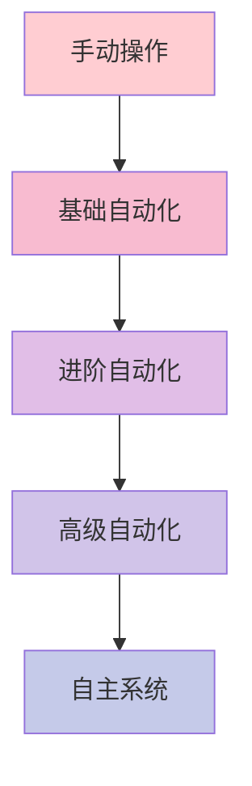
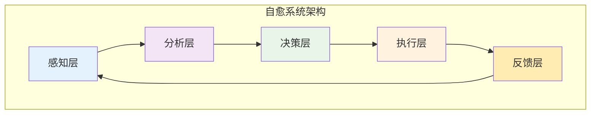
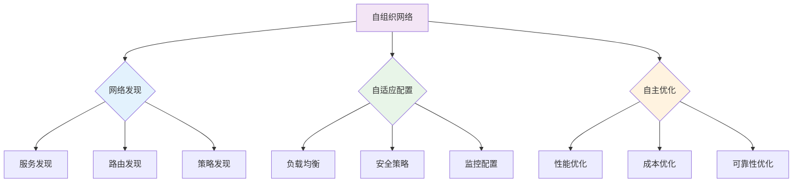

## 服务网格的自动化与自愈能力：构建高度自治的微服务基础设施

随着微服务架构的普及和系统复杂性的增加，传统的人工运维模式已难以满足现代应用的需求。服务网格作为微服务架构的重要组成部分，正在向更高层次的自动化和自愈能力发展。通过构建具备自主感知、自主决策和自主执行能力的服务网格系统，可以显著降低运维复杂度，提升系统可靠性和稳定性。本章将深入探讨服务网格自动化与自愈能力的核心概念、技术实现、最佳实践以及未来发展趋势。

### 自动化与自愈能力概述

自动化与自愈能力是构建现代化云原生基础设施的关键要素。

#### 自动化能力的层次

服务网格的自动化能力可以分为以下几个层次：

```yaml
# 自动化能力层次
# 1. 基础自动化:
#    - 配置自动部署
#    - 服务自动注册
#    - 健康检查自动执行
#    - 日志自动收集

# 2. 进阶自动化:
#    - 流量自动调节
#    - 容量自动伸缩
#    - 安全策略自动更新
#    - 故障自动检测

# 3. 高级自动化:
#    - 智能路由决策
#    - 预测性维护
#    - 自适应优化
#    - 自主修复

# 4. 自主系统:
#    - 环境自感知
#    - 目标自学习
#    - 策略自生成
#    - 行为自演化
```

自动化能力演进图：



#### 自愈能力的核心组件

自愈能力依赖于以下核心组件的协同工作：



自愈能力组件说明：

```yaml
# 自愈能力组件说明
# 1. 感知层:
#    - 指标收集: CPU、内存、网络、应用指标
#    - 日志分析: 错误日志、性能日志、安全日志
#    - 链路追踪: 调用链路、延迟分析、错误传播

# 2. 分析层:
#    - 异常检测: 统计分析、机器学习、规则引擎
#    - 根因分析: 关联分析、因果推理、知识图谱
#    - 影响评估: 业务影响、用户影响、系统影响

# 3. 决策层:
#    - 策略引擎: 修复策略、降级策略、迁移策略
#    - 优先级排序: 任务优先级、资源优先级、风险优先级
#    - 执行规划: 步骤规划、依赖分析、风险控制

# 4. 执行层:
#    - 自动修复: 重启服务、替换实例、调整配置
#    - 流量控制: 熔断、限流、路由切换
#    - 资源调整: 扩缩容、迁移、隔离

# 5. 反馈层:
#    - 效果评估: 修复效果、性能改善、稳定性提升
#    - 知识积累: 经验总结、模式识别、策略优化
#    - 持续改进: 算法优化、规则完善、能力增强
```

### 自动化配置管理

自动化配置管理是实现服务网格自动化的基础。

#### 配置自动发现与同步

服务网格需要能够自动发现和同步配置信息：

```yaml
# 配置自动发现与同步
# 1. 服务发现:
apiVersion: v1
kind: ConfigMap
metadata:
  name: service-discovery-config
  namespace: istio-system
data:
  discovery.yaml: |-
    discovery:
      enabled: true
      interval: "30s"
      methods:
        - "kubernetes-api"
        - "consul-catalog"
        - "custom-endpoint"
      sync:
        full_sync_interval: "5m"
        incremental_sync: true
        conflict_resolution: "latest_wins"
---
# 2. 配置同步:
apiVersion: apps/v1
kind: Deployment
metadata:
  name: config-sync-controller
  namespace: istio-system
spec:
  replicas: 2
  selector:
    matchLabels:
      app: config-sync-controller
  template:
    metadata:
      labels:
        app: config-sync-controller
    spec:
      containers:
      - name: controller
        image: servicemesh/config-sync-controller:latest
        env:
        - name: SYNC_INTERVAL
          value: "10s"
        - name: RETRY_ATTEMPTS
          value: "3"
        - name: CONFLICT_RESOLUTION
          value: "merge"
```

#### 配置自动验证与回滚

自动化配置需要具备验证和回滚能力：

```yaml
# 配置自动验证与回滚
# 1. 配置验证:
apiVersion: admissionregistration.k8s.io/v1
kind: ValidatingWebhookConfiguration
metadata:
  name: istio-config-validation
webhooks:
- name: validation.istio.io
  clientConfig:
    service:
      name: istio-validation-service
      namespace: istio-system
      path: "/validate"
  rules:
  - operations: ["CREATE", "UPDATE"]
    apiGroups: ["networking.istio.io"]
    apiVersions: ["v1alpha3"]
    resources: ["virtualservices", "destinationrules"]
  admissionReviewVersions: ["v1"]
  sideEffects: None
  timeoutSeconds: 5
---
# 2. 自动回滚:
apiVersion: apps/v1
kind: Deployment
metadata:
  name: config-rollback-controller
  namespace: istio-system
spec:
  replicas: 1
  selector:
    matchLabels:
      app: config-rollback-controller
  template:
    metadata:
      labels:
        app: config-rollback-controller
    spec:
      containers:
      - name: controller
        image: servicemesh/config-rollback-controller:latest
        env:
        - name: ROLLBACK_THRESHOLD
          value: "0.8"  # 80%的成功率阈值
        - name: ROLLBACK_WINDOW
          value: "5m"   # 5分钟观察窗口
        - name: MAX_ROLLBACK_DEPTH
          value: "10"   # 最大回滚深度
```

#### 智能配置生成

基于应用特征和历史数据生成智能配置：

```yaml
# 智能配置生成示例
# 1. 配置模板:
apiVersion: v1
kind: ConfigMap
metadata:
  name: smart-config-template
  namespace: istio-system
data:
  template.yaml: |-
    apiVersion: networking.istio.io/v1alpha3
    kind: DestinationRule
    metadata:
      name: {{ .ServiceName }}-dr
    spec:
      host: {{ .ServiceName }}
      trafficPolicy:
        connectionPool:
          tcp:
            maxConnections: {{ .Auto }}
          http:
            http1MaxPendingRequests: {{ .Auto }}
        outlierDetection:
          consecutive5xxErrors: {{ .Auto }}
          interval: {{ .Auto }}
---
# 2. 配置生成器:
apiVersion: apps/v1
kind: Deployment
metadata:
  name: smart-config-generator
  namespace: istio-system
spec:
  replicas: 1
  selector:
    matchLabels:
      app: smart-config-generator
  template:
    metadata:
      labels:
        app: smart-config-generator
    spec:
      containers:
      - name: generator
        image: servicemesh/smart-config-generator:latest
        env:
        - name: LEARNING_PERIOD
          value: "24h"  # 24小时学习期
        - name: CONFIDENCE_THRESHOLD
          value: "0.9"  # 90%置信度阈值
        - name: UPDATE_INTERVAL
          value: "1h"   # 1小时更新间隔
```

### 自动故障检测与处理

自动故障检测与处理是自愈能力的核心功能。

#### 多维度异常检测

通过多维度指标实现全面的异常检测：

```yaml
# 多维度异常检测配置
# 1. 指标异常检测:
apiVersion: monitoring.coreos.com/v1
kind: PrometheusRule
metadata:
  name: multi-dimensional-anomaly-detection
spec:
  groups:
  - name: anomaly-detection.rules
    rules:
    - alert: HighErrorRate
      expr: |
        sum(rate(istio_requests_total{response_code=~"5.*"}[5m])) / 
        sum(rate(istio_requests_total[5m])) > 0.05
      for: 1m
      labels:
        severity: critical
      annotations:
        summary: "High error rate detected"
    - alert: HighLatency
      expr: |
        histogram_quantile(0.95, sum(rate(istio_request_duration_milliseconds_bucket[5m])) by (le)) > 1000
      for: 1m
      labels:
        severity: warning
      annotations:
        summary: "High latency detected"
    - alert: HighMemoryUsage
      expr: |
        container_memory_usage_bytes{container!="POD",container!=""} / 
        container_spec_memory_limit_bytes{container!="POD",container!=""} > 0.8
      for: 2m
      labels:
        severity: warning
      annotations:
        summary: "High memory usage detected"
---
# 2. 日志异常检测:
apiVersion: monitoring.coreos.com/v1
kind: PrometheusRule
metadata:
  name: log-anomaly-detection
spec:
  groups:
  - name: log-anomaly.rules
    rules:
    - alert: ErrorLogSpike
      expr: |
        rate(log_messages{level="error"}[5m]) > 100
      for: 30s
      labels:
        severity: critical
      annotations:
        summary: "Error log spike detected"
```

#### 智能根因分析

通过关联分析和机器学习实现智能根因分析：

```yaml
# 智能根因分析配置
# 1. 关联分析规则:
apiVersion: v1
kind: ConfigMap
metadata:
  name: root-cause-analysis-rules
  namespace: istio-system
data:
  rules.yaml: |-
    correlations:
      - name: "database-connection-issue"
        symptoms:
          - metric: "high_error_rate"
            service: "user-service"
          - metric: "high_latency"
            service: "user-service"
          - log_pattern: "database connection timeout"
        root_cause: "database_connection_pool_exhausted"
        confidence: 0.85
      - name: "network-partition"
        symptoms:
          - metric: "high_error_rate"
            service: "*"
          - metric: "high_retry_count"
            service: "*"
          - trace_pattern: "network timeout"
        root_cause: "network_partition"
        confidence: 0.90
---
# 2. 机器学习模型:
apiVersion: apps/v1
kind: Deployment
metadata:
  name: ml-root-cause-analyzer
  namespace: istio-system
spec:
  replicas: 1
  selector:
    matchLabels:
      app: ml-root-cause-analyzer
  template:
    metadata:
      labels:
        app: ml-root-cause-analyzer
    spec:
      containers:
      - name: analyzer
        image: servicemesh/ml-root-cause-analyzer:latest
        env:
        - name: MODEL_PATH
          value: "/models/root-cause-model.pkl"
        - name: LEARNING_RATE
          value: "0.01"
        - name: CONFIDENCE_THRESHOLD
          value: "0.8"
```

#### 自动故障恢复

实现多种自动故障恢复机制：

```yaml
# 自动故障恢复配置
# 1. 自动重启策略:
apiVersion: apps/v1
kind: Deployment
metadata:
  name: auto-recovery-controller
  namespace: istio-system
spec:
  replicas: 1
  selector:
    matchLabels:
      app: auto-recovery-controller
  template:
    metadata:
      labels:
        app: auto-recovery-controller
    spec:
      containers:
      - name: controller
        image: servicemesh/auto-recovery-controller:latest
        env:
        - name: RESTART_THRESHOLD
          value: "3"    # 3次失败后重启
        - name: RESTART_COOLDOWN
          value: "300"  # 5分钟冷却期
        - name: MAX_RESTARTS
          value: "10"   # 最大重启次数
---
# 2. 流量切换策略:
apiVersion: networking.istio.io/v1alpha3
kind: VirtualService
metadata:
  name: auto-failover-routing
spec:
  hosts:
  - user-service
  http:
  - route:
    - destination:
        host: user-service-primary
      weight: 90
    - destination:
        host: user-service-secondary
      weight: 10
    retries:
      attempts: 3
      perTryTimeout: 2s
      retryOn: connect-failure,refused-stream,gateway-error
    fault:
      delay:
        percentage:
          value: 0.1
        fixedDelay: 5s
```

### 自适应优化能力

自适应优化能力使服务网格能够根据环境变化自动调整配置。

#### 动态资源调整

根据负载情况动态调整资源分配：

```yaml
# 动态资源调整配置
# 1. 智能HPA配置:
apiVersion: autoscaling/v2
kind: HorizontalPodAutoscaler
metadata:
  name: adaptive-hpa
spec:
  scaleTargetRef:
    apiVersion: apps/v1
    kind: Deployment
    name: user-service
  minReplicas: 3
  maxReplicas: 20
  metrics:
  - type: Resource
    resource:
      name: cpu
      target:
        type: Utilization
        averageUtilization: 70
  - type: Resource
    resource:
      name: memory
      target:
        type: Utilization
        averageUtilization: 80
  - type: External
    external:
      metric:
        name: predicted_load
      target:
        type: Value
        value: "1000"
  behavior:
    scaleDown:
      stabilizationWindowSeconds: 300
      policies:
      - type: Percent
        value: 10
        periodSeconds: 60
    scaleUp:
      stabilizationWindowSeconds: 60
      policies:
      - type: Percent
        value: 50
        periodSeconds: 60
---
# 2. 资源自适应控制器:
apiVersion: apps/v1
kind: Deployment
metadata:
  name: resource-adaptation-controller
  namespace: istio-system
spec:
  replicas: 1
  selector:
    matchLabels:
      app: resource-adaptation-controller
  template:
    metadata:
      labels:
        app: resource-adaptation-controller
    spec:
      containers:
      - name: controller
        image: servicemesh/resource-adaptation-controller:latest
        env:
        - name: ADAPTATION_INTERVAL
          value: "60"   # 60秒调整间隔
        - name: RESOURCE_UTILIZATION_THRESHOLD
          value: "0.7"  # 70%资源利用率阈值
        - name: ADAPTATION_STRATEGY
          value: "predictive"  # 预测性调整策略
```

#### 智能流量管理

根据性能指标智能调整流量策略：

```yaml
# 智能流量管理配置
# 1. 动态负载均衡:
apiVersion: networking.istio.io/v1alpha3
kind: DestinationRule
metadata:
  name: adaptive-load-balancing
spec:
  host: user-service
  trafficPolicy:
    loadBalancer:
      simple: LEAST_REQUEST
    connectionPool:
      tcp:
        maxConnections: 1000
      http:
        http1MaxPendingRequests: 10000
    outlierDetection:
      consecutive5xxErrors: 5
      interval: 30s
      baseEjectionTime: 30s
      splitExternalLocalOriginErrors: true
      consecutiveLocalOriginFailures: 5
      localOriginSuccessRateMinimum: 0.95
---
# 2. 智能路由控制器:
apiVersion: apps/v1
kind: Deployment
metadata:
  name: smart-routing-controller
  namespace: istio-system
spec:
  replicas: 1
  selector:
    matchLabels:
      app: smart-routing-controller
  template:
    metadata:
      labels:
        app: smart-routing-controller
    spec:
      containers:
      - name: controller
        image: servicemesh/smart-routing-controller:latest
        env:
        - name: ROUTING_UPDATE_INTERVAL
          value: "30"   # 30秒更新间隔
        - name: PERFORMANCE_METRIC_WEIGHT
          value: "0.7"  # 性能指标权重
        - name: COST_METRIC_WEIGHT
          value: "0.3"  # 成本指标权重
```

#### 预测性维护

基于历史数据和趋势分析实现预测性维护：

```yaml
# 预测性维护配置
# 1. 预测模型配置:
apiVersion: v1
kind: ConfigMap
metadata:
  name: predictive-maintenance-model
  namespace: istio-system
data:
  model.yaml: |-
    models:
      - name: "failure_prediction"
        type: "time_series"
        features:
          - "cpu_usage"
          - "memory_usage"
          - "error_rate"
          - "latency"
        horizon: "1h"  # 1小时预测窗口
        confidence: 0.85
      - name: "capacity_planning"
        type: "regression"
        features:
          - "request_rate"
          - "user_growth"
          - "seasonal_trends"
        horizon: "7d"  # 7天预测窗口
        confidence: 0.90
---
# 2. 预测性维护控制器:
apiVersion: apps/v1
kind: Deployment
metadata:
  name: predictive-maintenance-controller
  namespace: istio-system
spec:
  replicas: 1
  selector:
    matchLabels:
      app: predictive-maintenance-controller
  template:
    metadata:
      labels:
        app: predictive-maintenance-controller
    spec:
      containers:
      - name: controller
        image: servicemesh/predictive-maintenance-controller:latest
        env:
        - name: PREDICTION_INTERVAL
          value: "300"  # 5分钟预测间隔
        - name: ALERT_THRESHOLD
          value: "0.8"  # 80%预测置信度阈值
        - name: MAINTENANCE_WINDOW
          value: "2h"   # 2小时维护窗口
```

### 自主系统架构

构建具备完全自主能力的服务网格系统。

#### 环境自感知能力

系统能够自主感知环境变化和状态：

```yaml
# 环境自感知配置
# 1. 环境监测器:
apiVersion: apps/v1
kind: DaemonSet
metadata:
  name: environment-monitor
  namespace: istio-system
spec:
  selector:
    matchLabels:
      app: environment-monitor
  template:
    metadata:
      labels:
        app: environment-monitor
    spec:
      containers:
      - name: monitor
        image: servicemesh/environment-monitor:latest
        env:
        - name: MONITOR_INTERVAL
          value: "10"   # 10秒监测间隔
        - name: METRICS_ENDPOINT
          value: "http://prometheus:9090"
        - name: LOG_ENDPOINT
          value: "http://elasticsearch:9200"
        volumeMounts:
        - name: host-info
          mountPath: /host
      volumes:
      - name: host-info
        hostPath:
          path: /
---
# 2. 状态感知器:
apiVersion: apps/v1
kind: Deployment
metadata:
  name: state-awareness-controller
  namespace: istio-system
spec:
  replicas: 1
  selector:
    matchLabels:
      app: state-awareness-controller
  template:
    metadata:
      labels:
        app: state-awareness-controller
    spec:
      containers:
      - name: controller
        image: servicemesh/state-awareness-controller:latest
        env:
        - name: STATE_UPDATE_INTERVAL
          value: "30"   # 30秒状态更新间隔
        - name: STATE_CHANGE_THRESHOLD
          value: "0.1"  # 10%状态变化阈值
```

#### 目标自学习能力

系统能够自主学习和优化目标：

```yaml
# 目标自学习配置
# 1. 目标学习器:
apiVersion: apps/v1
kind: Deployment
metadata:
  name: goal-learning-controller
  namespace: istio-system
spec:
  replicas: 1
  selector:
    matchLabels:
      app: goal-learning-controller
  template:
    metadata:
      labels:
        app: goal-learning-controller
    spec:
      containers:
      - name: controller
        image: servicemesh/goal-learning-controller:latest
        env:
        - name: LEARNING_RATE
          value: "0.01"
        - name: EXPLORATION_RATE
          value: "0.1"
        - name: REWARD_FUNCTION
          value: "latency_cost_availability"
---
# 2. 策略优化器:
apiVersion: apps/v1
kind: Deployment
metadata:
  name: policy-optimizer
  namespace: istio-system
spec:
  replicas: 1
  selector:
    matchLabels:
      app: policy-optimizer
  template:
    metadata:
      labels:
        app: policy-optimizer
    spec:
      containers:
      - name: optimizer
        image: servicemesh/policy-optimizer:latest
        env:
        - name: OPTIMIZATION_ALGORITHM
          value: "reinforcement_learning"
        - name: OPTIMIZATION_INTERVAL
          value: "3600"  # 1小时优化间隔
        - name: CONVERGENCE_THRESHOLD
          value: "0.001"
```

#### 行为自演化能力

系统能够根据经验自主演化行为：

```yaml
# 行为自演化配置
# 1. 行为演化器:
apiVersion: apps/v1
kind: Deployment
metadata:
  name: behavior-evolution-controller
  namespace: istio-system
spec:
  replicas: 1
  selector:
    matchLabels:
      app: behavior-evolution-controller
  template:
    metadata:
      labels:
        app: behavior-evolution-controller
    spec:
      containers:
      - name: controller
        image: servicemesh/behavior-evolution-controller:latest
        env:
        - name: EVOLUTION_RATE
          value: "0.05"
        - name: MUTATION_PROBABILITY
          value: "0.1"
        - name: SELECTION_PRESSURE
          value: "0.8"
---
# 2. 知识库管理:
apiVersion: apps/v1
kind: Deployment
metadata:
  name: knowledge-base-manager
  namespace: istio-system
spec:
  replicas: 1
  selector:
    matchLabels:
      app: knowledge-base-manager
  template:
    metadata:
      labels:
        app: knowledge-base-manager
    spec:
      containers:
      - name: manager
        image: servicemesh/knowledge-base-manager:latest
        env:
        - name: KNOWLEDGE_UPDATE_INTERVAL
          value: "86400"  # 24小时更新间隔
        - name: KNOWLEDGE_RETENTION_PERIOD
          value: "2592000"  # 30天保留期
        volumeMounts:
        - name: knowledge-storage
          mountPath: /knowledge
      volumes:
      - name: knowledge-storage
        persistentVolumeClaim:
          claimName: knowledge-pvc
```

### 实施案例与最佳实践

通过实际案例了解自动化与自愈能力的实施效果。

#### 案例一：电商平台自动化运维

某大型电商平台通过自动化服务网格实现智能运维：

```bash
# 电商平台自动化运维案例
# 1. 实施背景:
#    - 服务数量超过1000个
#    - 日均请求量数亿次
#    - 运维复杂度极高

# 2. 解决方案:
#    - 部署自动化配置管理
#    - 实施智能故障检测
#    - 启用自适应优化能力

# 3. 实施效果:
#    - 故障响应时间缩短90%
#    - 运维人力成本降低70%
#    - 系统可用性提升至99.99%
```

自动化运维配置：

```yaml
# 自动化运维配置示例
# 1. 综合自动化控制器:
apiVersion: apps/v1
kind: Deployment
metadata:
  name: ecommerce-automation-controller
  namespace: istio-system
spec:
  replicas: 2
  selector:
    matchLabels:
      app: ecommerce-automation-controller
  template:
    metadata:
      labels:
        app: ecommerce-automation-controller
    spec:
      containers:
      - name: controller
        image: servicemesh/ecommerce-automation-controller:latest
        env:
        - name: SERVICE_COUNT
          value: "1000"
        - name: REQUEST_VOLUME
          value: "100000000"  # 1亿日均请求
        - name: AUTOMATION_LEVEL
          value: "full"  # 完全自动化
---
# 2. 业务指标监控:
apiVersion: monitoring.coreos.com/v1
kind: ServiceMonitor
metadata:
  name: ecommerce-business-metrics
  namespace: monitoring
spec:
  selector:
    matchLabels:
      app: istio-ingressgateway
  endpoints:
  - port: http-monitoring
    path: /metrics
    interval: 15s
    metricRelabelings:
    - sourceLabels: [__name__]
      targetLabel: business_metric
      regex: "business_(.+)"
```

#### 案例二：金融服务自愈系统

某金融服务公司通过自愈系统提升业务连续性：

```bash
# 金融服务自愈系统案例
# 1. 实施背景:
#    - 金融业务对稳定性要求极高
#    - 故障恢复时间要求小于1分钟
#    - 需要满足监管合规要求

# 2. 解决方案:
#    - 构建多维度异常检测
#    - 实施智能根因分析
#    - 部署自动故障恢复

# 3. 实施效果:
#    - 平均故障恢复时间缩短至30秒
#    - 故障检测准确率提升至95%
#    - 满足金融行业监管要求
```

自愈系统配置：

```yaml
# 自愈系统配置示例
# 1. 金融级自愈控制器:
apiVersion: apps/v1
kind: Deployment
metadata:
  name: finance-self-healing-controller
  namespace: istio-system
spec:
  replicas: 3  # 高可用部署
  selector:
    matchLabels:
      app: finance-self-healing-controller
  template:
    metadata:
      labels:
        app: finance-self-healing-controller
    spec:
      containers:
      - name: controller
        image: servicemesh/finance-self-healing-controller:latest
        env:
        - name: RECOVERY_TIME_OBJECTIVE
          value: "60"   # 60秒恢复时间目标
        - name: DETECTION_ACCURACY_TARGET
          value: "0.95" # 95%检测准确率目标
        - name: COMPLIANCE_MODE
          value: "strict"  # 严格合规模式
---
# 2. 合规审计配置:
apiVersion: v1
kind: ConfigMap
metadata:
  name: compliance-audit-config
  namespace: istio-system
data:
  audit.yaml: |-
    audit:
      enabled: true
      interval: "300"  # 5分钟审计间隔
      log_level: "detailed"
      retention_period: "2592000"  # 30天保留期
      compliance_standards:
        - "PCI-DSS"
        - "SOX"
        - "GDPR"
```

### 技术挑战与解决方案

自动化与自愈能力的实施也面临一些技术挑战。

#### 复杂性管理挑战

自动化系统的复杂性需要有效管理：

```bash
# 复杂性管理挑战及解决方案
# 1. 挑战:
#    - 系统组件众多
#    - 依赖关系复杂
#    - 配置管理困难

# 2. 解决方案:
#    - 采用模块化设计
#    - 实施分层架构
#    - 建立配置模板库
```

复杂性管理配置：

```yaml
# 复杂性管理配置示例
# 1. 模块化架构:
apiVersion: v1
kind: ConfigMap
metadata:
  name: modular-architecture-config
  namespace: istio-system
data:
  modules.yaml: |-
    modules:
      - name: "config-management"
        enabled: true
        dependencies: []
      - name: "fault-detection"
        enabled: true
        dependencies: ["config-management"]
      - name: "self-healing"
        enabled: true
        dependencies: ["fault-detection"]
      - name: "adaptive-optimization"
        enabled: true
        dependencies: ["self-healing"]
---
# 2. 配置模板库:
apiVersion: v1
kind: ConfigMap
metadata:
  name: config-template-library
  namespace: istio-system
data:
  templates.yaml: |-
    templates:
      - name: "basic-service-template"
        description: "基础服务配置模板"
        version: "1.0"
        content: |
          apiVersion: apps/v1
          kind: Deployment
          metadata:
            name: {{ .ServiceName }}
          spec:
            replicas: {{ .Replicas | default 3 }}
      - name: "advanced-service-template"
        description: "高级服务配置模板"
        version: "1.0"
        content: |
          apiVersion: apps/v1
          kind: Deployment
          metadata:
            name: {{ .ServiceName }}
          spec:
            replicas: {{ .Replicas | default 3 }}
            template:
              spec:
                containers:
                - name: {{ .ServiceName }}
                  resources:
                    requests:
                      cpu: {{ .CPURequest | default "100m" }}
                      memory: {{ .MemoryRequest | default "128Mi" }}
```

#### 可靠性保障挑战

自动化系统的可靠性需要特别保障：

```bash
# 可靠性保障挑战及解决方案
# 1. 挑战:
#    - 自动化决策可能出错
#    - 级联故障风险
#    - 人为干预困难

# 2. 解决方案:
#    - 实施决策审批机制
#    - 建立安全防护措施
#    - 提供手动干预接口
```

可靠性保障配置：

```yaml
# 可靠性保障配置示例
# 1. 决策审批机制:
apiVersion: v1
kind: ConfigMap
metadata:
  name: decision-approval-config
  namespace: istio-system
data:
  approval.yaml: |-
    approval:
      enabled: true
      threshold: "critical"  # 关键操作需要审批
      timeout: "300"         # 5分钟审批超时
      fallback: "manual"     # 审批超时回退到手动
      auditors:
        - "system-admin"
        - "security-officer"
---
# 2. 安全防护措施:
apiVersion: security.istio.io/v1beta1
kind: AuthorizationPolicy
metadata:
  name: automation-security-policy
  namespace: istio-system
spec:
  selector:
    matchLabels:
      app: automation-controller
  rules:
  - from:
    - source:
        principals: ["cluster.local/ns/istio-system/sa/istio-ingressgateway-service-account"]
    to:
    - operation:
        methods: ["GET", "POST"]
        paths: ["/api/*"]
    when:
    - key: request.auth.claims[automation_approved]
      values: ["true"]
```

### 未来发展趋势

自动化与自愈能力将继续向更高层次发展。

#### 增强智能决策

结合AI技术实现更智能的决策能力：

```yaml
# 增强智能决策配置示例
# 1. AI决策引擎:
apiVersion: apps/v1
kind: Deployment
metadata:
  name: ai-decision-engine
  namespace: istio-system
spec:
  replicas: 1
  selector:
    matchLabels:
      app: ai-decision-engine
  template:
    metadata:
      labels:
        app: ai-decision-engine
    spec:
      containers:
      - name: engine
        image: servicemesh/ai-decision-engine:latest
        env:
        - name: ML_MODEL_PATH
          value: "/models/decision-model.pkl"
        - name: DECISION_CONFIDENCE_THRESHOLD
          value: "0.9"  # 90%置信度阈值
        - name: EXPLORATION_RATE
          value: "0.05" # 5%探索率
---
# 2. 强化学习控制器:
apiVersion: apps/v1
kind: Deployment
metadata:
  name: reinforcement-learning-controller
  namespace: istio-system
spec:
  replicas: 1
  selector:
    matchLabels:
      app: reinforcement-learning-controller
  template:
    metadata:
      labels:
        app: reinforcement-learning-controller
    spec:
      containers:
      - name: controller
        image: servicemesh/reinforcement-learning-controller:latest
        env:
        - name: LEARNING_ALGORITHM
          value: "q-learning"
        - name: REWARD_FUNCTION
          value: "latency_availability_cost"
        - name: LEARNING_RATE
          value: "0.1"
```

#### 边缘自治能力

在边缘计算环境中实现自治能力：

```yaml
# 边缘自治能力配置示例
# 1. 边缘自治节点:
apiVersion: apps/v1
kind: DaemonSet
metadata:
  name: edge-autonomous-node
  namespace: istio-system
spec:
  selector:
    matchLabels:
      app: edge-autonomous-node
  template:
    metadata:
      labels:
        app: edge-autonomous-node
    spec:
      containers:
      - name: node
        image: servicemesh/edge-autonomous-node:latest
        resources:
          requests:
            cpu: 100m
            memory: 128Mi
          limits:
            cpu: 200m
            memory: 256Mi
        env:
        - name: EDGE_MODE
          value: "autonomous"
        - name: OFFLINE_TOLERANCE
          value: "3600"  # 1小时离线容忍
---
# 2. 边缘协调器:
apiVersion: apps/v1
kind: Deployment
metadata:
  name: edge-coordinator
  namespace: istio-system
spec:
  replicas: 1
  selector:
    matchLabels:
      app: edge-coordinator
  template:
    metadata:
      labels:
        app: edge-coordinator
    spec:
      containers:
      - name: coordinator
        image: servicemesh/edge-coordinator:latest
        env:
        - name: SYNC_INTERVAL
          value: "300"   # 5分钟同步间隔
        - name: CONFLICT_RESOLUTION
          value: "edge_priority"  # 边缘优先冲突解决
```

#### 自组织网络能力

构建具备自组织能力的服务网格网络：



自组织网络配置：

```yaml
# 自组织网络配置示例
# 1. 网络自组织控制器:
apiVersion: apps/v1
kind: Deployment
metadata:
  name: self-organizing-network-controller
  namespace: istio-system
spec:
  replicas: 1
  selector:
    matchLabels:
      app: self-organizing-network-controller
  template:
    metadata:
      labels:
        app: self-organizing-network-controller
    spec:
      containers:
      - name: controller
        image: servicemesh/self-organizing-network-controller:latest
        env:
        - name: ORGANIZATION_INTERVAL
          value: "60"    # 60秒组织间隔
        - name: OPTIMIZATION_GOAL
          value: "performance_cost_balance"  # 性能成本平衡目标
        - name: ADAPTATION_SPEED
          value: "moderate"  # 中等适应速度
---
# 2. 网络拓扑管理:
apiVersion: v1
kind: ConfigMap
metadata:
  name: network-topology-manager
  namespace: istio-system
data:
  topology.yaml: |-
    topology:
      discovery:
        enabled: true
        methods:
          - "multicast"
          - "broadcast"
          - "directory"
      optimization:
        enabled: true
        algorithms:
          - "minimum_spanning_tree"
          - "shortest_path"
          - "load_balancing"
      resilience:
        enabled: true
        strategies:
          - "redundancy"
          - "diversity"
          - "isolation"
```

### 总结

服务网格的自动化与自愈能力是构建现代化云原生基础设施的关键要素。通过实现配置自动管理、故障自动检测与处理、自适应优化以及自主系统等能力，可以显著降低运维复杂度，提升系统可靠性和稳定性。

关键要点包括：
1. 理解自动化与自愈能力的层次和核心组件
2. 掌握自动化配置管理、故障检测处理、自适应优化等核心技术
3. 学习自主系统架构的设计和实现方法
4. 了解实际案例中的最佳实践和实施效果
5. 认识技术挑战并掌握相应的解决方案
6. 把握增强智能决策、边缘自治、自组织网络等未来发展趋势

通过系统性的能力建设和创新实践，我们可以：
1. 构建高度自治的微服务基础设施
2. 实现故障的快速检测和自动恢复
3. 优化系统性能和资源利用率
4. 降低运维成本和人力投入
5. 提升业务连续性和用户体验

随着人工智能、边缘计算等技术的不断发展，服务网格的自动化与自愈能力将向更高层次演进，为构建智能化、自主化的云原生生态系统提供强有力的技术支撑。企业和技术团队需要积极拥抱这一趋势，通过持续学习和实践，掌握相关技术和方法，为数字化转型和业务创新提供前沿技术支持。

自动化与自愈能力不仅是技术发展的必然趋势，更是提升企业竞争力和创新能力的重要驱动力。通过构建具备高度自治能力的服务网格系统，我们有望在未来的数字化竞争中占据有利地位，实现可持续的技术创新和业务发展。