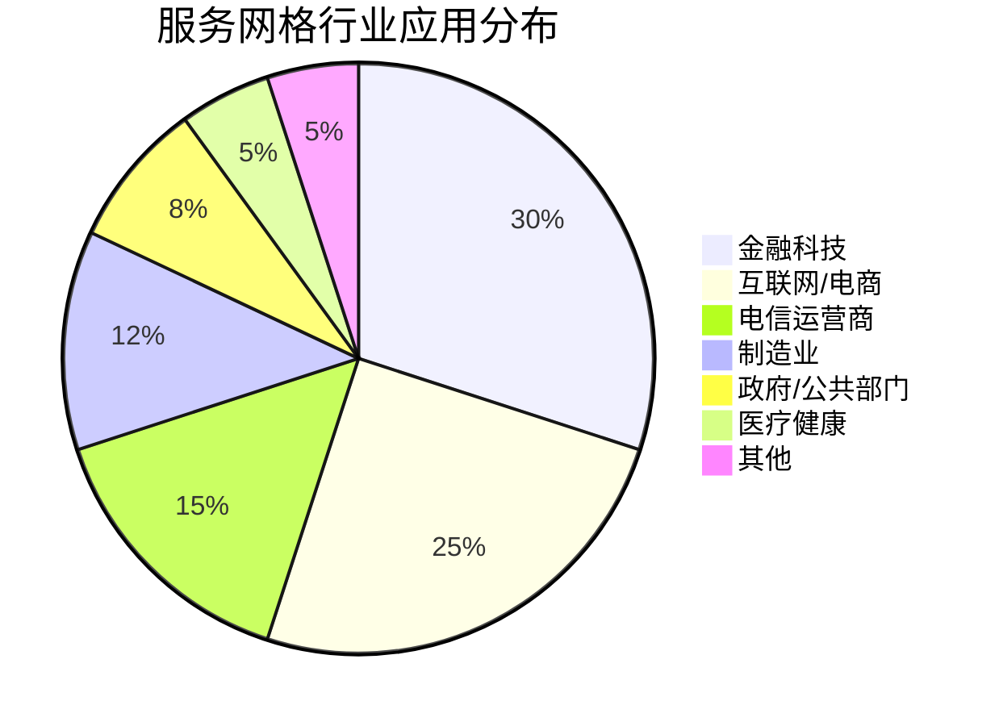
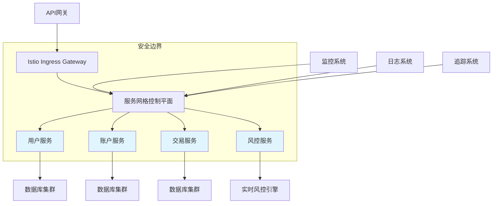

## 服务网格的市场应用与趋势分析：洞察服务网格技术的行业实践与发展方向

服务网格技术作为云原生生态系统的重要组成部分，正在全球范围内得到广泛应用。从初创企业到大型跨国公司，从互联网巨头到传统金融机构，越来越多的企业开始采用服务网格技术来解决微服务架构中的通信、安全和治理问题。本章将深入分析服务网格在不同行业和场景中的市场应用情况，探讨当前的技术发展趋势，并预测未来的发展方向，帮助读者全面了解服务网格技术的市场表现和未来潜力。

### 服务网格市场应用概况

服务网格技术在全球范围内的应用情况反映了其市场接受度和商业价值。

#### 全球市场分布

服务网格技术在全球不同地区的应用情况：

```yaml
# 全球市场分布
# 1. 北美市场:
#    - 市场份额: 约45%
#    - 主要驱动因素: 技术创新、云原生普及
#    - 典型用户: 互联网巨头、金融科技公司
#    - 发展特点: 技术领先、生态完善

# 2. 亚太市场:
#    - 市场份额: 约35%
#    - 增长速度: 最快
#    - 主要国家: 中国、日本、印度、韩国
#    - 发展特点: 数字化转型驱动、政府支持

# 3. 欧洲市场:
#    - 市场份额: 约15%
#    - 发展特点: 合规要求高、稳步增长
#    - 主要国家: 德国、英国、法国
#    - 应用场景: 金融、制造、电信

# 4. 其他地区:
#    - 市场份额: 约5%
#    - 发展特点: 起步较晚、潜力巨大
#    - 重点关注: 拉美、中东、非洲
```

#### 行业应用分布

服务网格技术在不同行业中的应用分布：



### 重点行业应用分析

深入分析服务网格在重点行业中的应用情况和价值体现。

#### 金融科技行业

金融科技行业是服务网格技术的重要应用领域：

```yaml
# 金融科技行业应用
# 1. 应用场景:
#    - 支付系统微服务化
#    - 风控系统实时通信
#    - 交易系统高可用保障
#    - 合规审计与监控

# 2. 技术需求:
#    - 高安全性: mTLS、RBAC
#    - 低延迟: 高性能代理
#    - 高可用: 故障恢复机制
#    - 可审计: 完整日志追踪

# 3. 实施案例:
#    - 某银行核心系统改造:
#      * 采用Istio服务网格
#      * 实现微服务间安全通信
#      * 提升系统可观测性
#      * 降低运维复杂度
```

典型实施架构：



#### 电子商务行业

电子商务行业对服务网格技术有着广泛的应用需求：

```yaml
# 电子商务行业应用
# 1. 应用场景:
#    - 商品推荐系统
#    - 订单处理流程
#    - 库存管理系统
#    - 用户行为分析

# 2. 技术需求:
#    - 高并发处理能力
#    - 灰度发布支持
#    - A/B测试能力
#    - 快速故障恢复

# 3. 实施案例:
#    - 某电商平台微服务改造:
#      * 使用服务网格管理200+微服务
#      * 实现智能流量路由
#      * 支持渐进式功能发布
#      * 提升用户体验
```

流量管理策略：

```yaml
# 电商平台流量管理配置示例
# 1. 灰度发布配置:
apiVersion: networking.istio.io/v1alpha3
kind: VirtualService
metadata:
  name: product-service-canary
spec:
  hosts:
  - product-service
  http:
  - match:
    - headers:
        user-segment:
          exact: "beta-tester"
    route:
    - destination:
        host: product-service
        subset: v2
  - route:
    - destination:
        host: product-service
        subset: v1
---
# 2. A/B测试配置:
apiVersion: networking.istio.io/v1alpha3
kind: VirtualService
metadata:
  name: recommendation-abtest
spec:
  hosts:
  - recommendation-service
  http:
  - match:
    - headers:
        user-id:
          regex: "^[0-4].*$"
    route:
    - destination:
        host: recommendation-service
        subset: algorithm-a
  - match:
    - headers:
        user-id:
          regex: "^[5-9].*$"
    route:
    - destination:
        host: recommendation-service
        subset: algorithm-b
```

#### 电信运营商行业

电信运营商在数字化转型中大量采用服务网格技术：

```yaml
# 电信运营商行业应用
# 1. 应用场景:
#    - 网络功能虚拟化(NFV)
#    - 5G核心网服务
#    - OSS/BSS系统现代化
#    - 边缘计算部署

# 2. 技术需求:
#    - 超大规模部署
#    - 低延迟通信
#    - 高可靠性保障
#    - 多地域管理

# 3. 实施案例:
#    - 某运营商5G核心网改造:
#      * 采用服务网格管理数千个微服务
#      * 实现跨地域服务发现
#      * 支持边缘计算节点
#      * 提升网络服务质量
```

多地域部署架构：

```yaml
# 多地域部署配置示例
# 1. 跨集群服务发现:
apiVersion: networking.istio.io/v1alpha3
kind: ServiceEntry
metadata:
  name: remote-billing-service
spec:
  hosts:
  - billing-service.global
  location: MESH_INTERNAL
  ports:
  - number: 80
    name: http
    protocol: HTTP
  resolution: DNS
  endpoints:
  - address: billing-service.us-east.prod.svc.cluster.local
    locality: us-east1/us-east1-a
  - address: billing-service.eu-west.prod.svc.cluster.local
    locality: eu-west1/eu-west1-a
  - address: billing-service.apac-south.prod.svc.cluster.local
    locality: apac-south1/apac-south1-a
---
# 2. 地域感知路由:
apiVersion: networking.istio.io/v1alpha3
kind: DestinationRule
metadata:
  name: billing-service-dr
spec:
  host: billing-service.global
  trafficPolicy:
    loadBalancer:
      localityLbSetting:
        enabled: true
        distribute:
        - from: us-east1/*
          to:
            "us-east1/*": 80
            "eu-west1/*": 20
```

### 技术发展趋势分析

服务网格技术的发展趋势反映了市场的需求和技术的演进方向。

#### 标准化趋势

服务网格技术的标准化进程正在加速：

```yaml
# 标准化趋势
# 1. Service Mesh Interface (SMI):
#    - 微软主导的标准化项目
#    - 提供统一的API接口
#    - 支持多厂商互操作
#    - 降低厂商锁定风险

# 2. Gateway API:
#    - Kubernetes原生网关API
#    - 提供更丰富的路由功能
#    - 支持多协议网关
#    - 简化网关配置管理

# 3. 可观测性标准:
#    - OpenTelemetry集成
#    - 统一指标收集
#    - 标准化追踪格式
#    - 一致的日志规范
```

标准化架构示例：

```yaml
# SMI标准配置示例
# 1. 流量分割配置:
apiVersion: split.smi-spec.io/v1alpha2
kind: TrafficSplit
metadata:
  name: recommendation-split
spec:
  service: recommendation-service
  backends:
  - service: recommendation-v1
    weight: 90
  - service: recommendation-v2
    weight: 10
---
# 2. 流量访问控制:
apiVersion: access.smi-spec.io/v1alpha2
kind: TrafficTarget
metadata:
  name: recommendation-target
spec:
  destination:
    kind: ServiceAccount
    name: recommendation-service
    namespace: prod
  rules:
  - kind: HTTPRouteGroup
    name: recommendation-routes
    matches:
    - get-recommendations
  sources:
  - kind: ServiceAccount
    name: frontend-service
    namespace: prod
```

#### 云原生集成趋势

服务网格与云原生生态系统的深度集成：

```yaml
# 云原生集成趋势
# 1. Kubernetes原生集成:
#    - CRD资源管理
#    - Admission控制器
#    - 生命周期管理
#    - 自动扩缩容支持

# 2. 无服务器架构集成:
#    - 函数间通信管理
#    - 事件驱动治理
#    - 冷启动优化
#    - 资源利用率提升

# 3. 边缘计算适配:
#    - 轻量级代理
#    - 资源限制优化
#    - 离线模式支持
#    - 边缘安全增强
```

Kubernetes集成示例：

```yaml
# Kubernetes原生集成配置
# 1. 自动注入配置:
apiVersion: v1
kind: ConfigMap
metadata:
  name: istio-sidecar-injector
  namespace: istio-system
data:
  config: |-
    policy: enabled
    alwaysInjectSelector:
      - matchLabels:
          sidecar.istio.io/inject: "true"
    neverInjectSelector:
      - matchLabels:
          sidecar.istio.io/inject: "false"
    injectedAnnotations:
      prometheus.io/scrape: "true"
      prometheus.io/port: "15020"
---
# 2. 资源限制配置:
apiVersion: v1
kind: LimitRange
metadata:
  name: istio-proxy-limits
spec:
  limits:
  - default:
      cpu: 100m
      memory: 128Mi
    defaultRequest:
      cpu: 50m
      memory: 64Mi
    type: Container
```

#### 智能化治理趋势

服务网格向智能化治理方向发展：

```yaml
# 智能化治理趋势
# 1. AI驱动的流量管理:
#    - 基于历史数据的路由决策
#    - 动态负载均衡算法
#    - 预测性故障处理
#    - 自适应性能优化

# 2. 自动化策略生成:
#    - 基于业务指标的策略
#    - 自动安全策略更新
#    - 智能访问控制
#    - 动态配置调整

# 3. 预测性运维:
#    - 异常检测与预警
#    - 性能瓶颈预测
#    - 资源需求预测
#    - 自动故障恢复
```

智能化治理示例：

```yaml
# 智能化治理配置示例
# 1. 自适应负载均衡:
apiVersion: networking.istio.io/v1alpha3
kind: DestinationRule
metadata:
  name: adaptive-lb
spec:
  host: user-service
  trafficPolicy:
    loadBalancer:
      simple: LEAST_REQUEST
    connectionPool:
      tcp:
        maxConnections: 1000
      http:
        http1MaxPendingRequests: 10000
    outlierDetection:
      consecutive5xxErrors: 5
      interval: 30s
      baseEjectionTime: 30s
---
# 2. 智能重试策略:
apiVersion: networking.istio.io/v1alpha3
kind: VirtualService
metadata:
  name: smart-retry
spec:
  hosts:
  - payment-service
  http:
  - route:
    - destination:
        host: payment-service
    retries:
      attempts: 3
      perTryTimeout: 2s
      retryOn: connect-failure,refused-stream,gateway-error
```

### 市场驱动因素分析

服务网格市场增长的主要驱动因素：

#### 技术驱动因素

技术层面的驱动因素：

```yaml
# 技术驱动因素
# 1. 微服务架构普及:
#    - 应用拆分需求增加
#    - 服务间通信复杂化
#    - 治理需求提升

# 2. 云原生技术成熟:
#    - Kubernetes成为标准
#    - 容器化技术普及
#    - DevOps流程完善

# 3. 安全合规要求:
#    - 零信任安全模型
#    - 数据保护法规
#    - 审计追溯需求
```

#### 业务驱动因素

业务层面的驱动因素：

```yaml
# 业务驱动因素
# 1. 数字化转型:
#    - 业务敏捷性需求
#    - 创新速度要求
#    - 用户体验优化

# 2. 成本优化:
#    - 资源利用率提升
#    - 运维成本降低
#    - 故障损失减少

# 3. 竞争优势:
#    - 技术领先优势
#    - 业务创新能力
#    - 市场响应速度
```

### 市场挑战与障碍

服务网格市场发展面临的挑战和障碍：

#### 技术挑战

技术层面的挑战：

```yaml
# 技术挑战
# 1. 性能开销:
#    - Sidecar代理延迟
#    - 资源消耗增加
#    - 网络复杂性提升

# 2. 复杂性管理:
#    - 配置管理复杂
#    - 运维难度增加
#    - 学习曲线陡峭

# 3. 可扩展性:
#    - 大规模集群支持
#    - 多集群管理
#    - 跨云环境适配
```

#### 市场挑战

市场层面的挑战：

```yaml
# 市场挑战
# 1. 人才短缺:
#    - 专业技能要求高
#    - 培训成本较大
#    - 团队能力提升

# 2. 成本考量:
#    - 初期投入较高
#    - 运维成本增加
#    - ROI评估困难

# 3. 组织变革:
#    - 开发运维协作
#    - 流程调整
#    - 文化转变
```

### 未来发展趋势预测

基于当前市场情况和技术发展，预测服务网格的未来发展趋势：

#### 短期趋势（1-2年）

短期内服务网格技术的发展重点：

```yaml
# 短期趋势
# 1. 性能优化:
#    - 轻量级代理方案
#    - eBPF技术应用
#    - 硬件加速支持

# 2. 简化管理:
#    - 简化配置管理
#    - 自动化运维工具
#    - 可视化管理平台

# 3. 标准化推进:
#    - SMI标准普及
#    - Gateway API成熟
#    - 多厂商互操作
```

#### 中期趋势（3-5年）

中期内服务网格技术的发展方向：

```yaml
# 中期趋势
# 1. 智能化治理:
#    - AI驱动的决策
#    - 自动策略优化
#    - 预测性运维

# 2. 新兴技术融合:
#    - 与无服务器架构深度集成
#    - 边缘计算场景适配
#    - 与AI/ML平台结合

# 3. 生态完善:
#    - 工具链丰富
#    - 第三方集成
#    - 社区发展
```

#### 长期趋势（5年以上）

长期内服务网格技术的发展愿景：

```yaml
# 长期趋势
# 1. 架构演进:
#    - 无Sidecar模式
#    - 内核级集成
#    - 硬件原生支持

# 2. 能力增强:
#    - 更智能的治理
#    - 更强的安全能力
#    - 更好的可观测性

# 3. 应用扩展:
#    - 更多行业应用
#    - 更广泛场景支持
#    - 更深层次集成
```

### 总结

服务网格技术在市场应用和趋势发展方面展现出强劲的增长势头。从全球市场分布来看，北美和亚太地区是主要市场，其中亚太地区增长最为迅速。在行业应用方面，金融科技、电子商务、电信运营商等行业是服务网格技术的主要应用领域，这些行业对安全性、可靠性、可扩展性有着较高的要求。

技术发展趋势方面，标准化进程正在加速，云原生集成不断深化，智能化治理成为发展方向。这些趋势反映了市场对服务网格技术易用性、互操作性和智能化能力的需求。

然而，服务网格技术在性能开销、复杂性管理、人才短缺等方面仍面临挑战。企业需要根据自身情况，制定合理的实施策略，逐步推进服务网格技术的应用。

关键要点包括：
1. 了解服务网格在全球和各行业的市场分布情况
2. 掌握重点行业（金融科技、电商、电信）的应用场景和价值
3. 认识服务网格技术的标准化、云原生集成、智能化治理等发展趋势
4. 理解市场增长的驱动因素和面临的挑战
5. 预测服务网格技术的短期、中期和长期发展趋势

通过深入分析市场应用和趋势发展，我们可以：
1. 准确把握服务网格技术的市场定位和发展潜力
2. 制定符合行业特点的技术实施策略
3. 预见技术发展方向，提前布局相关能力建设
4. 有效应对市场挑战，降低实施风险
5. 充分发挥服务网格技术的商业价值

随着技术的不断发展和市场应用的深入，服务网格将在性能优化、智能化治理、生态完善等方面取得新的突破，为更多行业和企业提供价值，推动数字化转型和业务创新。